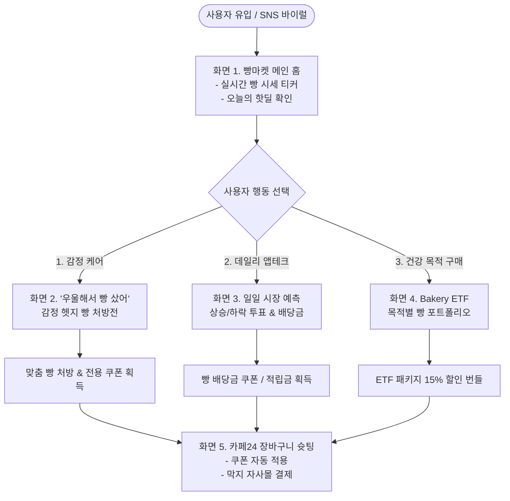
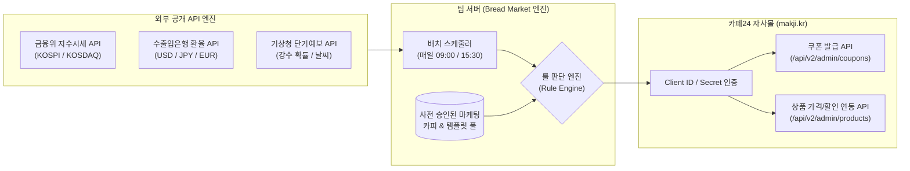

# MAKJI 빵마켓(Bread Market) 서비스 기획안 & 와이어프레임 명세서

> **문서 버전:** v1.0  
> **기준일자:** 2026년 9월 7일  
> **프로젝트:** ㈜스윗앤스위츠 MAKJI AI 기반 Food FinCommerce Platform ('Bread Market' MVP)  
> **기획 방향:** 막지(MAKJI)의 공식 인터랙티브 콘텐츠 플랫폼 & 감정 헷지 커머스

---

## 📋 목차
1. [서비스 개요 및 포지셔닝 전략](#1-서비스-개요-및-포지셔닝-전략)
2. [전체 서비스 흐름도 (User Journey)](#2-전체-서비스-흐름도-user-journey)
3. [킬러 피처: '우울해서 빵 샀어' 감정 헷지 빵 처방전](#3-킬러-피처-우울해서-빵-샀어-감정-헷지-빵-처방전)
4. [화면별 마크다운 와이어프레임 (Wireframe)](#4-화면별-마크다운-와이어프레임-wireframe)
   * [화면 1: 메인 홈 - 오늘의 빵 거래소 (Ticker & Home)](#화면-1-메인-홈---오늘의-빵-거래소-ticker--home)
   * [화면 2: 인터랙티브 팝업 - '우울해서 빵 샀어' 진단 & 처방전](#화면-2-인터랙티브-팝업---우울해서-빵-샀어-진단--처방전)
   * [화면 3: 일일 미션 - 오늘의 빵 시장 예측 & 빵 배당금](#화면-3-일일-미션---오늘의-빵-시장-예측--빵-배당금)
   * [화면 4: 큐레이션 - Bakery ETF (나만의 빵 포트폴리오)](#화면-4-큐레이션---bakery-etf-나만의-빵-포트폴리오)
   * [화면 5: 전환 - 카페24 장바구니 슛팅 & 다이렉트 결제](#화면-5-전환---카페24-장바구니-슛팅--다이렉트-결제)
5. [데이터 연동 및 백엔드 파이프라인 (RFP 기술 연계)](#5-데이터-연동-및-백엔드-파이프라인-rfp-기술-연계)

---

## 1. 서비스 개요 및 포지셔닝 전략

### (1) 브랜드 이원화 전략: "콘텐츠 브랜드로서의 빵마켓"
막지(MAKJI)의 프리미엄 웰니스 브랜드 정체성을 훼손하지 않으면서, 2030 소비자의 데일리 유입을 이끌어내기 위해 **커머스 본체**와 **콘텐츠 플랫폼**을 이원화합니다.

```
┌─────────────────────────────────────────┐       ┌─────────────────────────────────────────┐
│     콘텐츠 플랫폼 : 빵마켓 (Bread Market)    │       │        커머스 본체 : 막지 (MAKJI)        │
├─────────────────────────────────────────┤       ├─────────────────────────────────────────┤
│ • 성격: 2030 놀이터 & 금융·시장 미디어   │       │ • 성격: 프리미엄 웰니스 베이커리몰      │
│ • 톤앤매너: 위트, 실시간 데이터, 게이미피케이션 │ ───▶ │ • 톤앤매너: 건강, 글루텐프리, 업사이클링│
│ • 역할: 매일 방문하는 트래픽 깔때기(Funnel)│       │ • 역할: 상품 결제, 배송, 정기구독 락인   │
│ • 핵심 기능: 시장 티커, 감정 처방전, ETF │       │   (카페24 백엔드 연동)                  │
└─────────────────────────────────────────┘       └─────────────────────────────────────────┘
```

### (2) 해결하고자 하는 핵심 비즈니스 과제
1. **낮은 자사몰 재방문율(DAU) 극복:** 빵을 다 소비하기 전까지 자사몰에 올 이유가 없던 소비자에게 "매일 주식 창을 보듯 빵 시세를 확인하고 배당을 받는 데일리 루틴" 부여.
2. **높은 첫 구매 가격 장벽 완화:** 외부 시장 데이터(환율 하락, 지수 변동 등)를 명분으로 제공되는 타깃 쿠폰을 통해 고단가 제품(초코케이크, 생지 등)의 진입 장벽 제거.

---

## 2. 전체 서비스 흐름도 (User Journey)



---

## 3. 킬러 피처: '우울해서 빵 샀어' 감정 헷지 빵 처방전

전국민 밈인 **'T(이성) vs F(감성)'의 티키타카**를 금융 데이터와 베이커리 제품군에 결합한 인터랙티브 진단 기능입니다.

```
"나 오늘 우울해서 빵 샀어..."
   │
   ├── 1단계 [F적 공감] : "왜 우울한데?" ➔ [실시간 시장 데이터 & 일상 감정 트리거]
   │
   └── 2단계 [T적 처방] : "무슨 빵 샀어?" ➔ [MAKJI 실제 10대 제품 매칭 & 할인 쿠폰]
```

### 💡 감정 진단 ➔ 제품 처방 매핑 테이블

| 감정 유형 (왜 우울한데?) | 연동 시장 데이터 (API) | 처방 빵 (무슨 빵 샀어?) | T적 처방 논리 및 할인 혜택 |
| :--- | :--- | :--- | :--- |
| **"내 주식 계좌가 파란불(폭락)이라서..."** | 금융위 API<br>(KOSPI -1.0% 이상) | **막지 글루텐프리 무설탕 마틸다 초코케이크** (42,000원) | *"파란불엔 당 충전이 약이지만, 설탕 빵 먹고 살찌면 더 우울해집니다. 설탕 0g 딥 초코로 세로토닌만 안전하게 충전하세요!"*<br>👉 **[파란불 헷지 7% 쿠폰]** |
| **"비 오고 날씨가 너무 우중충해서..."** | 기상청 API<br>(강수 확률 60% 이상) | **막지 ZERO 카스테라** (12,000원)<br>& **글루텐프리 스콘** (3,800원) | *"비 오는 날엔 파전 대신 막걸리 발효 부산물로 빚은 속 편한 카스테라! 은은한 발효 풍미와 따뜻한 차로 센치함을 달래보세요."*<br>👉 **[Rainy Day 웰니스 10% 쿠폰]** |
| **"월급은 그대로인데 환율/물가만 올라서..."** | 수출입은행 API<br>(환율 변동성) | **막지 글루텐프리 냉동생지 3종** (21,000원) | *"밖에서 비싼 디저트 사 먹지 말고, 집에서 에어프라이어로 갓 구워 먹는 가성비 끝판왕 홈베이킹으로 지갑을 방어하세요."*<br>👉 **[물가 방어 3,000원 쿠폰]** |
| **"다이어트 중인데 빵이 미치게 땡겨서..."** | 타깃 고유 Pain Point<br>(혈당 다이어트) | **막지 비건 잉글리시 머핀** (1,500원)<br>& **제로 무설탕 모닝롤** (4,500원) | *"참다가 폭식 터지면 끝장입니다. 밀가루 0g, 순탄수 3g 잉글리시 머핀은 먹어도 살 안 찝니다. 죄책감 없이 즐기세요!"*<br>👉 **[길티프리 처방 500원 쿠폰]** |

---

## 4. 화면별 마크다운 와이어프레임 (Wireframe)

---

### 화면 1: 메인 홈 - 오늘의 빵 거래소 (Ticker & Home)

```text
+-------------------------------------------------------------------------+
| [BREAD MARKET] by MAKJI                             [MY] [장바구니 (0)] |
+-------------------------------------------------------------------------+
| [🔴 LIVE 전광판]                                                         |
|  KOSPI 2,540.12 (-1.2% ▼) | USD 1,382원 (+0.3% ▲) | 서울 강수 80% ☔   |
|  >> [속보] 코스피 하락으로 마틸다 초코케이크 7% 긴급 헷지 세일 돌입!       |
+-------------------------------------------------------------------------+
|                                                                         |
|  +-------------------------------------------------------------------+  |
|  |  ✨ 오늘의 빵 고민 해결소                                         |  |
|  |  "나 오늘 우울해서 빵 사려고..."                                  |  |
|  |  실시간 시장 데이터로 내 기분을 분석하고 맞춤 빵을 처방받아보세요!   |  |
|  |                                                                   |  |
|  |            [ 💊 내 감정 진단하고 빵 처방받기 (10초) ]             |  |
|  +-------------------------------------------------------------------+  |
|                                                                         |
|  [ 오늘의 데일리 미션 (09:00 개장) ]                                     |
|  🔔 "오늘 코스피 종가는 빨간불일까? 파란불일까?"                         |
|     [ 🔴 상승 (빨간불) ]     vs     [ 🔵 하락 (파란불) ]                 |
|     (투표 참여 시 기본 배당금 100P + 정답 맞히면 1,000원 빵 쿠폰 지급)    |
|                                                                         |
|  [ 📈 실시간 빵 시세 핫딜 (Bread Market Hot Deals) ]                     |
|  +-----------------------+ +-----------------------+ +------------------+
|  | [코스피 파란불 특가]  | | [엔화 하락 환율우대전] | | [비오는날 발효특가]|
|  | 마틸다 초코케이크     | | 우지 말차 마들렌      | | ZERO 카스테라     |
|  | 42,000원 -> 39,060원  | | 3,800원 -> 3,600원    | | 12,000 -> 10,800 |
|  | [장바구니 담기]       | | [장바구니 담기]       | | [장바구니 담기]  |
|  +-----------------------+ +-----------------------+ +------------------+
|                                                                         |
|  [ 🧺 이번 주 인기 Bakery ETF (빵 포트폴리오) ]                          |
|  • [안정형] 혈당 방어 저속노화 ETF (저당 3종 번들) ---------- 15% OFF   |
|  • [성장형] 든든한 아침 프로틴 ETF (모닝롤+머핀 5종) -------- 10% OFF   |
+-------------------------------------------------------------------------+
| [하단 바]  [홈 / 거래소]   |   [감정 처방]   |   [ETF 빌더]   |   [MY]  |
+-------------------------------------------------------------------------+
```

---

### 화면 2: 인터랙티브 팝업 - '우울해서 빵 샀어' 진단 & 처방전

```text
+-------------------------------------------------------------------------+
|  [X 닫기]                '나 오늘 우울해서 빵 샀어'                      |
+-------------------------------------------------------------------------+
|                                                                         |
|  Q1. (F의 질문) 왜 우울한데? 무슨 일 있어?                               |
|                                                                         |
|  ( ) [📉 주식/코인 폭락] 오늘 내 계좌가 파란불이라 멘탈 바사삭...         |
|  (●) [☔ 날씨/기상 악화] 비 오고 날씨가 우중충해서 센치해... (선택됨)      |
|  ( ) [💸 고물가 스트레스] 월급 빼고 빵값, 환율 다 올라서 킹받아...        |
|  ( ) [🥗 다이어트 억압] 빵 너무 먹고 싶은데 살찔까 봐 눈물 나...         |
|                                                                         |
+-------------------------------------------------------------------------+
|                                                                         |
|  Q2. (T의 처방) 그럼 무슨 빵 사야 할까?                                 |
|                                                                         |
|  ========================= [ MAKJI 처방전 ] =========================   |
|                                                                         |
|  [ 💊 처방 코드 : RAIN-MAKJI-02 ]                                       |
|  "비 오는 날엔 파전 대신 '막지'! 쌀쌀하고 센치할 땐,                    |
|   막걸리 술지게미의 은은한 발효 풍미를 품은 글루텐프리 카스테라가 약!"   |
|                                                                         |
|   • 처방 상품 : 막지 ZERO 카스테라 (부드러운 저당/글루텐프리)           |
|   • 스펙 요약 : 당류 1.5g | 밀가루 0% | 업사이클링 막지 파우더 함유     |
|   • 특별 혜택 : 비오는 날 웰니스 위로 쿠폰 (-10% 즉시 할인)             |
|   • 가격 안내 : 12,000원 -> 10,800원                                    |
|                                                                         |
|  =====================================================================   |
|                                                                         |
|  [  🛍️ 이 처방전 들고 막지(MAKJI)에서 빵 사기 (원클릭 결제)  ]         |
|  [  🔗 내 처방전 인스타그램 / 친구에게 공유하기 (친구도 쿠폰 증정)  ]   |
+-------------------------------------------------------------------------+
```

---

### 화면 3: 일일 미션 - 오늘의 빵 시장 예측 & 빵 배당금

```text
+-------------------------------------------------------------------------+
|  [← 뒤로가기]          📊 오늘의 빵 시장 예측 (Bread Prediction)        |
+-------------------------------------------------------------------------+
|  "매일 아침 09:00 개장! 오늘의 금융 시장을 맞히면 빵 배당금이 쏟아집니다"|
|                                                                         |
|  +-------------------------------------------------------------------+  |
|  |  [오늘의 예측 종목] KOSPI 종합주가지수                             |  |
|  |  현재 시세: 2,542.10 pt                                            |  |
|  |                                                                   |  |
|  |  오늘 오후 15:30 장 마감 시 코스피는?                             |  |
|  |                                                                   |  |
|  |     +-------------------------+   +-------------------------+     |  |
|  |     |   🔴 빨간불 (상승 마감)  |   |   🔵 파란불 (하락 마감)  |     |  |
|  |     |   (현재 투표율 42%)     |   |   (현재 투표율 58%)     |     |  |
|  |     |        [ 선택하기 ]     |   |        [ 선택완료 ]     |     |  |
|  |     +-------------------------+   +-------------------------+     |  |
|  +-------------------------------------------------------------------+  |
|                                                                         |
|  [ 나의 배당금 금고 (My Dividend Vault) ]                               |
|  • 보유 적립금: 1,400 P (언제든 현금처럼 사용 가능)                     |
|  • 보유 배당 쿠폰: [아침 모닝롤 1,000원 할인권 (오늘 자정 만료)]        |
|                                                                         |
|  [ ⚡ 배당 쿠폰 즉시 사용 추천 상품 ]                                   |
|  • 막지 비건 잉글리시 머핀 (1,500원) ➔ 쿠폰 적용 시 **500원 구매 가능!**|
|  • 담백폭신 제로 모닝롤 (4,500원) ➔ 쿠폰 적용 시 **3,500원 구매 가능!** |
|                                                                         |
|  [ 🛒 배당 쿠폰 적용하고 아침빵 500원에 주문하기 ]                      |
+-------------------------------------------------------------------------+
```

---

### 화면 4: 큐레이션 - Bakery ETF (나만의 빵 포트폴리오)

```text
+-------------------------------------------------------------------------+
|  [← 뒤로가기]            🧺 Bakery ETF (Bread Portfolio)                |
+-------------------------------------------------------------------------+
|  "개별 빵 고르기 고민 끝! 나의 영양 목표에 분산 투자하는 웰니스 번들"  |
|                                                                         |
|  [ ETF 테마 탭 ]  [전체보기]  [혈당방어형]  [프로틴성장형]  [가성비홈베이킹]|
|                                                                         |
|  +-------------------------------------------------------------------+  |
|  |  ⭐ [BEST] 혈당 방어 저속노화 ETF (Ticker: $GLU-DEF)               |  |
|  |  "식후 혈당 스파이크 절대 방어! 당류 2g 미만 완벽한 디저트 포트폴리오" |  |
|  |                                                                   |  |
|  |  [자산 구성 종목 (비중)]                                          |  |
|  |  • 막지 ZERO 카스테라 (40%)                                       |  |
|  |  • 무설탕 달항아리 티라미수 (35%)                                 |  |
|  |  • 담백폭신 제로 모닝롤 (25%)                                     |  |
|  |                                                                   |  |
|  |  정상가 31,500원 ➔ ETF 번들 특가 26,700원 (15% OFF)               |  |
|  |  [ 1회 구매하기 ]             [ 주 1회 정기구독 신청 (추가 5%↓) ] |  |
|  +-------------------------------------------------------------------+  |
|                                                                         |
|  +-------------------------------------------------------------------+  |
|  |  💪 [운동족] 고성장 모닝 프로틴 ETF (Ticker: $PRO-GROW)             |  |
|  |  "출근길 든든한 단백질 & 식이섬유 충전! 활력 식사빵 포트폴리오"     |  |
|  |  • 구성: 비건 잉글리시머핀 3개 + 통식빵 테트리스 1개 + 샌드위치 2개   |  |
|  |  정상가 20,300원 ➔ ETF 번들 특가 17,200원 (15% OFF)               |  |
|  |  [ 1회 구매하기 ]             [ 주 1회 정기구독 신청 (추가 5%↓) ] |  |
|  +-------------------------------------------------------------------+  |
+-------------------------------------------------------------------------+
```

---

### 화면 5: 전환 - 카페24 장바구니 슛팅 & 다이렉트 결제

```text
+-------------------------------------------------------------------------+
|  [BREAD MARKET ➔ MAKJI 공식몰 연동]                                    |
+-------------------------------------------------------------------------+
|                                                                         |
|      🎉 빵마켓에서 발급받은 '감정 처방전 쿠폰'이 적용되었습니다!        |
|                                                                         |
|  +-------------------------------------------------------------------+  |
|  | 주문 상품 정보 (카페24 장바구니 자동 생성)                        |  |
|  +-------------------------------------------------------------------+  |
|  | [처방 상품] 막지 ZERO 카스테라 1개                       12,000원 |  |
|  | └ 적용 혜택: [비오는 날 웰니스 위로 쿠폰 (-10%)]        - 1,200원 |  |
|  | └ 배당 포인트 사용:                                       - 500 P |  |
|  +-------------------------------------------------------------------+  |
|  | 최종 결제 예정 금액                                     10,300원 |  |
|  +-------------------------------------------------------------------+  |
|                                                                         |
|  배송지: 서울시 강남구 테헤란로 ... (카페24 회원 정보 연동)             |
|  결제수단: [네이버페이] [카카오페이] [토스페이] [신용카드]              |
|                                                                         |
|  [ 💳 카페24 막지 공식몰에서 안전하게 원클릭 결제하기 ]                 |
|                                                                         |
|  * 결제 및 배송은 ㈜스윗앤스위츠 MAKJI 스마트 HACCP 시설에서 안전하게 진행|
+-------------------------------------------------------------------------+
```

---

## 5. 데이터 연동 및 백엔드 파이프라인 (RFP 기술 연계)



### (1) 데이터 수집 및 룰 엔진 주기
* **오전 08:50:** 기상청 API 호출 ➔ 오늘 서울/수도권 강수 확률 체크 ➔ 비 예보 시 'Rainy Day 프로모션' 트리거 On.
* **오전 09:00:** 수출입은행 환율 고시 및 주식시장 개장 ➔ 환율 급등락 체크 및 '오늘의 빵 시장 예측' 투표 개장.
* **오후 15:30:** 주식시장 마감 ➔ KOSPI 등락률 수집 ➔ 예측 게임 성공자에게 카페24 쿠폰 API로 자동 배당 지급 및 파란불 헷지 특가 온/오프 반영.

### (2) 콘텐츠 운영 원칙 준수 (RFP 엄수)
* **AI 자동 이미지/카피 생성 금지:** 모든 프로모션 문구, 배너 일러스트, 처방전 카피는 기업 담당자가 사전 승인한 마스터 풀(Template Pool) 내에서 데이터 트리거에 의해 선택/조합되는 방식으로만 안전하게 운영됩니다.
