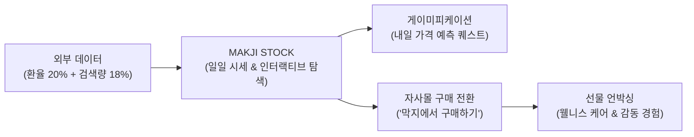

# 🥐 MAKJI STOCK (막지스톡)

> ### *"살 때는 주식처럼, 받을 때는 선물처럼"*
> **프리미엄 웰니스 베이커리 '막지(MAKJI)' 브랜드 RFP 기반 동적 시세 연동 서비스 기획 저장소**

[](logs/decision-log/DECISION_INDEX.md)
[](#-할인율-산출-엔진-핵심-규격)
[](logs/ai-log/)

---

## 📌 1. 프로젝트 개요 (Overview)

본 저장소는 건강한 웰니스 베이커리 브랜드 **'막지(MAKJI)'**의 기업 RFP 요구사항에 맞춰, 외부 시장 지표(외환시장 환율, 네이버 검색 트렌드)를 베이커리 가격에 실시간 연동하여 매일 아침 고객의 재방문과 자사몰 실구매 전환을 유도하는 **MAKJI STOCK** 서비스 기획 저장소입니다.



---

## 📂 2. 파일트리 구조 (Directory Tree)

```text
makji-personal/
├── .github/
│   └── workflows/
│       └── auto-log-verification.yml       # ADR 인덱스 정합성 CI 검증 워크플로우
├── docs/                                  # 5단계 체계적 기획 문서군
│   ├── 00_rfp/                            # 기업 RFP 분석 및 요구사항 정의
│   │   ├── RFP.pdf                        # 원본 RFP 문서
│   │   └── RFP_ANALYSIS.md                # RFP 핵심 분석 및 제약조건
│   ├── 01_concept/                        # 브랜드 세계관 및 스토리텔링
│   │   ├── 9_10_기획안_초안.md              # 초기 기획안 원본
│   │   └── BRAND_STORYTELLING.md          # '살 때는 주식처럼, 받을 때는 선물처럼' 감성 여정
│   ├── 02_pricing_engine/                 # 가격 결정 엔진 및 통계 검증
│   │   ├── FORMULA_SPECIFICATION.md       # 공식 할인율 산식 명세 (20% + 18% = 38%)
│   │   ├── VERIFICATION_REPORT_GEMINI.md  # 91일 실데이터 백테스팅 경영진 검증 보고서
│   │   └── data/                          # 외환/트렌드 실데이터 및 검증 엑셀 시트
│   ├── 03_product_spec/                   # 제품 사양 및 PRD
│   │   ├── KEYWORD_MAPPING.md             # 10대 웰니스 제품-검색어 매핑
│   │   └── PRD.md                         # 제품 요구사항 정의서 (기능/비기능 명세)
│   └── 04_presentations/                  # 시각화 발표 자료
│       └── 막지스톡_할인율산식_발표.html     # 경영진 보고용 인터랙티브 발표 덱
├── prototypes/                            # 실감형 인터랙티브 프로토타입
│   ├── exchange/
│   │   └── makji-stock-exchange.html      # 빵 시세 거래소 캔들 차트 프로토타입
│   └── simulator/
│       └── price-simulator.html           # 2-Factor 할인율 동적 시뮬레이터
├── logs/                                  # 자동화 로깅 및 의사결정 레코드
│   ├── README.md                          # 로깅 시스템 안내 가이드
│   ├── ai-log/                            # AI 협업 세션 로그
│   │   ├── 20260912_initial_restructuring.md
│   │   └── git-activity.log               # Git 훅에 의한 자동 커밋 로그
│   └── decision-log/                      # 아키텍처 및 기획 의사결정 (ADR)
│       ├── ADR-001_slogan_and_unboxing_flow.md
│       ├── ADR-002_formula_weights_20_18_38.md
│       ├── ADR-003_weekend_carryover_policy.md
│       └── DECISION_INDEX.md              # 자동 동기화되는 ADR 누적 인덱스
├── scripts/                               # 자동화 스크립트 도구
│   ├── auto_log.py                        # AI 작업 기록 및 ADR 생성 CLI 도구
│   ├── sync_decision_index.py             # ADR 인덱스 자동 동기화 스크립트
│   └── install_hooks.ps1                  # 로컬 Git hook 설치기
├── index.html                             # 모바일 최적화 웹 메인 애플리케이션 (GitHub Pages)
├── .gitignore
└── README.md                              # 본 문서
```

---

## ⚡ 3. 할인율 산출 엔진 핵심 규격 (진행 중 / 일부 확정)

현재 할인율 세부 비중은 두 가지 안(Plan A, Plan B)을 두고 검토 중이며(미정), **최대 할인율 38% 제한(Hard Cap)은 확정**되었습니다.

### [확정 사항]
- **최대 총합 마진 방어선 (Hard Cap): 38.0%** (재무적 역마진 원천 방어)
- **주말 외환 휴장 정책**: 금요일 오후장의 환율 할인율을 월요일 오전까지 동일하게 유지. 월요일 오후부터는 금요일 종가 대비 월요일 시가의 변동률(하락률) 반영.
- **코스피 (KOSPI) 게릴라 이벤트**: 삭제 (적용하지 않음)

### [검토 중인 할인율 배분안]
| 구분 | Plan A (기존안) | Plan B (신규 대안) |
| :--- | :--- | :--- |
| **동적 시세 할인 (환율 + 검색량)** | 최대 38% (환율 20% + 검색 18%) | 최대 25% |
| **기타 쿠폰 할인** | - | 최대 13% |
| **최대 총합 (Hard Cap)** | **38%** | **38%** |

---

## 🤖 4. 자동 로깅 시스템 (AI-Log & Decision-Log)

본 프로젝트는 기획 과정에서 발생하는 모든 의사결정과 AI 협업 과정을 추적 가능하도록 자동화된 시스템을 탑재하고 있습니다.

### 4-1. AI 작업 로그 기록
```bash
python scripts/auto_log.py ai \
  --model "Gemini 3.8 Flash" \
  --topic "할인율 산식 최적화" \
  --summary "환율 20% + 검색 18% = 38% 하드캡 확정 및 검증" \
  --files "docs/02_pricing_engine/FORMULA_SPECIFICATION.md"
```

### 4-2. 의사결정 레코드(ADR) 생성 및 색인 갱신
```bash
python scripts/auto_log.py decision \
  --title "주말 외환시장 휴장 시 금요일 종가 이월 정책" \
  --decider "기획팀 & 경영진" \
  --status "Accepted" \
  --context "토/일 외환시장 미운영 대응" \
  --decision "금요일 종가 유지 및 주말 특가 브랜딩" \
  --consequences "주말 구매 전환율 방어"
```
* 새 ADR이 생성되면 `scripts/sync_decision_index.py`가 자동 호출되어 [`DECISION_INDEX.md`](logs/decision-log/DECISION_INDEX.md)가 갱신됩니다.
* 로컬 Git `post-commit` 훅을 통해 커밋 시마다 색인이 무결하게 동기화됩니다.

---

## 🌐 5. 프로토타입 및 프레젠테이션 바로보기

1. **[모바일 통합 서비스 (index.html)](./index.html):** 선물 상자 언박싱 모션과 주식 시세 전광판, 10종 빵장, 자사몰 구매 아웃링크가 통합된 메인 웹앱.
2. **[빵 시세 거래소 프로토타입](./prototypes/exchange/makji-stock-exchange.html):** 캔들 차트와 호가창 메타포 인터랙션.
3. **[동적 가격 시뮬레이터](./prototypes/simulator/price-simulator.html):** 환율/검색량 슬라이더를 조작하며 실시간 산식을 테스트하는 도구.
4. **[경영진 산식 검증 발표 덱](./docs/04_presentations/막지스톡_할인율산식_발표.html):** 91일 실데이터 백테스팅 결과와 3대 리스크 보완 전략 덱.
