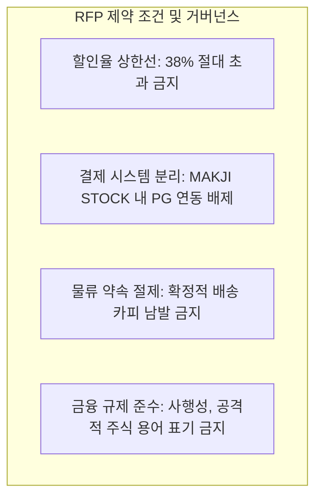

# 📄 MAKJI 브랜드 RFP 분석 및 기획 요구사항 정의서

**문서 코드:** MKJ-DOC-RFP-001  
**대상 브랜드:** 막지 (MAKJI - 프리미엄 웰니스 베이커리)  
**기획 프로젝트명:** MAKJI STOCK (일일 동적 시세 연동 이커머스 경험)  
**상태:** 진행 중 (옵션 및 세부 사항 검토 중)  
**작성일자:** 2026년 9월  

---

## 1. RFP 발주 배경 및 목적

### 1-1. 브랜드 개요
* **브랜드명:** 막지 (MAKJI)
* **카테고리:** 프리미엄 웰니스 베이커리
* **시장 포지셔닝:** 2030 세대를 타깃으로 맛과 영양, 헬시 플레저(Healthy Pleasure)를 지향하는 트렌디 베이커리 브랜드.

### 1-2. 발주 목적 (Client Objective)
1. **정적 이커머스의 한계 극복:** 단순한 고정가 할인 및 쿠폰 배포 방식에서 벗어나, 매일 사이트에 재방문해야 할 강력한 게이미피케이션 동기 부여.
2. **외부 시장 데이터의 빵값 연동:** 거시경제(환율) 및 대중의 관심도(네이버 검색량) 등 외부 시장 데이터를 베이커리 구매 경험에 연결.
3. **자사몰 유입 및 구매 전환 극대화:** MAKJI STOCK 서비스를 통해 유입된 고객이 자연스럽게 막지 공식 자사몰로 이동하여 실구매를 진행하도록 유도.
4. **마케팅 바이럴 소재 확보:** SNS, 메타(Meta) 광고 소재 및 인터랙티브 랜딩페이지로서의 화제성 창출.

---

## 2. 핵심 요구사항 및 기능 명세

| 구분 | 요구사항 항목 | 세부 내용 및 반영 방안 |
| :--- | :--- | :--- |
| **요구 1** | **외부 데이터 연동 동적 가격 산정** | • 매일 변동하는 외환시장(USD/KRW) 및 검색트렌드 지표 연동 • 매일 오전 09:00 정기 가격 갱신 |
| **요구 2** | **명확한 가격 상한선 준수** | • 브랜드 수익성 보호를 위한 **최대 할인율 38% 하드캡** 설정 (확정) • 환율 및 검색량 세부 배분 비율은 현재 복수 안(Plan A, B) 검토 중 |
| **요구 3** | **자사몰과의 분리 및 연동 구조** | • MAKJI STOCK: 시세 조회, 가격 비교, 인터랙티브 탐색 전용 사이트 • 막지 자사몰: 실 결제 및 장바구니/배송 주문 처리 시스템 |
| **요구 4** | **재방문 유도 게이미피케이션** | • '내일의 빵값 예측하기' 미니 퀘스트 • 예측 실패 시 0%, 성공 시 최대 ?% 쿠폰(더하기/곱하기 미정) 지급 |
| **요구 5** | **감성적 브랜드 스토리텔링** | • 복잡한 금융용어 강요 지양 • **"매일 오전 9시, 오늘의 빵 시장이 열립니다"** 슬로건 채택 |

---

## 3. 핵심 제약 조건 (Constraints & Boundaries)

1. **마진율 방어 (38% Hard Cap):**
   * 어떤 경우(환율 하락, 검색량 증가, 추가 쿠폰 등)에도 총 할인율은 38%를 초과할 수 없음.
2. **법적/금융 규제 리스크 방지:**
   * 실제 금전적 투자가 아닌 '유쾌한 빵 시장 할인 프로모션'임을 명시하여 사행성 오인을 방지.

---

## 4. 타깃 페르소나 및 사용자 여정

* **타깃:** 2535 스마트 컨슈머 (건강한 식습관 및 트렌드 소비를 즐기는 직장인/학생)
* **Customer Journey:**
  1. **[유입]** SNS 등 외부 링크를 통해 '오늘 빵 시세'에 대한 호기심으로 접속.
  2. **[탐색]** MAKJI STOCK에서 5종(옵션 미정) 상품의 가격 그래프 시세 비교.
  3. **[결제 연동]** 마음에 드는 상품의 '막지 공식몰에서 구매하기'를 통해 자사몰로 이동.
  4. **[재방문]** 다음 날의 가격 예측 및 쿠폰 지급 혜택 확인을 위해 사이트 재방문.

---
*본 분석 문서는 공식 기획 산출물 및 PRD 수립의 기초 기준 문서입니다.*
