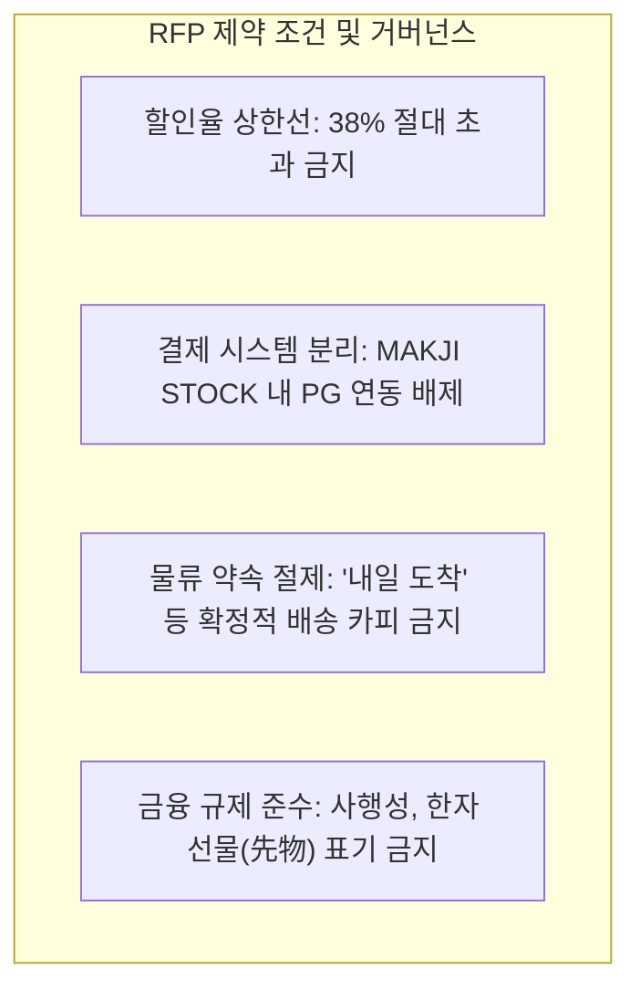

# 📄 MAKJI 브랜드 RFP 분석 및 기획 요구사항 정의서

**문서 코드:** MKJ-DOC-RFP-001  
**대상 브랜드:** 막지 (MAKJI - 프리미엄 웰니스 베이커리)  
**기획 프로젝트명:** MAKJI STOCK (일일 동적 시세 연동 이커머스 경험)  
**작성일자:** 2026년 9월  

---

## 1. RFP 발주 배경 및 목적

### 1-1. 브랜드 개요
* **브랜드명:** 막지 (MAKJI)
* **카테고리:** 프리미엄 웰니스 베이커리 (비건, 글루텐 프리, 유기농 곡물 기반의 건강한 빵)
* **시장 포지셔닝:** 2030 세대를 타깃으로 맛과 영양, 헬시 플레저(Healthy Pleasure)를 지향하는 트렌디 베이커리 브랜드.

### 1-2. 발주 목적 (Client Objective)
1. **정적 이커머스의 한계 극복:** 단순한 고정가 할인 및 쿠폰 배포 방식에서 벗어나, 매일 사이트에 재방문해야 할 강력한 게이미피케이션 동기 부여.
2. **외부 시장 데이터의 빵값 연동:** 거시경제(환율) 및 대중의 관심도(네이버 검색량) 등 외부 시장 데이터를 베이커리 구매 경험에 연결.
3. **자사몰 유입 및 구매 전환 극대화:** MAKJI STOCK 서비스를 통해 유입된 고객이 자연스럽게 막지 공식 자사몰로 이동하여 실구매를 진행하도록 유도.
4. **마케팅 바이럴 소재 확보:** SNS, 메타(Meta) 인스타그램 광고 소재 및 인터랙티브 랜딩페이지로서의 화제성 창출.

---

## 2. 핵심 요구사항 및 기능 명세

| 구분 | 요구사항 항목 | 세부 내용 및 반영 방안 |
| :--- | :--- | :--- |
| **요구 1** | **외부 데이터 연동 동적 가격 산정** | • 매일 변동하는 외환시장(USD/KRW) 및 검색트렌드 지표 연동 • 매일 오전 09:00 정기 가격 갱신 (주식 장 시작 메타포) |
| **요구 2** | **명확한 가격 상한선 준수** | • 브랜드 수익성 보호를 위한 **최대 할인율 38% 하드캡** 설정 • 환율(최대 20%) + 검색량(최대 18%) = 38%로 엄격히 제한 |
| **요구 3** | **자사몰과의 분리 및 연동 구조** | • MAKJI STOCK: 시세 조회, 가격 비교, 인터랙티브 탐색 전용 마이크로사이트 • 막지 자사몰: 실 결제 및 장바구니/배송 주문 처리 시스템 |
| **요구 4** | **재방문 유도 게이미피케이션** | • '내일의 빵값 예측하기' 미니 퀘스트 • 예측 성공 시 자사몰 사용 가능 시크릿 쿠폰 지급 |
| **요구 5** | **감성적 브랜드 스토리텔링** | • 복잡한 금융용어/사행성 지양 • **"살 때는 주식처럼, 받을 때는 선물처럼"** 슬로건 채택 |

---

## 3. 핵심 제약 조건 (Constraints & Boundaries)

1. **마진율 방어 (38% Hard Cap):**
   * 어떤 경우(환율 폭락, 검색량 폭증, 추가 이벤트)에도 총 할인율은 38%를 초과할 수 없음.
2. **법적/금융 규제 리스크 방지:**
   * '선물 거래(Futures)'로 오인되지 않도록 순수 한글 '선물(Gift)' 콘셉트를 강조하고, 실제 금전적 투자가 아닌 '유쾌한 할인 프로모션'임을 명시.
3. **물류 현실성 고려:**
   * 베이커리 신선 배송의 한계를 고려하여 "내일 도착" 대신 "신선 출고 및 정성스러운 선물 패키징" 경험에 집중.

---

## 4. 타깃 페르소나 및 사용자 여정

* **타깃:** 2535 스마트 컨슈머 (건강한 식습관에 관심이 많고, 주식/테크/재테크 트렌드에 익숙하며, 재미있는 소비 경험을 즐기는 여성 및 남성 직장인/학생)
* **Customer Journey:**
  1. **[유입]** 인스타그램 릴스/스토리 광고: *"오늘 밀가루 환율 떨어져서 빵값 폭락함? 지금 시세 확인!"*
  2. **[탐색]** MAKJI STOCK 접속: 오늘의 빵 시세표 확인, 10개 품목 가격 그래프 비교.
  3. **[의사결정]** 내가 좋아하는 바질 바게트가 오늘 32% 역대급 할인 중인 것을 발견.
  4. **[구매 전환]** '막지 공식몰에서 이 가격으로 구매하기' 버튼 클릭 → 막지 자사몰로 이동하여 결제.
  5. **[경험 완성]** 배송 수령 시 고급 선물 패키지와 웰니스 케어 카드를 개봉하며 만족감 획득.

---
*본 분석 문서는 공식 기획 산출물 및 PRD 수립의 기초 기준 문서입니다.*
