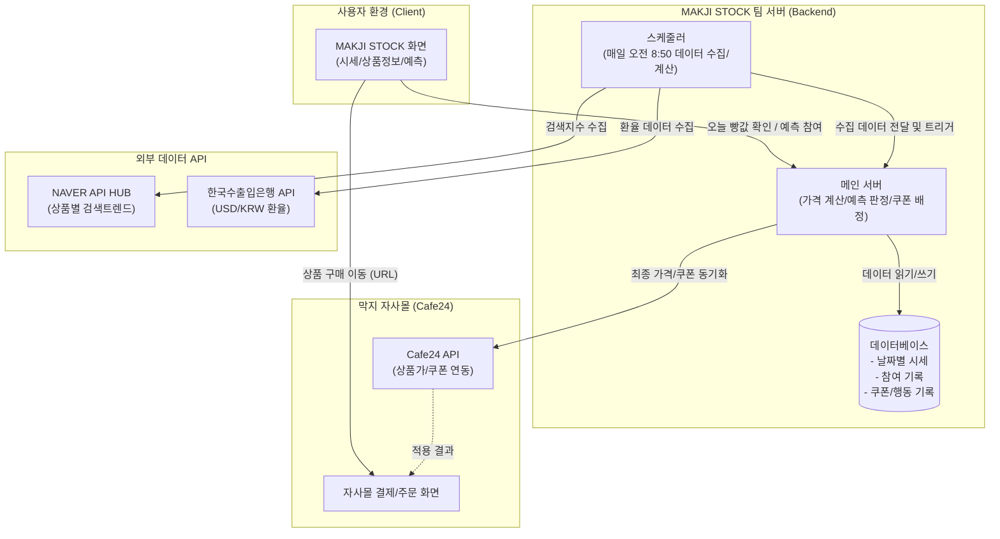

# MAKJI STOCK 시스템 아키텍처

기획안 '7-2. 시스템 구성안'을 바탕으로 시각화한 서비스 아키텍처 및 데이터 흐름도입니다.

### 💡 주요 아키텍처 설계 포인트
1. **스케줄러 선제 처리**: 오전 9시 트래픽 스파이크에 대비해 스케줄러가 외부 API 연동 및 복잡한 가격 계산 로직을 사전에 수행하고 DB에 캐싱합니다.
2. **독립적인 서버 운용**: 자사몰(Cafe24)에 부하를 주지 않고 참여 및 가격 계산은 '팀 서버'에서 100% 독립 처리하며, 결과값만 Cafe24 API로 연동(Sync)합니다.
3. **간결한 유입 동선**: 사용자는 별도의 가입 없이 MAKJI STOCK에서 확인하고, 실제 결제 시퀀스만 자사몰로 위임하여 결제 전환율을 방어합니다.
