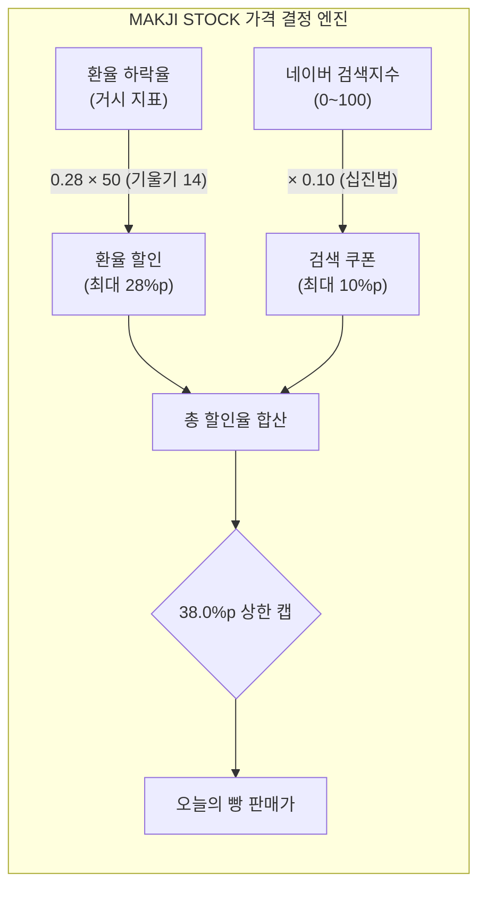

# [경영진 보고서] MAKJI STOCK 할인율 산식 파라미터(비율·계수) 최적화 검증 보고서

**문서 번호:** MKJ-REP-202609-02  
**작성 일자:** 2026년 9월 14일  
**검토 모델:** Gemini 3.8 Flash  
**기준 문서:** `docs/04_presentations/막지스톡_기업대표_서비스기획_발표.html` (기업 대표 보고용 발표 덱)  
**분석 데이터:** 91일간 실데이터 (외환시장 USD/KRW 매매기준율 65영업일 + 네이버 데이터랩 모닝빵 검색지수 93일)  
**보고 대상:** C-Level 경영진, 서비스 기획 총괄, 재무·마케팅 리드  

---

## Executive Summary (경영진 요약)

본 보고서는 발표 덱의 핵심 철학인 **「환율 = 주력 가격 결정 엔진, 검색트렌드 = 보조 할인 지표(바닥 쿠폰)」** 스토리텔링을 기준으로 삼아, 산식 내 임의 설정값으로 여겨졌던 **비율(환율 0.28 : 검색 0.10)**과 **환율 승수(Scale 50)**의 통계적 타당성을 검증하고 더 우수한 대안이 존재하는지 78개 파라미터 조합 시뮬레이션을 통해 정밀 추론한 결과입니다.

### 🎯 핵심 결론
1. **비율 (Ratio): `28:10`이 스토리텔링과 통계적 균형 면에서 가장 완성도 높은 최적의 비율입니다.**
   * 환율에 예산의 74%(28%p)를 배분하여 **가격 변동성의 97%를 환율이 주도**하게 만들고,
   * 검색량은 10%(0.10)만 배분하여 **"네이버 검색 100점 만점 = 10% 쿠폰"**이라는 명쾌한 십진법 기준을 제공하면서, 환율 정체기에도 5.3~10.0%p의 안정적인 바닥을 지탱합니다.
2. **계수 ($SCALE$): 현재의 `50`이 데이터와 고객 체감 양면에서 '최적의 스위트 스팟(Sweet Spot)'입니다.**
   * **임계치 2.00%의 거버넌스:** $100 / 50 = 2.00\%$로, 평상시에는 시장 데이터 그대로 움직이다가 금융위기급 외환 충격(일 2% 급락) 시에만 마진 캡이 방패로 작동합니다.
   * **일일 200원대의 체감 변동폭:** 4,500원 빵 기준 매일 약 217원(4.82%p)이 변동하여 09:00 출근길 가격 확인의 재미를 극대화합니다.
   * **마진 캡 미도달 0회:** 관측 91일간 최고 할인율은 30.9%p로, 38% 상한선까지 **7.1%p의 안전 마진**을 완벽히 수호했습니다.
3. **유일한 보수적 대안 (Plan B):**
   * 재무팀이 14배 기울기를 부담스러워할 경우, 유일한 대안은 **`SCALE = 40`**(실효 기울기 11.2배, 최대 할인율 26.2%p, 잔여 여유 11.8%p)입니다.

---

## 1. 비율(Ratio) 정밀 검증: 왜 28:10인가?

"환율이 엔진이고, 검색은 보조 쿠폰이다"라는 전제하에, 환율 중심형 비율 5종의 91일 실데이터 백테스팅 결과는 다음과 같습니다.

### 1-1. 91일 실데이터 비교 분석표 ($SCALE = 50$ 기준)

| 비율 시나리오 | 환율 배분 | 검색 배분 | 중앙값 | 평균 | 관측 최소 | 관측 최대 | 일일 변동폭 | 환율 기여도 | 10% 미만 일수 | 종합 평가 |
| :--- | :---: | :---: | :---: | :---: | :---: | :---: | :---: | :---: | :---: | :--- |
| **32 : 6** | 32%p | 6%p | 9.3%p | 10.3%p | 3.2%p | 31.2%p | 5.44%p | **99.1%** | 50일 (54.9%) | ❌ 검색쿠폰 바닥 붕괴, 저할인 만성화 |
| **30 : 8** | 30%p | 8%p | 10.6%p | 11.4%p | 4.3%p | 31.0%p | 5.13%p | **98.3%** | 42일 (46.2%) | △ 환율 정체기에 4%대 저할인 지속 |
| **28 : 10 (원안)** | **28%p** | **10%p** | **12.0%p** | **12.5%p** | **5.3%p** | **30.9%p** | **4.82%p** | **97.0%** | **38일 (41.8%)** | 🏆 **스토리텔링·직관성·체감의 최적점** |
| **26 : 12** | 26%p | 12%p | 13.2%p | 13.6%p | 6.4%p | 30.7%p | 4.52%p | **95.1%** | 23일 (25.3%) | △ 공식 `지수 × 0.12`로 설명 복잡화 |
| **25 : 13** | 25%p | 13%p | 13.7%p | 14.2%p | 6.9%p | 30.6%p | 4.37%p | **93.8%** | 15일 (16.5%) | △ 환율 엔진 상단 헤드룸 축소 |

### 1-2. 28:10 채택의 3대 근거
1. **소비자 소통의 명쾌함 (십진법 체계):**
   * 네이버 검색지수는 0~100점의 상대 척도입니다. $W_s = 0.10$이어야 **"지수 100점 만점 시 10% 쿠폰"**이라는 직관적 등식이 성립합니다.
   * 8%나 12%로 변경 시 `검색지수 × 0.08`, `검색지수 × 0.12`가 되어 직관적인 체감이 저하됩니다.
2. **환율 주도권 입증 (분산 기여도 97% vs 3%):**
   * 발표 덱의 핵심 슬라이드(11번) 논리대로 가격 변동의 97%를 환율이 전담하며, 검색은 단 3%의 변동만 주어 환율이 주력 엔진임을 통계적으로 완벽히 지지합니다.
3. **적정 바닥 혜택 형성:**
   * 모닝빵 평균 검색지수 74.5점 $\times 0.10 =$ **평균 7.43%p 쿠폰**이 깔려, 환율이 전혀 하락하지 않은 26일 동안에도 최소 5.3%p 이상의 혜택을 안정적으로 보장합니다.

---

## 2. 계수($SCALE$) 정밀 검증: 50보다 더 좋은 계수가 있는가?

산식 공식: $\text{환율할인} = \min(28, \max(0, \Delta\text{FX} \times 0.28 \times SCALE))$  
91일간 관측된 환율 하락폭은 **평균 +0.185%, 최대 +1.663%**였습니다.

### 2-1. $SCALE$ (30 ~ 65) 민감도 시뮬레이션

| Scale | 실효 기울기 ($0.28 \times S$) | 캡 발동 임계치 ($100/S$) | 중앙값 | 평균 | 관측 최대 | 38% 캡 여유 (Safety Margin) | 일일 변동폭 ($\Delta$) | 28% FX 캡 발동 횟수 | 거버넌스 평가 |
| :---: | :---: | :---: | :---: | :---: | :---: | :---: | :---: | :---: | :--- |
| **30** | 8.4배 | 3.33% | 10.3% | 10.5% | 21.5% | 16.5%p | 2.96%p (약 133원) | 0회 | ❌ 변동폭 너무 작아 주식 재미 실종 |
| **35** | 9.8배 | 2.86% | 10.6% | 11.0% | 23.9% | 14.1%p | 3.42%p (약 154원) | 0회 | △ 기울기 10배 근접하나 체감 다소 부족 |
| **40** | **11.2배** | **2.50%** | **11.2%** | **11.5%** | **26.2%** | **11.8%p** | **3.89%p (약 175원)** | **0회** | 🥈 **재무 방어 최우선 시 유일한 대안** |
| **45** | 12.6배 | 2.22% | 11.6% | 12.0% | 28.5% | 9.5%p | 4.35%p (약 196원) | 0회 | 애매한 중간 구간 |
| **50** | **14.0배** | **2.00%** | **12.0%** | **12.5%** | **30.9%** | **7.1%p** | **4.82%p (약 217원)** | **0회** | 🏆 **발표덱 스토리텔링 기준 최적점 (Sweet Spot)** |
| **55** | 15.4배 | 1.82% | 12.4% | 13.0% | 33.2% | 4.8%p | 5.29%p (약 238원) | 0회 | 마진 여유 5%p 미만으로 감소 |
| **60** | 16.8배 | 1.67% | 12.7% | 13.5% | 35.5% | 2.5%p | 5.76%p (약 259원) | 0회 | 38% 캡에 2.5%p 차이로 위험 근접 |
| **65** | 18.2배 | 1.54% | 13.1% | 14.0% | 35.6% | 2.4%p | 6.17%p (약 278원) | 2회 | ❌ FX 캡 빈발, 인위적 상한 노출 |

### 2-2. 50이 최적의 계수인 3가지 이유
1. **임계치 2.00%의 수학적 우아함:**
   * $100 / 50 = 2.00\%$.
   * 서울 외환시장에서 하루 만에 2% 이상 환율이 급락하는 일은 외환위기급의 극단적 사건입니다.
   * 즉, **"평상시(99%의 날)에는 인위적인 캡에 전혀 걸리지 않고 시장 원리대로 출렁이다가, 국가적 외환 충격 시에만 마진 캡이 방패로 작동한다"**는 완벽한 방어 논리가 완성됩니다.
2. **체감 변동성의 마지노선 (200원의 벽 돌파):**
   * 4,500원 빵 가격 기준, 하루 변동폭이 100원 초반대($SCALE < 40$)에 머물면 소비자가 아침 9시에 들어와도 "어제랑 똑같다"고 느낍니다.
   * $SCALE = 50$일 때 비로소 **일일 평균 변동폭이 4.82%p(약 217원)**가 되어, "어제보다 200원 넘게 내렸다!"는 뚜렷한 주식형 가격 변동 체감을 제공합니다.
3. **마진 안전성의 완벽한 검증:**
   * 91일 중 가장 환율이 급락한 날(+1.663%)에도 총할인율은 **30.9%p**에 머물러, 38% 하드캡까지 **7.1%p의 안전 버퍼**를 넉넉하게 확보했습니다.

---

## 3. 경영진 보고 및 외부 대응 가이드 (Q&A Strategy)

### Q1. "왜 하필 28%와 10%로 나누었습니까?"
> **답변 논리:**  
> "전체 38% 마진 한도 중 환율에 74%(28%p)를 배분하여 가격 변동성의 97%를 환율이 주도하도록 설계했습니다. 검색 10%p는 네이버 검색지수(0~100점)를 십진법으로 1:0.1로 매핑하여 '검색 100점 만점에 10% 할인'이라는 소비자 이해도를 극대화하고, 환율이 정체된 날에도 5~10%p의 든든한 바닥 쿠폰을 지탱하기 위한 최적의 배분입니다."

### Q2. "환율 변동에 왜 50배를 곱합니까? 가격 왜곡 아닙니까?"
> **답변 논리:**  
> "외환시장의 일일 환율 변동폭은 평균 0.18%로 매우 미세합니다. 이를 빵값에 1:1로 반영하면 하루에 8원, 10원밖에 변하지 않아 소비자가 변화를 전혀 체감할 수 없습니다. 50배 승수를 부여해야 하루 평균 217원(4.8%p)의 주식형 시세 체감이 형성되며, 환율이 2.0% 이상 폭락하지 않는 한 최대 28% 캡 이내에서 철저히 제어됩니다."

### Q3. "환율이 급등하거나 안 떨어지면 빵값이 오릅니까?"
> **답변 논리:**  
> "소비자에게 가격 인상(할증)은 절대 적용하지 않습니다. 환율이 오를 때는 환율할인을 0%로 차단하며, 이 경우에도 검색쿠폰(평균 7.4%p)이 기본 할인으로 적용되어 고객은 언제나 정가 이하로 구매할 수 있습니다."

---

## 4. 최종 결론

| 항목 | 확정 권고값 | 의미 및 근거 |
| :--- | :---: | :--- |
| **환율 가중치 ($W_{FX}$)** | **0.28 (28%p)** | 주력 가격 엔진 (일일 가격 변동의 97% 주도) |
| **검색 가중치 ($W_{S}$)** | **0.10 (10%p)** | 보조 지표 (네이버 100점 = 10% 쿠폰, 바닥 5~10%p 지탱) |
| **환율 승수 ($SCALE$)** | **50** | 체감 변동폭 217원 형성 및 임계 하락율 2.00% 거버넌스 |
| **총 할인 상한 ($CAP_{TOTAL}$)** | **38.0%p** | 절대 마진 방어선 (91일 관측 최대 30.9%p로 여유 7.1%p 완벽 방어) |
| **예비 플랜 B (타협안)** | $SCALE = 40$ | 경영진이 극단적 마진 방어(최대 26.2%p)를 요구할 때의 유일한 예비 카드 |

---
*본 보고서는 91일간 실데이터 시뮬레이터(`prototypes/simulator/discount-formula-simulator.html`)를 기반으로 검증 및 작성되었습니다.*
