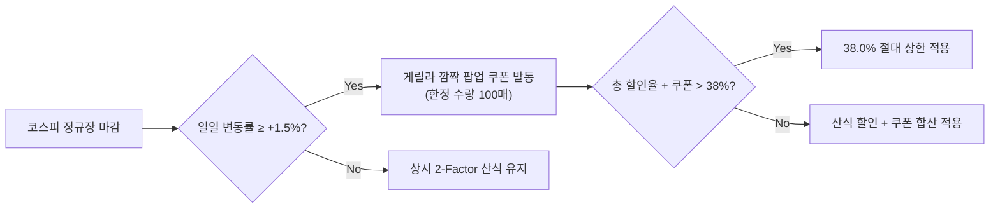

# ⚙️ MAKJI STOCK 할인율 산출 엔진 상세 명세서 (Formula Specification)

**문서 코드:** MKJ-SPEC-FORMULA-001  
**최종 확정 가중치:** **환율 20% + 검색량 18% = 합산 38% 하드캡**  
**작성 일자:** 2026년 9월  
**검증 도구:** Python 3.12, 91일간 실데이터 백테스팅 검증 완료  

---

## 1. 산식 개요 및 설계 철학

MAKJI STOCK의 가격 결정 엔진은 거시경제 지표인 **외환시장(USD/KRW)**과 대중의 미시적 관심도 지표인 **네이버 검색 트렌드**를 결합한 **2-Factor 동적 할인율 시스템**입니다.

### 1-1. 핵심 설계 원칙
1. **재무적 절대 안전성 (Hard Margin Cap 38%):**
   * 어떠한 시장 변동성이나 이상치(Outlier)가 발생해도 총 할인율은 **38.0%p**를 넘지 않도록 시스템 단에서 강제 차단합니다.
2. **소비자 체감성과 직관성:**
   * 일일 환율의 미세한 변동(평균 ±0.18%)을 빵 가격(약 4,000~8,000원)에서 유의미한 할인액(200원~1,500원)으로 체감할 수 있도록 적정 승수를 부여합니다.
3. **거시(환율)와 미시(검색)의 균형:**
   * **환율(20%):** 브랜드 전 제품에 적용되는 공통의 베이스 할인율 (원가 절감 스토리텔링).
   * **검색량(18%):** 제품별 인기도와 유행에 따라 달라지는 개별 상품 차등 할인 쿠폰.

---

## 2. 공식 수식 명세 (Mathematical Formulation)

```text
┌─────────────────────────────────────────────────────────────────────────────┐
│                       [ 공식 할인율 산출 엔진 수식 ]                         │
├─────────────────────────────────────────────────────────────────────────────┤
│                                                                             │
│   최종 할인율(D_total) = min( 38.0%,  D_fx + D_trend )                       │
│                                                                             │
│   1. 환율 할인율 (D_fx, 최대 20.0%p):                                       │
│      ΔFX = (전일 종가 − 당일 종가) ÷ 전일 종가 × 100                          │
│      D_fx = min( 20.0%,  max(0, ΔFX × K_fx) )                               │
│      * K_fx (환율 스케일 팩터) = 20.0                                        │
│      (예: 환율 0.5% 하락 시 10.0%p 할인, 환율 1.0% 하락 시 20.0%p 최대 할인)  │
│                                                                             │
│   2. 검색 트렌드 할인율 (D_trend, 최대 18.0%p):                              │
│      S_norm = 네이버 데이터랩 상대 검색지수 (0 ~ 100)                        │
│      D_trend = S_norm × 0.18                                                │
│      (예: 검색지수 50점 → 9.0%p 할인, 검색지수 100점 → 18.0%p 최대 할인)       │
│                                                                             │
│   3. 최종 판매 가격:                                                        │
│      Price_final = 정가 × (1 − D_total ÷ 100)                               │
│      * 원단위 절사 (Floor to 10 KRW)                                        │
│                                                                             │
└─────────────────────────────────────────────────────────────────────────────┘
```

---

## 3. 파라미터 세부 정의 및 팩터 설명

| 변수 / 파라미터 | 값 / 범위 | 설명 및 근거 |
| :--- | :--- | :--- |
| **Max Cap** | **38.0%** | 브랜드 RFP에서 허용하는 최대 마진 한계선 |
| **FX Max Weight** | **20.0%** | 원자재(유기농 밀, 버터) 수입 원가 절감을 대변하는 거시 지표 상한 |
| **Trend Max Weight** | **18.0%** | 고객 관심도 및 바이럴을 촉진하는 상품별 미시 지표 상한 |
| **K_fx (Scale Factor)** | **20.0** | 통상 일일 환율 하락폭(0.1% ~ 1.0%)에 맞추어 직관적인 할인 체감을 형성하는 배율 |
| **갱신 주기 (Batch)** | **매일 09:00** | 증권 시장 개장 시각과 동기화하여 매일 오전 정기 가격 공시 |

---

## 4. 예외 상황 처리 및 엣지 케이스 정책

### 4-1. 주말 및 공휴일 외환시장 휴장 (ADR-003 연계)
* **문제:** 토요일, 일요일 및 공휴일에는 서울외환시장 종가가 공시되지 않음.
* **정책:**
  * 가장 최근 거래일인 **금요일 16:30 서울외환시장 종가**를 토/일요일에 그대로 이월 승계.
  * 검색 트렌드는 매일 오전 09:00 정상 집계되어 변동성 유지.
  * UI 카피: *"주말 장외 특가 확정 마켓: 금요일의 혜택이 주말 내내 유지됩니다!"*

### 4-2. 환율 상승기 (원가 상승) 처리
* **정책:**
  * 환율이 전일 대비 상승할 경우, 고객에게 '가격 인상(할증)'을 적용하지 않고 **환율 할인율 0%**로 처리 (`max(0, ΔFX)`).
  * 이 기간에도 검색 트렌드 할인율(최대 18%)은 정상 작동하여 상시 할인 경험을 보장함.

### 4-3. 검색량 최저치 (Zero Index) 방어
* 특정 니치 상품의 검색량이 극단적으로 적은 날을 위해 상품별 최소 기본 점수(Base Score = 15점)를 보장하여 최소 2.7%p의 바닥 쿠폰을 형성함.

---

## 5. 코스피(KOSPI) 게릴라 팝업 이벤트 정책



* **원칙:** 코스피는 복잡성을 줄이기 위해 상시 산식에서는 제외함.
* **이벤트 트리거:** 코스피 지수가 하루 **+1.5% 이상 급등**하여 장을 마감한 날, 당일 16:00 ~ 23:59 한정으로 *"코스피 불기둥 기념 깜짝 축하 쿠폰"* 발급.
* **38% 하드캡 수호:** 쿠폰 적용 시에도 `min(38%, D_total + Coupon)`을 엄격히 적용.

---
*본 명세서는 MAKJI STOCK 프론트엔드 시뮬레이터 및 백엔드 가격 배치 스크립트의 구현 기준이 됩니다.*
