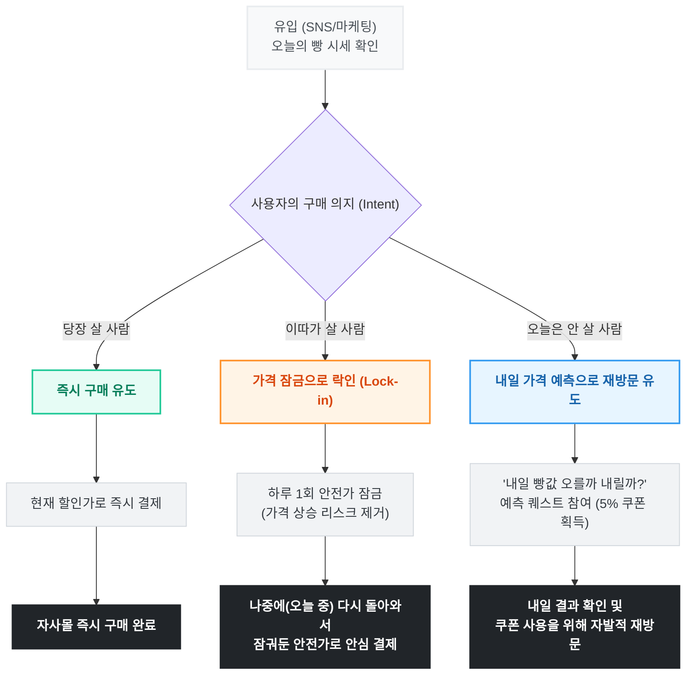

# MAKJI STOCK MVP 사용자 흐름 (User Flow)

> **막지스톡 MVP 핵심 의도:** 방문한 유저의 구매 의지(Intent)에 따라 맞춤형 혜택을 제공하여 '즉시 구매', '이탈 방지(가격 잠금)', '재방문 유도(가격 예측)'를 달성합니다.

```mermaid
flowchart TD
    %% 스타일 정의
    classDef step fill:#f8f9fa,stroke:#e9ecef,stroke-width:2px,color:#495057;
    classDef intent1 fill:#e6fcf5,stroke:#20c997,stroke-width:2px,color:#087f5b,font-weight:bold;
    classDef intent2 fill:#fff4e6,stroke:#ff922b,stroke-width:2px,color:#d9480f,font-weight:bold;
    classDef intent3 fill:#e7f5ff,stroke:#339af0,stroke-width:2px,color:#1864ab,font-weight:bold;
    classDef result fill:#f1f3f5,stroke:#ced4da,stroke-width:1px,color:#343a40;
    classDef final fill:#212529,stroke:#212529,stroke-width:2px,color:#ffffff,font-weight:bold;

    A["유입 (SNS/마케팅)<br>오늘의 빵 시세 확인"]:::step

    A --> B{"사용자의 구매 의지 (Intent)"}

    B -->|당장 살 사람| C1["즉시 구매 유도"]:::intent1
    B -->|이따가 살 사람| C2["가격 잠금으로 락인 (Lock-in)"]:::intent2
    B -->|오늘은 안 살 사람| C3["내일 가격 예측으로 재방문 유도"]:::intent3

    C1 --> D1["현재 할인가로 즉시 결제"]:::result
    C2 --> D2["하루 1회 안전가 잠금<br>(가격 상승 리스크 제거)"]:::result
    C3 --> D3["'내일 빵값 오를까 내릴까?'<br>예측 퀘스트 참여 (5% 쿠폰 획득)"]:::result

    D1 --> E1["자사몰 즉시 구매 완료"]:::final
    D2 --> E2["나중에(오늘 중) 다시 돌아와서<br>잠궈둔 안전가로 안심 결제"]:::final
    D3 --> E3["내일 결과 확인 및<br>쿠폰 사용을 위해 자발적 재방문"]:::final
```
