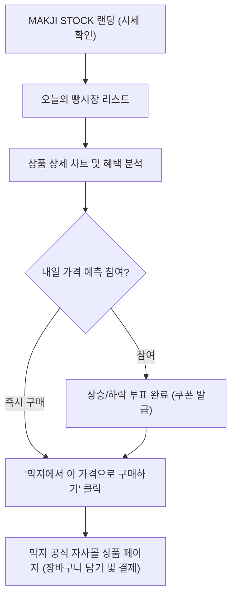

# 📱 MAKJI STOCK 제품 요구사항 정의서 (PRD)

**프로젝트명:** MAKJI STOCK (막지스톡)  
**버전:** v2.0  
**상태:** 승인 완료 (Accepted)  
**최근 갱신:** 2026년 9월  

---

## 1. 제품 개요 (Product Overview)

MAKJI STOCK은 프리미엄 웰니스 베이커리 '막지(MAKJI)'의 마케팅 및 이커머스 유입을 견인하는 **인터랙티브 시세 연동 마이크로 서비스**입니다.  
고객에게 매일 달라지는 베이커리 시세와 주식형 차트를 제공하여 능동적인 가격 탐색과 구매 동기를 부여하며, 최종 구매는 막지 공식몰에서 매끄럽게 이루어지도록 설계되었습니다.

---

## 2. 공식 10종 상품 및 검색 키워드 매핑 (Product Lineup)

| No | 상품명 | 정가(원) | 웰니스 분류 | 연동 검색 키워드 | 특성 및 소구점 |
| :---: | :--- | :---: | :---: | :---: | :--- |
| 1 | **소금빵** | 3,800 | 비건 / 저염 | `소금빵` | 프랑스 게랑드 소금, 부드러운 천연 발효 |
| 2 | **단팥빵** | 4,200 | 저당 / 통팥 | `단팥빵` | 국내산 100% 팥, 대체당 사용으로 칼로리 40% 절감 |
| 3 | **크루아상** | 4,500 | 프리미엄 버터 | `크루아상` | AOP 프랑스 이즈니 버터, 72겹 결 |
| 4 | **바게트** | 4,800 | 유기농 통밀 | `바게트` | 100% 프랑스 유기농 밀가루, 저온 숙성 |
| 5 | **베이글** | 4,000 | 고단백 / 무설탕 | `베이글` | 끓는 물에 데쳐 쫄깃한 뉴욕식 웰니스 베이글 |
| 6 | **치아바타** | 4,600 | 엑스트라버진 올리브 | `치아바타` | 이탈리아 유기농 올리브 오일 풍미, 소화가 편한 빵 |
| 7 | **식빵** | 5,500 | 무첨가 / 쌀식빵 | `식빵` | 글루텐 최소화, 국내산 쌀가루 블렌딩 |
| 8 | **스콘** | 4,300 | 저탄수 / 글루텐프리 | `스콘` | 아몬드 가루 베이스, 혈당 스파이크 방지 |
| 9 | **휘낭시에** | 3,500 | 헤이즐넛 버터 | `휘낭시에` | 태운 버터의 깊은 풍미, 한입 웰니스 디저트 |
| 10 | **포카치아** | 5,200 | 로즈마리 & 방울토마토 | `포카치아` | 지중해 식단 기반, 신선한 허브와 토마토 토핑 |

---

## 3. 핵심 사용자 경험 및 화면 기능 요구사항

### 3-1. 메인 시세 전광판 (Ticker & Ticker Board)
* **기능:** 상단에 전일 대비 환율 변동, 오늘의 종합 빵 지수(MAKJI-10 Index)를 주식 전광판처럼 티커로 롤링.
* **표시 항목:** 품목명, 정가, 오늘 할인가, 총 할인율(%), 환율 기여도, 검색량 트렌드 기여도.

### 3-2. 인터랙티브 캔들 차트 (Price History)
* **기능:** 선택한 상품의 최근 7일 ~ 30일간의 가격 변동 추이를 봉차트(Candle) 및 라인 차트로 시각화.
* **지표 설명:** 마우스 호버/터치 시 해당 일자의 환율 하락폭과 검색지수를 말풍선 툴팁으로 제공.

### 3-3. 자사몰 아웃링크 전환 (Frictionless Outlink)
* **기능:** 상품 카드마다 **"막지에서 오늘 가격으로 구매하기 ↗"** CTA 버튼 배치.
* **파라미터 전달:** 자사몰 이동 시 할인 코드 및 추천 경로 트래킹 파라미터(`?ref=makji_stock&item_id=101&discount=28`)를 전달하여 자사몰 장바구니에 해당 할인 즉시 적용.

### 3-4. 내일 가격 예측 퀘스트 (Prediction Gamification)
* **기능:** "내일 오전 9시, 이 빵의 가격은 오를까요, 내릴까요?" 1초 원클릭 투표.
* **리워드:** 투표 참여 시 막지 자사몰에서 사용 가능한 1,000원 적립금 또는 무료 배송 쿠폰 번호 즉시 증정.

---

## 4. 비기능 요구사항 (Non-Functional Requirements)

1. **모바일 퍼스트 반응형 웹 (Responsive Web):**
   * 주 유입 경로가 모바일 SNS(인스타그램, 카카오톡)이므로 모바일 뷰포트(375px ~ 430px)에 최적화.
2. **초고속 로딩 성능:**
   * 정적 HTML/JS 기반 단일 페이지 아키텍처(SPA)로 제작하여 로딩 속도 1초 미만 달성.
3. **독립성 및 보안:**
   * MAKJI STOCK은 회원 DB 및 결제 모듈을 직접 보유하지 않으며, 전적인 결제 처리는 막지 공식 자사몰의 인증 체계에 위임.
