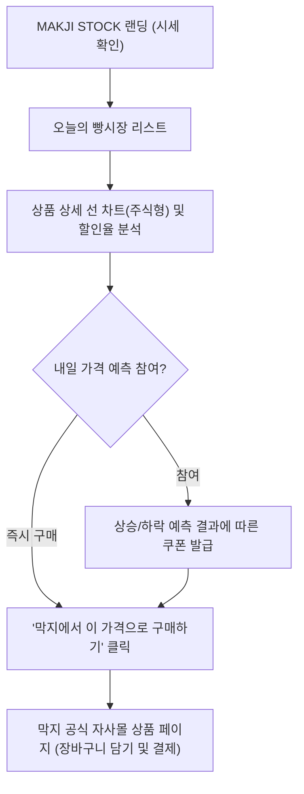

# 📱 MAKJI STOCK 제품 요구사항 정의서 (PRD)

**프로젝트명:** MAKJI STOCK (막지스톡)  
**버전:** v2.1 (진행 중)  
**상태:** 업데이트 중  

---

## 1. 제품 개요 (Product Overview)

MAKJI STOCK은 프리미엄 웰니스 베이커리 '막지(MAKJI)'의 마케팅 및 이커머스 유입을 견인하는 **인터랙티브 시세 연동 마이크로 서비스**입니다.  
고객에게 매일 달라지는 베이커리 시세와 주식형 차트를 제공하여 능동적인 가격 탐색과 구매 동기를 부여하며, 최종 구매는 막지 공식몰에서 매끄럽게 이루어지도록 설계되었습니다.

---

## 2. 공식 상품 및 검색 키워드 매핑 (Product Lineup)

*(새로운 상품 라인업 재작성 예정으로 현재 비워둠)*

---

## 3. 핵심 사용자 경험 및 화면 기능 요구사항

### 3-1. 메인 시세 전광판 (Ticker & Ticker Board)
* **기능:** 상단에 각 우리 제품들의 **할인율**을 주식 전광판처럼 티커로 롤링 (환율 변동 표시 아님).
* **표시 항목:** 품목명, 정가, 오늘 할인가, 총 할인율(%).

### 3-2. 선 그래프 주식 차트 (Line Chart)
* **기능:** 선택한 상품의 가격 변동 추이를 캔들 차트가 아닌 주식 차트 스타일의 **선 그래프(Line Graph)**로 시각화.
* **참조 기준:** 현재 배포된 데모 사이트 레이아웃 기준 (https://makji-stock.vercel.app/market).

### 3-3. 자사몰 아웃링크 전환 (Frictionless Outlink)
* **기능:** 상품 카드마다 **"막지에서 오늘 가격으로 구매하기 ↗"** CTA 버튼 배치.
* **파라미터 전달:** 자사몰 이동 시 트래킹 파라미터를 전달하여 할인 즉시 적용.

### 3-4. 내일 가격 예측 퀘스트 (Prediction Gamification)
* **기능:** "내일 이 빵의 가격은 오를까요, 내릴까요?" 투표 참여 인터랙션.
* **리워드 정책:**
  * **예측 실패 시:** 0% 쿠폰 발급
  * **예측 성공 시:** 최대 ?% 쿠폰 발급 (추가 할인 쿠폰)
  * **쿠폰 적용 방식:** 기존 할인가에 더해지는 '더하기 쿠폰'이 될 수도 있고, 할인된 최종 금액에 한 번 더 비율 할인이 들어가는 '곱셈 쿠폰'이 될 수도 있음 (추후 확정 예정).

---

## 4. 비기능 요구사항 (Non-Functional Requirements)

1. **모바일 퍼스트 반응형 웹 (Responsive Web):**
   * 주 유입 경로가 모바일 SNS이므로 모바일 뷰포트 최적화.
2. **초고속 로딩 성능:**
   * 로딩 속도 1초 미만 달성.
3. **독립성 및 보안:**
   * 전적인 결제 처리는 막지 공식 자사몰의 인증 체계에 위임.
