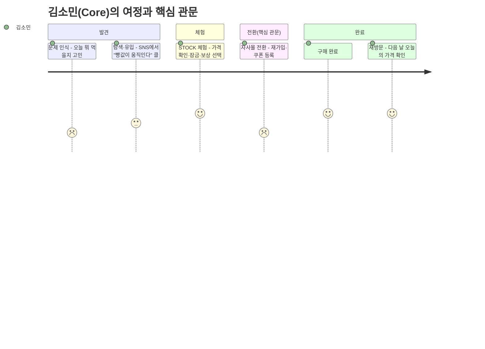
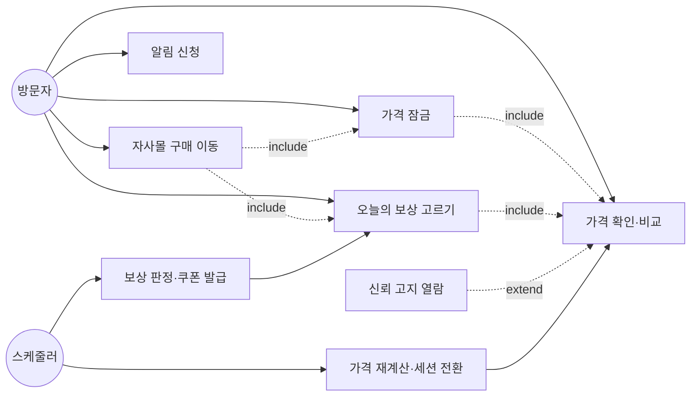
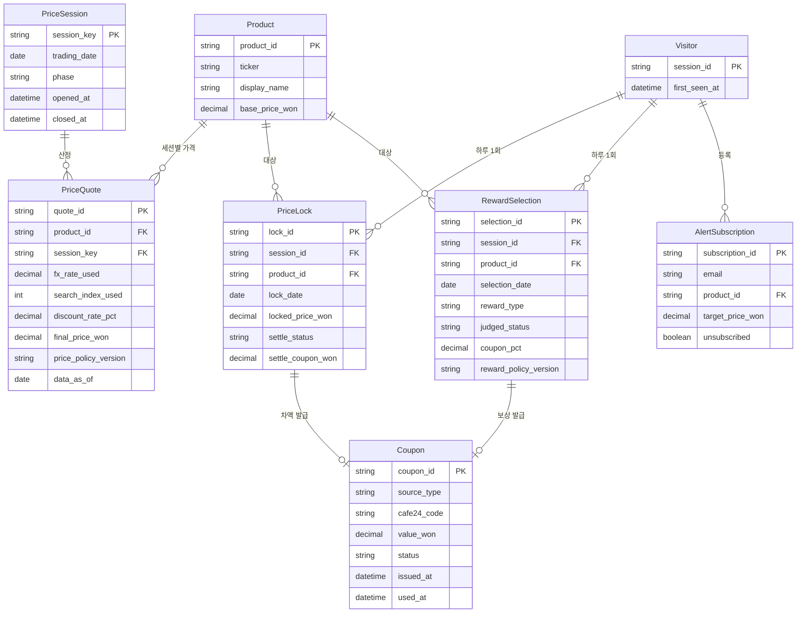
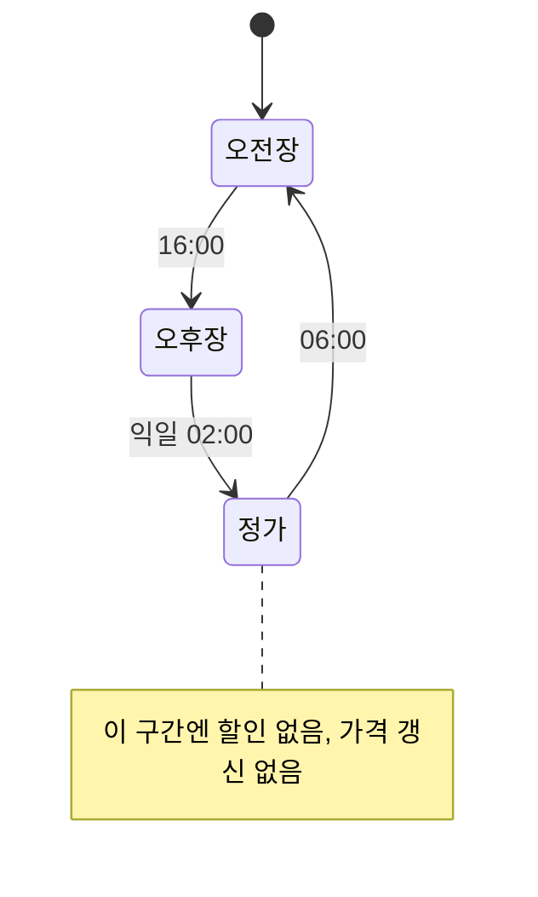
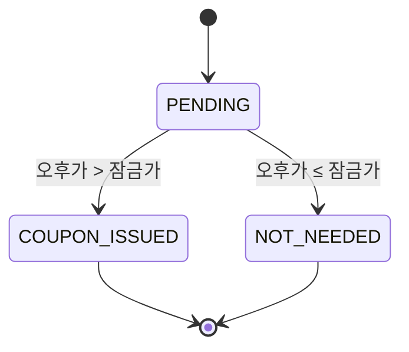
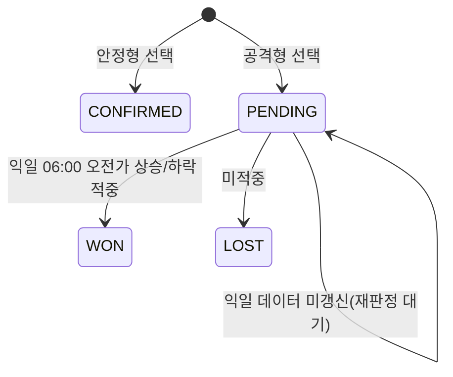

# [MAKJI STOCK 빵값 게이미피케이션 D2C 확장 제안] v1.0
- Owner 팀: 막지(MAKJI) 프로덕트팀
- 최종 업데이트: 2026-09-23
- 변경 이력:
  - v1.0 최초 작성 — `docs/06_market_analysis/01~08`(Five Forces~가치제안서 VPS), `docs/00_rfp/RFP_ANALYSIS.md`, `docs/03_product_spec/PRD_MAKJI_STOCK_SERVICE.md`(v1.1), `makji-personal/docs/`의 최신 정책 메모를 하나의 CardFit식 PRD 골격으로 재구성

> 출처: `docs/06_market_analysis/01~08_*.md`(시장분석 시리즈), `docs/00_rfp/RFP_ANALYSIS.md`, `docs/03_product_spec/PRD_MAKJI_STOCK_SERVICE.md` v1.1, `makji-personal/docs/가격-잠금-1회-사유.md`·`매수가-기준-예측-제외-사유.md`·`기획-정리-2026-09-23-할인상한과-상품옵션.md`
> **문서 성격 고지**: 이 문서는 기업 RFP(`docs/00_rfp/RFP_ANALYSIS.md`)에 대응해 작성 중인 실제 서비스 제안이며, 포트폴리오용 역기획이 아니다. 다만 서비스가 아직 출시 전이라 사용자 행동 지표는 대부분 **미측정**이고, 가격 산식·보상 범위 일부는 두 소스(온보딩 화면 vs 2026-09-23 정책 메모)가 서로 다른 수치를 제시해 **Proposed(승인 대기)** 로 표시한다. 확정 전 수치를 최종안처럼 인용하지 말 것 — 상세는 7장 계산 정책·22장(舊 PRD 오픈 이슈)을 따른다.

## 문서 요약

MAKJI STOCK은 프리미엄 웰니스 베이커리 막지(MAKJI)가 운영하는 게이미피케이션 시세 랜딩이다. 원/달러 환율과 네이버 검색량을 반영해 하루 두 번(오전장 06:00·오후장 16:00) 빵값을 다시 매기고, 사용자는 오전장에 한해 상품 1개의 가격을 하루 1회 잠글 수 있으며, 매일 안정형(즉시 확정 쿠폰) 또는 공격형(익일 오전가 적중형 쿠폰) 중 하나를 고른다. 실제 결제는 MAKJI STOCK이 아니라 별도 운영되는 막지 자사몰(`makji.kr`, 카페24)에서만 이뤄진다.

이 PRD는 `docs/06_market_analysis/`에 이미 수행한 8단계 시장분석(Five Forces→가치제안서)을 근거 삼아 제품 목표·사용자 요구를 정의한다. 후속 SRS는 이미 존재하는 `SRS_BREAD_MARKET_MVP.md`(Bread Market 부분)를 기준선으로 삼고, 이 PRD가 새로 정의하는 가격 잠금·보상 선택·신뢰 고지 기능만 확장 SRS로 구체화한다.

### 목차

1. 개요·목표
2. 사용자와 페르소나
3. 사용자 스토리와 수용 기준
4. 기능 요구사항
5. 비기능 요구사항
6. 데이터·인터페이스 개요
7. 범위·리스크·ADR·가정·의존성
8. 실험·롤아웃·측정
9. 근거
10. PRD 최종 품질검토
11. 결론 및 제품 인사이트
12. 출처

---

## 1. 개요·목표

### 문제 정의 (Pain 지표 포함)

| # | Pain | 실패 KPI(수치화) | 측정 경로 | 연결된 Needs |
| :---: | --- | --- | --- | --- |
| P1 | STOCK에서 가격 확인·잠금·쿠폰 획득까지 마쳐도, 결제는 별도 채널(자사몰)에서만 가능해 그 자리에서 전환되지 않는다 | **AOS 4.0 / DOS 3.6 — 시장분석06이 채점한 9개 Pain 중 전체 1위(BEST CASE)**. 실제 STOCK→자사몰 전환율은 서비스 미출시로 **미측정** | 시장분석06 AOS·DOS 채점(정성, 05 CJM 근거) → 출시 후 E1 베이스라인 실험(8장)에서 최초 실측 | N1 매끄러운 결제 연속성 |
| P2 | "빵값이 오르내린다"는 컨셉 자체가 사행성처럼 느껴져 잠재 고객이 진입 자체를 거부한다 | 벤치마크 경쟁사 5곳(런던베이글뮤지엄·노티드·성심당·SPC·CJ더마켓) 중 가격 변동을 신뢰·재미 요소로 쓰는 곳 **0/5 = 0%**(시장분석08 1절). 동시에 **AOS 4.0 / DOS 3.4 — 공동 1위**(시장분석06 N1) | 시장분석01·08 경쟁사 실측 + 시장분석06 AOS·DOS. RFP 자체가 발주 단계부터 "사행성·공격적 주식 용어 표기 금지" 조항을 명시(`RFP_ANALYSIS.md` 3장) | N2 즉각적인 안심 근거 |
| P3 | 프리미엄 베이커리 특유의 화제성이 짧게 소진되고, STOCK의 재미 요소가 습관으로 굳기 전에 이탈할 위험이 있다 | 런던베이글뮤지엄 최근 매출 둔화, 노티드 매장 급확장 후 고객 이탈 등 업계 사례(정성, 시장분석01 5절). 인접 Pain C2·C4 **AOS 2.4~1.6**(시장분석06) | 시장분석01 업계 실측 기사 + 시장분석06 AOS 채점 | N3 지속 가능한 콘텐츠 재생산 리듬 |
| P4 | 원/달러 환율 상승이 원가와 STOCK의 할인폭을 동시에 악화시키는 이중 노출 구조라, 마진 방어와 소비자 혜택이 구조적으로 충돌한다 | 2026년 삼립 등 식품업계가 원부자재 부담으로 빵값 평균 **9% 인상**(시장분석01 1절). 舊 91일 백테스트 기준 가격 변동성 기여도는 **환율 97% / 검색 3%**(PRD v1.1 10장, 3구간 모델 재검증 전 잠정치) | 시장분석01 원부자재 뉴스 인용 + PRD 10장 백테스트(舊 모델) | N4 마진 방어 자동화(38% 하드캡) |

**Needs (실패 KPI 대비 목표 임계치)**

| Needs | 목표 임계치 | 현재 상태(기준선) |
| --- | --- | --- |
| N1 매끄러운 결제 연속성 | STOCK→자사몰 전환 시 **재입력 스텝 0개**(원클릭 지향) | 미측정 — 현재 설계는 "쿠폰번호 복사→자사몰 로그인→직접 등록"의 수동 연동(시장분석02) |
| N2 즉각적인 안심 근거 | 최초 진입 화면(문제 인식~탐색 단계)에서 "투자가 아니다" **인지율 ≥ 90%**(CardFit US-C AC8과 동일 측정 방식 차용) | 0% — 현재 온보딩 안심 문구는 탐색 이후 단계에 위치(시장분석07 N1 근거) |
| N3 지속 가능한 콘텐츠 재생산 리듬 | 연속 재방문율이 화제성 소진 곡선보다 완만하게 유지 | 미측정 — 출시 전 |
| N4 마진 방어 자동화 | 38%(또는 재정의될 원 단위 캡) 상한 **위반 0건** | 0건(舊 모델 91일 백테스트 기준, 3구간 모델 재검증 필요 — PRD 10장) |

### 목표 (Desired Outcome 수치화)

| 목표 | 수치화된 정의 |
| --- | --- |
| G1 결제 전환 마찰을 없앤다 | STOCK→자사몰 전환 시 재입력 스텝 **0개**, 잠금·보상 코드는 자사몰에서 자동 인식(F-05) |
| G2 사행성이 아님을 먼저 증명한다 | 온보딩 최초 화면에서 "정가보다 비싸지는 일은 없다" 고지 **노출률 100%**, 사행성 연상 문구 **0건**(GR2) |
| G3 화제성을 습관으로 전환한다 | 연속 방문·연속 잠금에 대한 보상 설계(F-09, 2차)로 재방문율 저하 곡선을 완만화 |
| G4 마진 상한을 자동으로 지킨다 | 총혜택 상한(38% 또는 재정의 값) 위반 **0건**, 위반 시 신규 가격 공개·구매 연결 즉시 중단(PRD 11장) |
| G5 위험 성향에 맞는 선택권을 준다 | 안정형·공격형 2択을 매일 노출하고, 선택 없이 결과가 강제되는 케이스 **0건** |
| G6 잠금은 항상 사용자에게 유리한 쪽으로 정산한다 | 오후가가 잠금가보다 높으면 차액 쿠폰, 낮으면 오후가 적용 — 사용자가 잠금으로 손해 보는 케이스 **0건**(FR-LOCK02) |

### 성공 지표 (북극성 KPI / 보조 KPI)

**북극성 KPI**

| 지표 | 정의(분자/분모) | 기준선 | 목표값 | 측정 경로 | 측정 주기 |
| --- | --- | :---: | :---: | --- | :---: |
| **STOCK→자사몰 전환율** | 자사몰 구매 완료(쿠폰 등록+결제)까지 도달한 세션 수 ÷ STOCK에서 가격 잠금 또는 보상 선택을 완료한 세션 수 | 서비스 미출시 — **미측정**, E1 베이스라인 실험에서 최초 확보(8장) | E1 확보 후 확정(Proposed 없음 — 근거 없이 숫자를 만들지 않음) | STOCK 이벤트 로그(`lock_completed`/`reward_selected`) × 자사몰 주문 로그(쿠폰 사용 시점) 대조 | 주간 |

**보조 KPI**

| 계열 | 지표 | 정의(분자/분모) | 기준선 | 목표값 | 측정 경로 | 주기 |
| :---: | --- | --- | :---: | :---: | --- | :---: |
| 전환 | 자사몰 구매 이동률 | 자사몰 구매 버튼 클릭 수 ÷ 방문자 수 | 미측정 | 베타 1주차 실측으로 확정 | `store_redirect_clicked` 이벤트 | 주간 |
| 리텐션 | MAKJI STOCK 익일 재방문율 | 특정 날짜 방문자 중 다음 날 재방문한 인원 ÷ 해당일 방문자 | 미측정 | 베타 1주차 실측으로 확정 | 방문 로그(익명 세션) | 일간 |
| 잠금 | 가격 잠금 사용률 | 잠금 버튼 클릭(성공) 수 ÷ 오전장 방문자 수 | 미측정 | 베타 실측으로 확정 | `lock_completed` 이벤트 | 일간 |
| 보상 | 안정형·공격형 선택 비율 | 각 선택 수 ÷ 전체 보상 선택 수 | 미측정 | 기준선 측정(목표 없음 — 분포 관찰용) | `reward_selected(type)` 이벤트 | 주간 |
| 전환 | 쿠폰 사용률 | 자사몰에서 실사용된 쿠폰 수 ÷ 배정된 쿠폰 수 | 미측정 | 베타 실측으로 확정 | Cafe24 쿠폰 사용 로그 | 주간 |
| 알림 | 알림 신청률 / 클릭률 | 알림 신청자 수 ÷ 방문자 / 발송 메일 중 클릭 수 ÷ 발송 수 | 미측정 | 베타 실측으로 확정 | `alert_subscribed`, 이메일 클릭 트래킹 | 주간 |
| 신뢰 | 안심 고지 열람률 | "투자가 아닙니다" 배지·근거 패널을 1회 이상 연 인원 ÷ 온보딩 진입 인원 | 미측정 | ≥ 50%(CardFit 근거 열람률 목표를 유사 구조로 차용) | `trust_badge_opened` 이벤트 | 주간 |

**Guardrail (하나라도 초과 시 롤아웃 즉시 중단)**

| # | 지표 | 임계 | 이유 |
| :---: | --- | :---: | --- |
| GR1 | 총혜택 상한(38% 또는 재정의 값) 위반 | 0건 | RFP 절대 조건("38%p 하드캡") — 위반은 곧 계약 위반(PRD 11장 즉시 차단 기준) |
| GR2 | 사행성·공격적 주식 용어 노출 | 0건 | RFP 법적 제약(`RFP_ANALYSIS.md` 3장 C4) — 위반 시 금융 규제 리스크 |
| GR3 | 표시가격·자사몰 결제가격 불일치 | 0건 | PRD 12장 핵심 리스크 — 신뢰·법적 위험 직결 |
| GR4 | 가격 계산 오류율 | ≤ 0.1% | 규칙 엔진은 결정론적 — 오류는 곧 버그(CardFit GR1과 동일 논리) |
| GR5 | 환율·검색지수 데이터 최신성 경고 미표시 | 0%(PRD 11장 세부 임계치: 7일 초과 시 경고, 30일 초과 시 계산 대상 제외) | 오래된 데이터로 계산된 가격을 "오늘 가격"으로 오인시키지 않기 위함 |
| GR6 | 잠금·보상 쿠폰 중복 적용 | 0건 | 한 주문에 두 쿠폰을 함께 쓰면 총혜택 상한을 넘을 수 있음(FR-LOCK04) |

### 차별 가치 (Differential Value)

기존 대안(경쟁사 5곳, 시장분석08) 대비 MAKJI STOCK의 차별화 지점을 정리한다. CardFit처럼 "판단 소요시간 48배 단축" 같은 하드 넘버 비교는 이 도메인 특성상(체험형 D2C, 초기 단계) 성립하지 않으므로, 시장분석08이 확인한 **"경쟁사 5곳 중 누구도 하지 않는 것"** 기준으로 비교한다.

| 축 | 기존 대안(경쟁사 5곳) | MAKJI STOCK | 검증 근거 |
| --- | :---: | :---: | --- |
| 가격을 콘텐츠로 쓰는가 | **0/5** — 전부 공간·캐릭터·나눔·성분·편의로 어필 | 가격 변동 자체가 매일의 재방문 트리거(F-01) | 시장분석08 1절 경쟁사 가치 선언 브리핑 |
| 가격 산정 근거를 공개하는가 | 공개 안 함(결과 가격만 노출) | "왜 이 가격인지" 신뢰 배지 공개 예정(F-06, 산식 자체는 비노출) | 시장분석01 "가격 로직 공개가 오히려 신뢰 요소" |
| 리워드를 위험 성향별로 고르게 하는가 | 전부 고정형 적립·혜택 | 안정형/공격형 2択(F-04) | 시장분석05 이도현(Extreme) 페르소나, 시장분석08 2절③ |
| 사행성 오인 방어 장치가 있는가 | 해당 없음(가격이 안 움직이므로 이슈 자체가 없음) | "정가보다 비싸지는 일은 없다" 명시 고지(F-06) | 시장분석06 N1(BEST CASE 공동 1위), RFP 법적 제약 |

> **전제조건(Hygiene Factor)과 차별적 가치는 다르다**: "STOCK→자사몰 매끄러운 전환"(P1)은 네 번째 차별점이 아니라, CJ더마켓이 이미 업계 표준으로 만들어 놓은 **전제조건**이다(시장분석08 2절 각주). 위 표의 세 가치는 이 전제조건이 해결된 뒤에야 의미가 생긴다 — 3장 US-E가 최우선순위인 이유다.

---

## 2. 사용자와 페르소나

CardFit처럼 12명을 생성해 4명으로 필터링하는 과정 대신, 시장분석05가 이미 SOM(시장분석04, 2535세대·온라인 D2C)에서 직접 도출한 4개 대표 페르소나를 그대로 쓴다.

### 페르소나 스펙트럼 (4명, 4계층)

| 유형 | 인물 | 특징 | Pain | Goal | 서비스 대응 |
| --- | --- | --- | --- | --- | --- |
| 핵심(Core) | 김소민(28), 마케팅 직장인 | 헬시플레저 계정 다수 팔로우, 재테크 앱도 습관적으로 확인 | 개념 신뢰 부족(C2), 자사몰 전환 마찰(C3), 재방문 습관화 실패 위험(C4) | 맛있으면서 부담 없는 간식을 재미있게 고르고 싶다 | F-01, F-03, F-04, F-05, F-06 |
| 확장(Adjacent) | 박현주(35), 육아 병행 프리랜서 | 헬시플레저 관심도는 Core만큼 높지만 매일 앱 켤 시간이 없음 | 매일 확인할 시간 부족(A1), 저관여 구독 경로 부재(A2) | 믿을 만한 곳에서 정기적으로, 고민 없이 사고 싶다 | F-07(알림), F-09(2차, 스트릭 대신 저관여 경로 확장 후보) |
| 극단(Extreme) | 이도현(27), 코인·주식 앱 헤비유저 | "장이 열린다"는 컨셉에 과몰입, 공격형 쿠폰 획득 자체를 게임처럼 반복 | 예측·쿠폰 획득이 목적이라 실구매로 안 이어짐(E2, 사업 리스크형 Pain) | 이기는 재미(예측 성공) 자체가 목적, 빵 구매는 부차적 | F-04(공격형) — 단, 리텐션 지표와 구매전환 지표는 분리 측정 필요(시장분석05·06) |
| 비활성(Non-user) | 정은숙(42), 보수적 소비 성향 | 프리미엄 베이커리엔 관심 있으나 "가격이 오르내린다"는 컨셉에 거부감 | 사행성 오인으로 진입 자체를 거부(N1, BEST CASE 공동 1위) | 명확한 정가에 안심하고 사고 싶다 | F-06(신뢰 고지) — 최우선 대응 |

**선정 근거**: Core·Adjacent는 시장분석04 Market Segment Map 1·2사분면(핵심 타겟·확장 타겟)을 인물화한 것이고, Extreme·Non-user는 시장분석01이 이미 지적한 리스크(구매자 교섭력의 극단, KSF#4의 근거)를 인물로 구체화한 것이다 — 임의로 만든 캐릭터가 아니다(시장분석05).

### 2.1 페르소나별 "빵값이 주식처럼 움직인다"는 은유와의 실제 관계

이 서비스가 파는 핵심 장치는 빵이 아니라 **"주식처럼 움직이는 가격"이라는 은유**다. 그런데 이 은유가 통하는 정도는 각 인물이 실제 주식·투자와 맺고 있는 관계에 따라 정반대로 갈린다 — 위 스펙트럼표의 "특징" 칸에 흩어져 있던 이 축을 별도로 꺼내어 정리한다.

| 인물 | 실제 주식·투자와의 관계 | "빵값이 주식처럼 움직인다"가 이 사람에게 작동하는 방식 | 제품 시사점 |
| --- | --- | --- | --- |
| 김소민(Core) | 토스증권 등 재테크 앱을 습관적으로 확인 — 가볍게 투자에 익숙한 편 | 은유가 즉시 이해된다 — "오전장·오후장"·"장이 열린다" 같은 표현이 낯설지 않아 학습 비용 없이 재미로 받아들여짐 | Core에게는 설명을 길게 풀 필요 없다 — 이미 아는 문법이므로 온보딩을 짧게 압축 |
| 박현주(Adjacent) | 투자 앱과 무관 — 헬시플레저 관심은 높지만 주식 문법 자체에 노출이 없는 소비자 | 은유 자체가 의미도 재미도 아니다 — "장이 열린다"는 표현이 그냥 "배워야 할 규칙 하나"로 소비되어 무심하게 지나침 | 이 세그먼트엔 은유를 설명하려 하지 말고, 은유를 몰라도 쓸 수 있는 저관여 경로(F-07 알림)로 우회 |
| 이도현(Extreme) | 코인·주식 앱 헤비유저 — 실제 투자 행위 자체에 몰입도가 높음 | 은유가 과하게 잘 통한다 — 빵이 목적이 아니라 "장이 열리고 예측이 맞았는지"를 확인하는 행위 자체가 실제 투자 습관의 연장으로 소비됨(시장분석06 E2, DOS 음수) | 은유의 성공이 오히려 사업 리스크가 되는 사례 — 리텐션(은유 몰입)과 구매전환(빵 판매) 지표를 반드시 분리 측정해야 하는 근거가 여기서 나온다 |
| 정은숙(Non-user) | 투자 자체에 반감 또는 무관심(보수적 소비 성향) | 은유가 위협으로 작동한다 — "가격이 오르내린다"는 말이 재미가 아니라 "이거 도박 아니야?"라는 경계심을 즉시 유발(N1, 시장분석06 BEST CASE 공동 1위) | 이 세그먼트에겐 은유를 설명하기 전에 "이건 투자가 아니다"부터 증명해야 한다(F-06) — 온보딩 진입 순서 자체를 바꿔야 하는 근거 |

**패턴**: 같은 은유 하나가 네 갈래로 갈린다 — 이미 아는 문법이라 편한 사람(Core), 몰라도 상관없는 사람(Adjacent), 은유에 잡아먹혀 정작 빵(구매)을 잊는 사람(Extreme), 은유 자체를 위협으로 읽는 사람(Non-user). 이 서비스가 실제로 파는 것은 "빵"이 아니라 "가격이 움직인다는 감각"이며, 그 감각의 수용도는 고객이 평소 주식·투자와 맺고 있는 실제 관계를 그대로 투영한다 — 이것이 이 페르소나 분석의 핵심 발견이고, 4장 F-06(신뢰 고지)·8장 E6(보상 분포 관찰)이 이 발견에서 직접 도출된 대응이다.

### 고객 여정 — 김소민(Core) 기준, 6단계

**핵심 관문**: "④자사몰 전환"이 이 여정의 유일한 매출 실현 지점이다(가구시장의 '실측', 자동차시장의 '시승'과 동일한 성격 — 시장분석05). 이 단계를 통과하지 못하면 앞의 모든 관심이 매출로 연결되지 않는다.

**다른 3유형이 이 여정에서 갈라지는 지점**

| 인물 | 단절 지점 | 원인 | 대응 |
| --- | :---: | --- | --- |
| 박현주(Adjacent) | ③STOCK 체험 | 매일 능동적으로 켜서 확인하는 흐름 자체와 안 맞음 | 🔶 F-07 저관여 알림으로 우회 |
| 이도현(Extreme) | ③STOCK 체험에서 정체 | ④전환으로 잘 안 넘어가는 게 이 페르소나의 정의 자체 | 📊 리텐션·구매전환 지표 분리 측정만 — 강제 전환 유도는 하지 않음 |
| 정은숙(Non-user) | ②탐색·유입 | "빵값이 움직인다"는 문구 자체에서 이탈 | ✅ F-06 신뢰 고지를 이 단계 이전에 노출 |

> 가장 취약한 전환점은 ②탐색(신뢰 부족)과 ④전환(마찰) 두 곳이다. 이 PRD 3~4장의 최우선 순위(F-05, F-06)가 정확히 이 두 지점을 겨냥한다.

---

## 3. 사용자 스토리와 수용 기준(AC, Acceptance Criteria)

### Use Case 개요

### US-A (우선순위 1) — 오전장·오후장 가격 확인

**Story**: As a 매일 달라지는 빵값이 궁금한 사용자(김소민), I want 오전장·오후장 가격과 전일 대비 변화를 빠르게 확인하기, so that 오늘 살지 다음 장을 기다릴지 판단할 수 있다.

- **AC1**: Given 오전장(06:00~15:59)에 방문한 사용자가, When Bread Market 화면에 진입하면, Then 전일 종가 기준 오전가·오늘 최종 할인율·전일 대비 변화가 표시되고 현재 세션 상태가 "오전장"으로 표기된다(FR-BM01, FR-BM07).
- **AC2**: Given 오후장(16:00~다음 날 01:59)에 방문한 사용자가, When 화면에 진입하면, Then 당일 시가 기준으로 재계산된 오후가가 표시되고 세션 상태는 "오후장"으로 표기된다(FR-BM07).
- **AC3 (실패 케이스)**: Given 정가 구간(02:00~05:59)에 방문한 사용자가, When 화면에 진입하면, Then 할인이 해제된 정가만 표시되며 "지금은 장이 쉬는 시간, 06:00에 다시 열립니다" 같은 안내가 함께 노출된다(FR-BM07).
- **AC4 (실패 케이스)**: Given 환율 또는 검색지수 API가 응답하지 않아 최신 데이터를 확보하지 못한 경우, When 가격을 계산하려 하면, Then 마지막 확정 데이터를 이월하되 "최근 확인된 데이터 기준" 경고와 데이터 기준일을 함께 표시한다(GR5, PRD 11장).
- **AC5**: Given 사용자가 상품 상세로 진입하면, When 할인 구성을 확인하면, Then 환율 기반 기본 할인 → 검색수요 추가 할인의 2단계로 표시되며 산식·데이터 출처는 노출하지 않는다(FR-PD01, [[feedback_user_facing_copy]]).

### US-B (우선순위 1) — 가격 잠금

**Story**: As a 마음에 드는 빵이 있지만 오후에 가격이 오를까 불안한 사용자(김소민), I want 오전가를 하루 1회 잠그기, so that 오후에 가격이 올라도 손해 보지 않는다.

- **AC1**: Given 오전장에 방문했고 오늘 아직 잠금을 쓰지 않은 사용자가, When 상품 1개의 "가격 잠금"을 누르면, Then 그 시점의 오전가가 보장가로 기록되고 하루 1회·상품 1개 제한이 즉시 소진 처리된다(FR-LOCK01).
- **AC2 (실패 케이스)**: Given 이미 오늘 잠금을 사용한 사용자가, When 다른 상품에 잠금을 다시 시도하면, Then 잠금 버튼은 비활성화되고 "오늘 잠금은 이미 사용했어요" 안내가 표시된다(FR-LOCK01, 중복 잠금 0건).
- **AC3 (실패 케이스)**: Given 오후장·정가 구간에 있는 사용자가, When Bread Market 화면을 보면, Then 잠금 버튼 자체가 노출되지 않는다(FR-LOCK01).
- **AC4**: Given 잠금을 완료한 사용자에 대해, When 16:00 오후가가 공개되고 오후가가 보장가보다 **높으면**, Then 차액만큼 정액 쿠폰이 자동 발급된다(FR-LOCK02).
- **AC5**: Given 잠금을 완료한 사용자에 대해, When 오후가가 보장가보다 **낮으면**, Then 잠금 쿠폰을 발급하지 않고 오후가로 구매하도록 안내한다 — 잠금으로 인해 사용자가 손해를 보는 케이스는 0건이다(FR-LOCK02, G6).
- **AC6 (실패 케이스)**: Given 잠금 쿠폰과 US-C의 보상 쿠폰을 모두 보유한 사용자가, When 자사몰에서 한 주문에 결제를 시도하면, Then 시스템은 두 쿠폰 중 더 큰 혜택 하나만 적용 가능하도록 안내하고 동시 적용은 차단한다(FR-LOCK04, GR6).

### US-C (우선순위 1) — 오늘의 보상 고르기

**Story**: As a 오늘 바로 혜택을 받을지, 내일을 걸고 더 큰 혜택에 도전할지 고민하는 사용자(김소민·이도현), I want 안정형 또는 공격형 중 하나를 매일 선택하기, so that 내 위험 성향에 맞는 방식으로 쿠폰을 받는다.

- **AC1**: Given 하루 한 번, 상품 1개에 대해, When 사용자가 안정형을 선택하면, Then 판정 없이 즉시 쿠폰이 확정 지급된다(FR-RW01, FR-RW02).
- **AC2**: Given 사용자가 공격형을 선택하면, When 선택 시점이 오전장이든 오후장이든, Then 판정은 항상 **다음 날 06:00 오전가 공개 시점**을 기준으로 통일된다 — 오늘 16:00 오후가로 판정하지 않는다(FR-RW03).
- **AC3 (실패 케이스)**: Given 이미 오늘 보상을 선택한 사용자가, When 다른 선택을 다시 시도하면, Then 재선택은 거부되고 오늘의 선택 내역만 표시된다(하루 1회 제한).
- **AC4 (실패 케이스)**: Given 공격형을 선택했으나 익일 06:00 가격 데이터가 미갱신된 경우, When 판정을 시도하면, Then 자동으로 실패 처리하지 않고 데이터 확보 후 재판정하는 `PENDING` 상태로 유지한다(CardFit AC4~AC5 패턴 차용).
- **AC5**: Given 안정형·공격형의 정확한 % 범위는 두 후보(온보딩 10~15%/5~20% vs 09-23 정책메모 10~14%/15~18%)로 **미확정**인 상태이므로, When 이 화면을 구현하면, Then 배포 코드는 반드시 `reward_policy_version`을 함께 저장해 추후 값이 바뀌어도 과거 지급 내역을 재현할 수 있어야 한다(FR-RW04, CardFit D5/`scenario_policy_version` 패턴 차용).
- **AC6 (실패 케이스)**: Given 보상은 익명 세션 기준으로만 참여를 기록하고, When Cafe24 실결제 금액을 검증한 "매수가 기준" 추가 보너스를 요청받으면, Then 1차 출시에서는 해당 기능을 제공하지 않는다 — Cafe24 주문 연동 없이는 실결제 여부·단가를 서버가 확정할 수 없기 때문이다(FR-RW05, `매수가-기준-예측-제외-사유.md`).

### US-D (우선순위 1) — 사행성 오인 방지(신뢰 고지)

**Story**: As a "가격이 오르내린다"는 말에 거부감이 드는 잠재 고객(정은숙), I want 이게 투자가 아니라는 근거를 먼저 보기, so that 도박처럼 보이는 것에 대한 불안 없이 안심하고 둘러볼 수 있다.

- **AC1**: Given 신규 방문자가, When 온보딩 또는 첫 화면에 진입하면, Then "정가보다 비싸지는 일은 없습니다" 같은 안심 고지가 **탐색 단계 이전**에 노출된다(N2, 시장분석07 JTBD-N1 — 현재는 이 고지가 탐색 이후에 위치해 있어 순서 자체를 바꿔야 함을 명시).
- **AC2**: Given 가격 화면에서 "왜 이 가격인지" 신뢰 배지를 클릭하면, When 근거 패널이 열리면, Then 산식·계산 과정은 노출하지 않되 "환율이 내려서 -70원, 많이 찾아봐서 -330원" 같은 계산 결과 요약은 표시한다([[feedback_user_facing_copy]], F-06).
- **AC3 (실패 케이스)**: Given 어떤 화면 문구든, When 사행성·투자·수익 연상 표현("대박", "완판 행진", "수익률" 등)이 포함되면, Then 배포 전 금지어 자동 스캐너가 이를 탐지해 차단한다(GR2, CardFit GR4 패턴 차용).
- **AC4**: Given 온보딩을 마친 사용자에게, When 사용자 인지도를 측정하면, Then "이건 투자가 아니다"에 대한 인지율이 **≥ 90%**로 확인되어야 한다(N2 목표, CardFit US-C AC8 차용).

### US-E (우선순위 1, 최고 리스크) — STOCK→자사몰 전환

**Story**: As a STOCK에서 잠금·쿠폰까지 다 받은 사용자(김소민), I want 추가 가입 절차 없이 방금 본 가격 그대로 결제하기, so that 관심이 식기 전에 구매를 완료할 수 있다.

- **AC1**: Given 잠금 또는 보상 쿠폰을 보유한 사용자가, When "막지에서 구매하기"를 누르면, Then 선택 상품·최종가격·`makji.kr` 도메인이 재확인 화면에 표시된 뒤 자사몰로 이동한다(FR-PD02).
- **AC2 (실패 케이스)**: Given 자사몰 미가입 사용자가 쿠폰을 사용하려는 경우, When 결제를 시도하면, Then 회원가입·로그인 후에만 쿠폰 등록이 가능하다는 것을 자사몰 이동 **이전**에 안내한다(FR-LOCK03, 시장분석05 CJM "어, 여기서 또 가입해야 돼?" 이탈 지점 대응).
- **AC3 (실패 케이스)**: Given 쿠폰 번호를 복사하지 않고 자사몰로 이동한 사용자가, When 자사몰에서 쿠폰을 찾지 못하면, Then STOCK으로 돌아가 번호를 다시 확인할 수 있는 경로가 항상 제공된다(전환 이탈 완화).
- **AC4**: Given 이 전환 경로 개선은 이 PRD의 최우선 과제(P1, KSF#1)이므로, When 향후 로드맵을 수립하면, Then 소셜 로그인·쿠폰 자동 인식 등 "재입력 스텝 0개"를 향한 개선안을 Should 등급 이상으로 최우선 배치한다(4장 F-05).

### US-F (우선순위 3) — 가격 하락·지정가 알림

**Story**: As a 매일 앱을 켜서 확인할 시간이 없는 사용자(박현주), I want 관심 상품이 내려가면 이메일로 알려주기, so that 매일 들어오지 않아도 좋은 시점을 놓치지 않는다.

- **AC1**: Given 로그인 기능이 없으므로, When 사용자가 관심 상품과 희망 가격을 등록하면, Then 이메일 주소만으로 등록되며 모든 발송 메일에 수신거부 링크가 포함된다(FR-EV03).
- **AC2**: Given 가격 갱신 배치가 완료된 직후, When 등록 상품이 전일 대비 하락하거나 지정가 이하로 떨어지면, Then 알림이 발송된다(FR-EV04).
- **AC3 (실패 케이스)**: Given 동일 상품·동일 알림 조건에 대해, When 조건이 하루에 여러 번 충족되더라도, Then 발송은 **하루 1회**로 제한된다(FR-EV04, 중복 발송 0건).

---

## 4. 기능 요구사항(Functional)

**MoSCoW 우선순위·근거·의존성** — 상세 화면별 세부 요구사항(FR-H*, FR-BM*, FR-PD*, FR-LOCK*, FR-RW*, FR-EV*)은 `PRD_MAKJI_STOCK_SERVICE.md` 8장에 정의돼 있다. 아래는 그 기능들을 CardFit 스타일의 기능 단위(F-*)로 묶어 우선순위를 매긴 표다.

| ID | 기능 | 대응 FR | MoSCoW | 우선순위 근거(대안 대비 가치) | 의존성 |
| :---: | --- | --- | :---: | --- | --- |
| **F-01** | 오전장·오후장 가격 확인(세션 상태 표시 포함) | FR-H01~03, FR-BM01~07 | **Must** | 경쟁사 0/5가 가격 변동을 콘텐츠로 쓰지 않음(P2) — 유일한 차별화 축의 기반 | 환율·검색량 데이터 API |
| **F-02** | 상품 상세·할인 구성 공개 | FR-PD01~02 | **Must** | 사용자가 "정가 대비 얼마나 싼지"를 판단하는 최소 단위 | F-01 |
| **F-03** | 가격 잠금(오전장 1회) | FR-LOCK01~04 | **Must** | 재방문·구매 의향 확보 장치(`가격-잠금-1회-사유.md`) | F-01 |
| **F-04** | 오늘의 보상 고르기(안정형/공격형) | FR-RW01~05 | **Must** | 위험 성향별 선택형 리워드 — 경쟁사 5곳 모두 고정형(시장분석08 2절③) | F-01 |
| **F-05** | STOCK→자사몰 전환(원클릭 지향) | FR-PD02, FR-LOCK03 | **Must** | P1(전체 1위 Pain, AOS 4.0/DOS 3.6) 직접 대응 — 유일한 매출 실현 관문 | F-02, F-03/F-04 |
| **F-06** | "투자 아님" 신뢰 고지 + 가격 근거 배지 | (신규, US-D) | **Must** | P2(공동 1위 Pain, AOS 4.0/DOS 3.4) 직접 대응 — 시장 진입 자체의 전제조건 | 없음(문구·UX 자산) |
| **F-07** | 가격 하락·지정가 이메일 알림 | FR-EV03~04 | Should | Adjacent 세그먼트(박현주) 저관여 경로 대응(A1·A2, 시장분석06) | F-01 |
| F-08 | 이벤트 콘텐츠(빵 운세·빵 자르기 게임) | FR-EV01~02 | Could | 부가 재미 요소, 핵심 전환 지표에 직접 기여하지 않음 | 없음 |
| F-09 | 연속 방문·연속 잠금 스트릭 보상 | (VPS F8, 2차) | Could | 재방문 습관화(C4) 대응이나 구체 설계 전 — 1 스프린트 내 확장 가능한 표시 로직 | F-03 |
| F-10 | 화제성 콘텐츠·이벤트 캘린더 운영 | (VPS F9) | Should(운영) | KSF#2(화제성 재생산력) 대응 — 시스템 기능이 아니라 지속 운영 프로세스 | F-08 |
| **F-11** | 38% 하드캡 가드레일 엔진 | PRD 11장 | **Must** | RFP 절대 조건 — 위반 시 계약 위반(GR1) | F-01 |
| F-12 | 사행성 오인 방지 금지어 자동 스캐너 | (신규, US-D AC3) | Should | 구현 난이도 낮음 대비 규제 리스크 차단 효과 큼(CardFit F-12 패턴 차용) | F-06 |
| F-13 | 도감·씰 수집형 콘텐츠 | — | **Won't v1** | [[makji-stock-prototype]] 전제에 따라 명시적 제외(PRD 23장) | 해당 없음 |
| F-14 | 매수가 기준(실결제 검증) 보상 보너스 | — | **Won't v1** | Cafe24 주문 연동 없이는 검증 불가(`매수가-기준-예측-제외-사유.md`) | Cafe24 주문 API 연동(미확보) |

> 핵심 기능은 F-05(STOCK→자사몰 전환)다. F-01~F-04는 이 전환이 성립하기 위한 선행 단계이고, F-06은 진입 자체를 막는 P2를 해소하는 전제조건이다. F-05가 "중요도 최상위이면서 동시에 구현 난이도도 최상위"라는 점(시장분석08 VPS Job-Feature Map)이 이 로드맵의 핵심 리스크다.

---

## 5. 비기능 요구사항(NFR)

- **성능**:
  - 가격 조회·상세 화면은 모바일 4G 기준 **LCP ≤ 2.5초**(`SRS_BREAD_MARKET_MVP.md` 8장과 동일)
  - 오전장(06:00)·오후장(16:00) 가격 재계산 배치는 각 개장 시각 이후 지연 없이 반영(Vercel Hobby 크론 사용 시 최대 02:59까지 정가 리셋이 늦어질 수 있음 — `가격-잠금-1회-사유.md` "남은 위험" 절)
- **신뢰성**:
  - 가격 계산 오류율 **≤ 0.1%**(GR4)
  - 규칙 엔진 결정론성 — 가격 산식·보상 정책 버전(`price_policy_version`, `reward_policy_version`) 변경 시마다 회귀 테스트 재실행
- **보안/개인정보**:
  - MAKJI STOCK은 회원 DB·결제 모듈을 직접 보유하지 않으며, 결제는 자사몰 인증 체계에 위임(PRD 16장)
  - 익명 세션 중심 운영. 이메일 알림 신청 시에만 이메일 주소를 최소 수집하고 목적 외 사용 금지
- **데이터 최신성(GR5 세부 임계치, PRD 11장)**:
  - 환율·검색지수 갱신 지연 **7일 초과** → 최신성 경고 표시 + 운영팀 일간 알림
  - 갱신 지연 **30일 초과** → 해당 계산은 자동 이월 대신 계산 대상에서 제외
- **관측성**: 배치 ID, 데이터 기준일, 가격·보상 정책 버전, 실패 사유, 알림 발송 로그를 남긴다(PRD 16장)

**모니터링 항목**

| 지표 | 발의 | 결정 | 조치 | 탐지 방법 | 알림 지연 SLA |
| :---: | :---: | :---: | --- | --- | :---: |
| GR1 총혜택 상한 위반 | 가격 엔진 | PM | 즉시 가격 공개·구매 연결 중지 | 원시 할인율 vs 상한 비교(PRD 11장 표) | ≤ 15분 |
| GR2 사행성 문구 노출 | 제품 | PM | 즉시 문구 회수 + 금지어 스캐너 패턴 추가 | 금지어 자동 스캐너(전 화면 문구 스캔) | ≤ 24시간 |
| GR3 표시·결제가 불일치 | 가격 엔진 | PM | 구매 연결 중지 | 카페24 실결제가 대조 배치 | ≤ 24시간 |
| GR4 계산 오류율 | 가격 엔진 | PM | 즉시 롤아웃 중단 | 회귀 테스트 자동 집계 | ≤ 15분 |
| GR5 데이터 최신성 | 데이터 운영 | 데이터 운영 | 경고 표시(7일)/계산 대상 제외(30일) | 환율·검색지수 수집 배치 결과 대조 | ≤ 24시간(일간 배치) |
| GR6 쿠폰 중복 적용 | 가격 엔진 | PM | 결제 거부 + 코드 재발급 | 주문 시 코드 개수 검증 | 실시간 |

---

## 6. 데이터·인터페이스 개요

### 핵심 엔터티

> `PriceSession.phase`는 `MORNING`(오전장)·`AFTERNOON`(오후장)·`FLAT`(정가) 중 하나다. `PriceLock.settle_status`는 `PENDING`→`COUPON_ISSUED`(오후가 상승)/`NOT_NEEDED`(오후가 하락, 오후가로 구매)로 전이한다. `RewardSelection.judged_status`는 안정형은 즉시 `CONFIRMED`, 공격형은 `PENDING`→익일 06:00에 `WON`/`LOST`로 전이한다.

| 엔터티 | 주요 필드 | 출처 |
| --- | --- | --- |
| PriceSession | 거래일, 세션 구분(오전/오후/정가), 개장·마감 시각 | 자체 스케줄러 |
| PriceQuote | 적용 환율·검색지수, 할인율, 최종가, 가격 정책 버전, 데이터 기준일 | 가격 엔진 |
| PriceLock | 잠근 가격, 정산 상태, 정산 쿠폰액 | 자체(F-03) |
| RewardSelection | 보상 유형(안정형/공격형), 판정 상태, 쿠폰 %, 보상 정책 버전 | 자체(F-04) |
| Coupon | 발급 출처(잠금/보상), Cafe24 코드, 금액, 사용 여부 | 자체 + Cafe24 |
| AlertSubscription | 이메일, 대상 상품, 희망가, 수신거부 여부 | 사용자(F-07) |

### 외부/내부 API 개요

| 인터페이스 | 입출력·제약 |
| --- | --- |
| NAVER 검색트렌드 API | 상품별 검색 관심도 지수. 갱신 지연 시 GR5 적용 |
| 원/달러 환율 API(한국수출입은행 등) | 오전장은 전일 종가, 오후장은 당일 시가 기준(9장 재검증 필요) |
| `POST /internal/price/recalculate` | 스케줄러가 06:00·16:00에 호출, 세션별 `PriceQuote` 일괄 생성 |
| `POST /lock` | 입력: 세션·상품 / 출력: 잠금 확정 또는 "이미 사용" 거부 |
| `POST /reward/select` | 입력: 세션·상품·보상유형 / 출력: 안정형 즉시 쿠폰 또는 공격형 `PENDING` |
| `POST /internal/reward/judge` | 익일 06:00 스케줄러가 호출, 공격형 판정·쿠폰 발급 |
| Cafe24 Admin API(`Discountcodes`) | 잠금·보상 쿠폰을 실제 할인코드로 발급. 한 주문 1코드 제약 확인됨(`기획-정리-2026-09-23-...md` 1.2절) |

### 상태 전이 — 3개 핵심 객체

---

## 7. 범위(In/Out), 리스크·주요 설계 결정(ADR)·가정·의존성

### 범위

| In | Out |
| --- | --- |
| F-01~F-07, F-10~F-12 (Must·Should 등급 전부) | F-13 도감·씰 수집 콘텐츠 · F-14 매수가 기준 보상 · MAKJI STOCK 내 결제 처리 · 로그인·회원가입 기능(STOCK 자체) · 38%(재정의 값) 초과 이벤트성 할인 |

### 리스크 (7개)

| 축 | 리스크 | 대응 | 상태 |
| --- | --- | --- | :---: |
| 전환 | STOCK→자사몰 수동 연동이 유일한 매출 관문에서 발생(P1, KSF#1) | F-05 최우선 배치, 소셜로그인·쿠폰자동인식 로드맵화 | 관리 중 — 전환율 미측정 |
| 규제 | "가격이 오르내인다"는 표현이 사행성으로 오인될 수 있음(P2, KSF#4) | F-06 신뢰 고지 선(先)배치, F-12 금지어 스캐너, RFP 법무 검토(PRD 12장) | 통제 적용 |
| 데이터 | 환율·검색지수 공식 통합 API 부재 위험 — 수집 실패 시 계산 신뢰도 붕괴 | GR5 최신성 경고·계산 제외 임계치 | 관리 중 |
| 재무 | 환율 상승이 원가와 할인폭을 동시에 악화(P4, 이중 노출) | 38% 하드캡(GR1)으로 마진 최저선 방어 | 통제 적용 |
| 운영 | 베이커리 생산 리듬(F&B)과 개발 배포 리듬(하루 2회 정시 갱신)의 조율 실패 시 장애(시장분석02·03 KSF#5) | 06:00/16:00 배치 모니터링, 지연 시 GR5·운영 알림 | 관리 중 |
| 정책 | 가격 산식 모델·보상 % 범위·MVP 상품 수가 미확정(PRD 22장) | `price_policy_version`/`reward_policy_version`으로 버전 관리, 확정 전 배포 금지 | **미확정 — Owner 승인 대기** |
| 인프라 | Vercel Hobby 크론은 분 단위 정확도가 없어 정가 리셋이 최대 02:59까지 늦어질 수 있음(`가격-잠금-1회-사유.md`) | Pro 플랜 전환 검토 | 관리 중 |

### 주요 설계 결정 (ADR)

| ID | 결정 | 배경/이유 | 상태 |
| :---: | --- | --- | :---: |
| ADR-001 | 가격 계산은 결정론적 규칙 엔진으로 구현하고, 산식·근거는 화면에 노출하지 않는다 | "산식을 알면 조작 가능하다"는 오해와 사행성 오인을 동시에 방지([[feedback_user_facing_copy]]) | 확정 |
| ADR-002 | MAKJI STOCK 내에서는 결제를 처리하지 않고 막지 자사몰에 위임한다 | RFP 요구사항("결제 시스템 분리") — 사행성 오인 시에도 STOCK엔 실제 결제가 없다는 것이 법적 방어선이 됨(시장분석02) | 확정 |
| ADR-003 | 가격 잠금은 오전장에만, 하루 1회, 상품 1개로 제한한다(오후 잠금 없음) | 오후 잠금은 다음 가격(정가)이 항상 더 비싸 "잠금의 불확실성"이 성립하지 않고, 선택지가 늘면 신규 방문자가 이해 부담으로 이탈한다(`가격-잠금-1회-사유.md`) | 확정 |
| ADR-004 | 공격형 예측은 선택 시점과 무관하게 항상 다음 날 06:00 오전가로 통일 판정한다 | 잠금 차액 쿠폰과 예측 적중 쿠폰이 같은 사건("오늘 오후에 오를까")에 동시 발생하면 두 기능의 역할이 흐려진다(`가격-잠금-1회-사유.md`) | 확정 |
| ADR-005 | 매수가(실결제) 기준 보상 보너스는 1차 출시에서 제외한다 | Cafe24 주문 연동 없이는 서버가 실결제 여부·단가를 확정할 수 없다(`매수가-기준-예측-제외-사유.md`) | 확정 |
| ADR-006 | 잠금 코드와 보상 코드는 한 주문에 하나만 적용한다 | Cafe24가 한 주문에 할인코드 1개만 허용 — "더 큰 혜택 하나 적용" 규칙으로 총혜택 상한 초과를 방지(FR-LOCK04) | 확정 |
| ADR-007 | 사용자 화면에는 "예측 성공/실패" 대신 "안정형/공격형" 프레이밍을 쓴다 | 이긴다/진다는 도박 프레이밍보다 위험 성향 선택으로 표현해 사행성 오인을 낮춘다(온보딩 확정안) | 확정 |
| ADR-008 | 가격 산식·보상 % 범위는 버전 필드(`price_policy_version`/`reward_policy_version`)로 관리하고, 값 변경 시에도 과거 계산을 재현 가능하게 보존한다 | 현재 두 소스(온보딩 vs 09-23 정책메모)가 다른 수치를 제시하는 상태라, 값이 바뀔 것을 전제로 설계해야 한다(PRD 22장) | 확정(구조) · 값은 Proposed |

### 제품 전제와 검증 우선순위

| # | 가정 | 검증 우선순위 | 반증되면 무엇이 무너지나 | 검증 |
| :---: | --- | --- | --- | :---: |
| A1 | 가격이 매일 두 번 바뀐다는 사실 자체가 재방문을 유도할 만큼 매력적이다 | 1순위 — 서비스 성립 전제 | 북극성 KPI 전체 | E1 베이스라인 |
| A2 | "투자가 아니다"라는 고지를 먼저 보여주면 Non-user의 진입 거부가 줄어든다 | 1순위 | F-06의 존재 이유(P2 해소) | E2 인터뷰(시장분석07 인터뷰 설계 재사용) |
| A3 | STOCK→자사몰 전환 마찰이 실제 이탈로 이어진다 | 1순위 | P1·KSF#1 전체 | E1 베이스라인, E3 전환율 실측 |
| A4 | 위험 성향별 선택(안정형/공격형)이 실제로 참여를 늘린다 | 2순위 | 차별 가치③ | 보상 선택 분포 실측 |
| A5 | 화제성이 소진되기 전에 재방문이 습관으로 굳는다 | 2순위 | KSF#2, G3 | D+7·D+30 재방문율 코호트 |

### 의존성

- 환율 API(한국수출입은행), NAVER 검색트렌드 API — 외부 단일 채널, 대체 공급자 없음
- Cafe24 Admin API(쿠폰·주문) — 한 주문 1코드 제약 확인됨, 실결제 연동은 미확보(ADR-005)
- 가격·보상 정책 버전 확정 — Owner(기업) 승인 대기(7장 리스크 "정책" 행)
- 스케줄러 인프라 — Vercel 크론 플랜(Hobby vs Pro)에 따라 정가 리셋 정확도가 달라짐

---

## 8. 실험·롤아웃·측정

| 실험 | 검증 질문 | 설계 | 성공 기준 |
| :---: | --- | --- | --- |
| **E1 베이스라인** | STOCK→자사몰 전환 마찰이 실제로 이탈로 이어진다(P1·A3) | 베타 출시 직후 전 사용자 대상 퍼널 로그(`lock_completed`/`reward_selected` → 자사몰 쿠폰 사용) | 전환율 분포 확정 — 이후 모든 목표값의 기준선으로 사용 |
| E2 JTBD 인터뷰 | "투자가 아니다" 고지가 Non-user·Core의 진입 거부·신뢰 부족을 실제로 완화한다(A2) | 시장분석07이 이미 설계한 3그룹 스크리닝(최근 시작 후 이탈자/미인지·거부자/유입 후 무재방문자) + 10개 질문을 그대로 실행 | Push/Pull/Habit/Anxiety 코딩 완료, N1·C2 JTBD 가설 검증/기각 |
| E3 전환율 A/B | 소셜로그인·쿠폰 자동인식이 STOCK→자사몰 전환율을 높인다(A3) | E1 베이스라인 확보 후 대조군/개선군 비교 | 개선군 전환율이 대조군 대비 유의미하게 상승 |
| E4 회귀 | 가격 계산이 세션 경계(06:00/16:00/02:00)에서 정확하다 | 경계값 케이스 ≥ 50건(세션 전환 시각, 비영업일, 데이터 미갱신) | 오류율 ≤ 0.1%(GR4), 재계산 불일치 0건 |
| E5 리텐션 코호트 | 화제성이 소진되기 전에 재방문이 습관화된다(A5) | D+7·D+30 재방문율 코호트 추적 | 화제성 소진 곡선(업계 사례 대비)보다 완만한 하락 |
| E6 보상 분포 관찰 | 안정형/공격형 선택 분포와 이도현형(Extreme) "쿠폰만 모으는" 행동 비율 | 보상 선택 로그 + 자사몰 구매 전환 로그 교차 | 리텐션 지표와 구매전환 지표를 분리 보고(시장분석05·06 시사점) |

**중단 조건**
- GR1(38% 상한 위반) 또는 GR2(사행성 문구 노출) 1건 = 즉시 중단
- E1 미완료 = E3 착수 불가(기준선 없이는 개선 여부 판정 불가)
- E2에서 "투자가 아니다" 고지 이후에도 Non-user 거부감이 해소되지 않으면 = F-06 UX 재설계
- E4 오류율 초과 = 가격 엔진 롤백

---

## 9. 근거(Proof)

| 주장 | 실험 설계(Design) | 측정 지표(Metrics) |
| --- | --- | --- |
| STOCK→자사몰 전환 마찰이 전체 Pain 중 1위다(P1) | 시장분석06 AOS·DOS 채점(정성) | AOS 4.0 / DOS 3.6 |
| 경쟁사 누구도 가격 변동을 신뢰·재미 요소로 쓰지 않는다(P2) | 시장분석01·08 경쟁사 5곳 실측 | 0/5 = 0% |
| 사행성 오인이 진입 거부의 핵심 원인이다(P2) | 시장분석06 AOS·DOS + 시장분석07 JTBD 가설(N1) | AOS 4.0 / DOS 3.4(공동 1위) |
| 프리미엄 베이커리 화제성은 빠르게 소진된다(P3) | 시장분석01 업계 사례(런던베이글뮤지엄·노티드) | 정성 — E5 리텐션 코호트로 정량화 예정 |
| 환율 상승이 원가·할인폭을 동시에 악화시킨다(P4) | 시장분석01 원부자재 뉴스 + PRD 10장 백테스트(舊 모델) | 삼립 등 9% 가격 인상 사례, 변동성 기여도 환율 97% |
| STOCK→자사몰 전환 개선이 실제로 효과가 있다(A3) | E1 베이스라인 + E3 A/B | 전환율 개선폭(E1 확보 후 산출) |
| "투자가 아니다" 고지가 진입 거부를 낮춘다(A2) | E2 JTBD 인터뷰(시장분석07 설계 재사용) | Push/Pull/Habit/Anxiety 코딩 결과 |
| 위험 성향별 선택이 참여를 늘린다(A4) | 시장분석05 이도현(Extreme) 페르소나 근거 + E6 보상 분포 관찰 | 선택 분포, 리텐션·구매전환 분리 지표 |

---

## 10. PRD 최종 품질검토

| 항목 | 검토 결과 | 근거 | 판정 |
| --- | --- | --- | :---: |
| 목표·지표 | 북극성 1개(STOCK→자사몰 전환율)와 보조 KPI를 정의했으나, 서비스 미출시로 전부 미측정이며 목표값은 E1 이후 확정 예정이다 | 1장 KPI·Guardrail, 8장 E1 | **조건부 PASS — 출시 후 기준선 확보 필요** |
| 스토리·AC | US-A~F를 Given/When/Then으로 작성하고 각 스토리에 실패 케이스를 2개 이상 포함했다. 다만 정확한 %·오류 임계값 일부는 두 소스가 갈려 버전 필드로만 관리한다 | 3장 US-A~F | **PASS** |
| 기능 요구 | Must·Should·Could·Won't과 근거·의존성을 명시했다. F-05(전환)가 중요도·난이도 모두 최상위라는 핵심 리스크를 명시했다 | 4장 F-01~F-14 | **PASS** |
| 비기능 | 성능·신뢰성·보안·데이터 최신성 임계치와 모니터링 체계를 PRD v1.1 11~16장에서 그대로 계승했다 | 5장 NFR·모니터링 표 | **PASS** |
| 리스크·가정·ADR | 전환·규제·데이터·재무·운영·정책·인프라 7개 리스크와 ADR 8건을 정의했다. 가격 산식·보상 %·MVP 상품 수는 Owner 승인 전 **Proposed** 상태다 | 7장 리스크·ADR·제품 전제 | **조건부 PASS — 정책 승인 필요** |
| 범위 | Must·Should를 In-Scope로, Won't v1(도감·매수가 보상)을 Out-of-Scope로 명확히 구분했다 | 7장 범위 | **PASS** |

### SRS 변환 적용 원칙

Bread Market 부분은 이미 존재하는 `SRS_BREAD_MARKET_MVP.md`를 그대로 기준선으로 쓴다. 이 PRD가 새로 정의한 가격 잠금(F-03)·오늘의 보상 고르기(F-04)·신뢰 고지(F-06)는 동일한 원칙(감사 가능한 저장, 상태 전이 명시, 정책 버전 관리)을 적용해 별도 SRS 절로 확장한다(현재 미작성 — PRD v1.1 22장 오픈 이슈와 동일 항목).

---

## 11. 결론 및 제품 인사이트

MAKJI STOCK의 진짜 경쟁 지점은 "빵을 더 싸게 파는 것"이 아니라 "가격이 움직인다는 사실 자체를 매일 확인하고 싶은 콘텐츠로 만드는 것"이다(시장분석08). 이 가치는 경쟁사 5곳 중 누구도 정면으로 점유하지 않았지만, 동시에 진입장벽이 낮은 기믹이라 빠르게 브랜드 자산(신뢰)으로 전환해야 방어력이 생긴다(시장분석01).

이번 시장분석·PRD 작업이 남긴 핵심 인사이트는 두 가지다. 첫째, 이 서비스의 최대 리스크는 화려한 기능이 아니라 **가장 평범한 두 지점**(결제 채널 분리로 인한 전환 마찰, "가격이 움직인다"는 말 자체의 신뢰 문제)에 몰려 있다 — Five Forces부터 VPS까지 8단계 분석이 각기 다른 각도에서 같은 지점(P1·P2)을 반복 지목했다는 사실 자체가 신호다. 둘째, 가격 산식·보상 범위·상품 수가 아직 두 소스 사이에서 흔들리고 있다는 것은 실패가 아니라 **정직하게 드러난 현재 상태**다 — 이 PRD는 그 불확실성을 감추지 않고 버전 필드(ADR-008)로 구조화해, 값이 확정되는 순간 문서 전체를 다시 쓰지 않아도 되게 만들었다.

후속 작업은 새 기능을 추가하는 것이 아니라, E1 베이스라인 확보와 정책(가격 산식·보상 %·상품 수) Owner 승인이다. 이 둘이 끝나야 본 PRD의 "조건부 PASS" 두 항목이 완전한 PASS로 바뀐다.

---

## 12. 출처

- 시장분석: `docs/06_market_analysis/01_PORTERS_FIVE_FORCES.md`~`08_VPS.md`(Five Forces·가치사슬·KSF·TAM-SAM-SOM·페르소나-CJM·시장기회(AOS/DOS)·JTBD·가치제안서)
- RFP: `docs/00_rfp/RFP_ANALYSIS.md`
- 기존 PRD: `docs/03_product_spec/PRD_MAKJI_STOCK_SERVICE.md` v1.1, `PRD_BREAD_MARKET_MVP.md`, `SRS_BREAD_MARKET_MVP.md`
- 최신 정책 메모: `makji-personal/docs/가격-잠금-1회-사유.md`, `매수가-기준-예측-제외-사유.md`, `기획-정리-2026-09-23-할인상한과-상품옵션.md`
- SSOT 기획안: `docs/01_concept/9_14_기획안_v2.md` v0.3(부록 A: RFP 대응표, 부록 B: 가격 계산·백테스트)
- 온보딩 화면 확정안: `막지_온보딩.png`(2026-09-23 사용자 제공)
- 참조 PRD 형식: [CardFit PRD v1.3](https://github.com/jennie-brain/CardFit-prd-to-srs/blob/master/docs/product/PRD_CardFit_v1.3.md)
