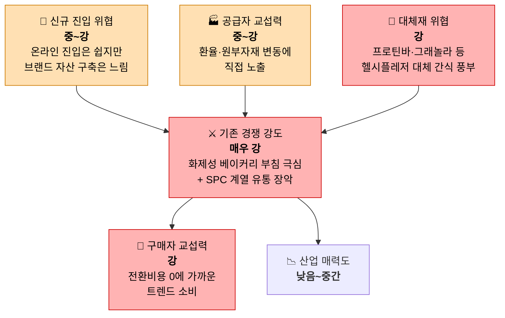

# 시장분석 01 — Porter's Five Forces: 국내 프리미엄 헬시플레저 베이커리 D2C 시장

**분석 대상**: 막지(MAKJI)가 속한 산업 — 2030 세대를 타깃으로 한 국내 프리미엄/헬시플레저 베이커리 시장 중, 자사몰(D2C 이커머스) 채널을 통해 판매하는 사업 구조. 비교 대상은 런던베이글뮤지엄·노티드·성심당 같은 화제성 프리미엄 베이커리, SPC(파리바게뜨)·CJ푸드빌(뚜레쥬르) 같은 대형 프랜차이즈, 그리고 스마트스토어·인스타그램 마켓 기반의 온라인 홈베이킹 셀러다.

방법론: [business-analysis-frameworks / 01_Porters_Five_Forces_모델](https://github.com/jennie-brain/business-analysis-frameworks/blob/main/01_Porters_Five_Forces_%EB%AA%A8%EB%8D%B8/00_%EB%B0%A9%EB%B2%95%EB%A1%A0.md)

## 한눈에 보기

## 5가지 힘 요약표

| 힘 | 강도 | 핵심 근거 |
|---|---|---|
| 공급자 교섭력 | 🟧 중~강 | 밀가루·버터·설탕 등 원부자재는 환율·인건비 상승분을 그대로 가격에 전가받는 구조. 2026년 삼립이 원가 부담을 이유로 평균 9% 가격 인상 |
| 구매자 교섭력 | 🟥 강 | 오픈런 베이커리도 SNS 화제가 식으면 곧바로 손님이 빠짐(런던베이글뮤지엄 최근 매출 둔화). 전환비용이 사실상 0 |
| 신규 진입 위협 | 🟧 중~강 | 스마트스토어·인스타마켓은 소자본으로 즉시 개설 가능. 다만 '프리미엄 웰니스' 포지셔닝과 스토리텔링은 단기간에 복제하기 어려움 |
| 대체재 위협 | 🟥 강 | 헬시플레저 카테고리 자체가 프로틴바·그래놀라·저당 디저트·편의점 즉석빵과 경쟁 중이며, 이들 모두 '맛+건강' 동일 니즈를 충족 |
| 기존 경쟁 강도 | 🟥 매우 강 | 런던베이글뮤지엄·노티드 등 화제성 브랜드의 급성장/급락, SPC 계열(파리바게뜨·뚜레쥬르 등)의 유통망 장악(제빵업 매출 기준 40%대), 신세계푸드 등 대기업까지 '건강빵'으로 참전 |

## 1. 공급자 교섭력 — **중 ~ 강**

- 밀가루·설탕·버터·달걀 등 필수 원재료 가격은 원/달러 환율과 국제 곡물가에 직접 연동되며, 환율 고공행진이 이어지면 수입 의존 원료 조달 비용이 그대로 오른다.
- 2026년 상반기 삼립이 "원부자재 가격이 급격히 상승한 데 따른 부담을 내부적으로 흡수하려 했으나 더 이상 버티지 못해" 빵 가격을 평균 9% 인상한 사례가 이를 보여준다. 제빵업 전반이 노동집약적이라 최저임금 인상·유틸리티 비용 상승까지 원가 압박을 더한다.
- 다만 밀가루·설탕 같은 범용 원료는 공급업체가 다수이고 전환이 비교적 쉬워 힘이 완화된다. 반면 '프리미엄' 포지셔닝을 위해 발효버터·유기농 밀가루·원산지 인증 과일 등 특수 원료를 쓸수록 소수 공급업체 의존도가 올라가고, 이 구간에서 공급자 힘이 강해진다.
- 공급업체의 전방통합(소비자 직접 판매) 유인은 낮다 — 제분·유가공 대기업은 B2B 공급에 집중하는 구조라 이 축의 위협은 상대적으로 약하다.
- 흥미로운 지점: MAKJI STOCK의 가격 엔진 자체가 '원/달러 환율'을 입력값으로 쓰고 있어, 공급자 교섭력이 강해지는 시점(환율 상승)이 곧 이 서비스의 할인폭이 줄어드는 시점과 구조적으로 맞물린다 — 원가 압박과 소비자 혜택 축소가 같은 방향으로 움직인다.

**판단**: 범용 원료는 다수 공급처로 힘이 분산되지만, 프리미엄 원료 의존도와 환율 노출이 이를 상쇄한다 → 중~강.

## 2. 구매자 교섭력 — **강**

- 최종 구매자는 파편화된 다수의 개인 소비자라 전통적 의미의 '소수 대형 구매자' 협상력은 없다. 그러나 SNS·오픈런 문화 특성상 전환비용이 사실상 0에 가까워, 집단으로서의 구매자는 강한 힘을 발휘한다.
- 런던베이글뮤지엄은 한때 2시간 대기 오픈런 맛집이었지만 이후 잇단 악재로 매출이 꺾였고, 노티드는 매장 확장 이후 오히려 고객 이탈과 매출 하락을 겪었다 — 화제성이 식으면 손님이 즉시 이동한다는 것을 보여주는 사례다.
- 프리미엄 베이커리 소비자는 다음 '핫플레이스'로 옮겨가는 데 심리적 장벽이 없고, 이커머스 자사몰 채널에서는 가격·혜택 비교가 앱 하나로 즉시 가능해 협상력이 더 커진다.
- 헬시플레저 카테고리 전반이 고단백·저당 제품 경쟁으로 흘러가면서, 무료 배송·쿠폰·구독 혜택이 업계 표준이 되어가는 중이다 — 차별화 요소가 빠르게 표준화되는 패턴은 앞서 본 해외 간편결제 시장의 '무료환전 표준화'와 같은 구조다.

**판단**: 개별 구매자의 힘은 약하지만, 낮은 전환비용과 트렌드 이동 속도가 집단적으로 강한 가격·혜택 압박을 만든다 → 강.

## 3. 신규 진입자의 위협 — **중 ~ 강**

- 오프라인 베이커리 카페 창업은 진입장벽이 높다 — 서울 주요 상권 기준 임대보증금 5천만~1억 원 이상, 데크 오븐·믹서기 등 장비만 2천만~4천만 원 수준이며 총 창업비용이 프랜차이즈 기준으로도 7천만~1억 원을 넘는다.
- 반면 MAKJI STOCK의 실제 판매 채널인 온라인 D2C(자사몰·스마트스토어·인스타그램 마켓)는 이 장벽을 우회한다. 스마트스토어는 무료 입점·간편한 개설이 가능하고, 인스타 마켓은 "누구나 시작할 수 있는" 소자본 채널로 알려져 있다 — 홈베이킹 셀러가 쉽게 뛰어드는 이유다.
- 다만 자본 장벽이 낮다고 해서 위협이 전부 해소되는 건 아니다. '프리미엄 웰니스' 포지셔닝, 2030 타깃에 맞는 브랜드 스토리텔링, SNS 화제성 확보는 시간과 노하우가 필요한 무형 자산이라 신규 진입자가 단기간에 복제하기 어렵다.
- 반대로 MAKJI STOCK의 핵심 차별화 장치인 '가격 게임화(주식처럼 움직이는 가격)' 자체는 특허·기술적 진입장벽이 크지 않은 UX/마케팅 기믹에 가까워, 경쟁사가 유사한 컨셉을 모방할 가능성을 배제할 수 없다.

**판단**: 채널(온라인)만 보면 자본장벽이 낮아 위협이 크지만, 브랜드 자산 축적에는 시간이 걸린다 → 중~강.

## 4. 대체재의 위협 — **강**

- MAKJI STOCK이 충족시키려는 소비자 니즈는 좁게는 '빵'이 아니라 넓게는 '맛있게 건강을 챙기고 싶다(헬시플레저)'다. 이 니즈를 채우는 대체재는 매우 다양하다 — 프로틴바, 그래놀라, 저당·제로칼로리 디저트, 요거트 등은 이미 20~30대 소비에서 프로틴 제품 선택 비율이 30~50%대에 달할 만큼 자리를 잡았다.
- 접근성 높은 대체재도 풍부하다 — 편의점 즉석 베이커리, 카페 디저트, 배달 앱을 통한 즉시 구매는 전환비용이 낮고 어디서나 접근 가능하다.
- '오늘 가격이 얼마나 움직였을까'를 확인하러 재방문하게 만드는 게이미피케이션 경험 자체도, 소비자 입장에서는 스타벅스 별적립·각종 앱 출석 쿠폰 같은 다른 리텐션 기믹과 대체 가능한 '재미' 카테고리로 인식될 수 있다.
- 저속노화·혈당관리 관심이 커지며 고단백·저당·고식이섬유 제품 수요가 계속 확대되는 추세라, 이 대체재 군의 위협은 앞으로 줄어들기보다 커질 가능성이 높다.

**판단**: 같은 니즈(맛+건강)를 채우는 대체재가 이미 다양하고 성장 중이라 가격 인상 여력이 제한된다 → 강.

## 5. 산업 내 경쟁 강도 — **매우 강**

- 화제성 프리미엄 베이커리 간 경쟁이 극심하다 — 런던베이글뮤지엄(매출 796억 원, 영업이익률 30.5%)과 성심당(매출 1,937억 원, 영업이익률 25%)이 양대 축을 이루지만, 런던베이글뮤지엄은 최근 잇단 악재로 매출이 꺾이고 있고, 노티드는 급격한 매장 확장 이후 고객 이탈을 겪는 등 부침이 매우 빠르다.
- 동시에 SPC그룹(파리바게뜨) 계열이 제빵 제조업 매출 기준 40%대(계열사 5곳 기준으로는 80%대라는 주장도 존재)를 차지하며 유통·저변을 사실상 장악하고 있어, 어떤 신규 브랜드도 이 유통 규모를 무시할 수 없다.
- 헬시플레저 트렌드가 커지자 신세계푸드 등 대기업까지 '건강빵' 카테고리에 가세하며 경쟁이 한 단계 더 확장되는 중이다.
- 국내 베이커리 시장 자체는 계속 성장 중(2025년 기준 전체 약 13.6조 원, 이 중 베이커리 전문점이 약 8.8조 원으로 65% — [시장분석 04](04_TAM_SAM_SOM.md) 참고)이라 '성장 정체로 인한 경쟁'은 아니지만, 점포 수는 2022년 정점 이후 정체 국면이고 인구 10만 명당 전문점 수가 일본의 5배에 달할 만큼 포화도가 높다. 플레이어 수와 마케팅·화제성 경쟁 강도, 트렌드 수명 주기가 짧다는 점까지 더하면 경쟁 압력은 최고 수준으로 봐야 한다.

**판단**: 대형 유통망(SPC)과 화제성 신흥 강자(런던베이글·노티드)가 동시에 존재하고, 대기업까지 신규 카테고리로 진입 중이라 경쟁이 최고조다 → 매우 강.

---

## 종합 평가

**산업 매력도**: 낮음 ~ 중간.

국내 베이커리 시장은 13.6조 원 규모([시장분석 04](04_TAM_SAM_SOM.md))로 여전히 성장 중이지만, 점포 수 기준으로는 이미 포화 국면에 들어섰고 SPC 계열의 유통 장악력과 화제성 브랜드 간 무한 경쟁이 공존하는 **성숙기~레드오션에 가까운 국면**이다. 개별 브랜드의 흥망 속도가 유난히 빠르다는 점(런던베이글뮤지엄·노티드 사례)은 이 시장이 '한 번 뜨면 끝'이 아니라 지속적인 화제성 재생산을 요구한다는 뜻이다.

MAKJI STOCK이 이 구도에서 자리를 잡으려면, 오프라인 매장 확장 경쟁(자본 소모전)이나 가격 경쟁(원가 압박 구조상 지속 불가능)보다는 **'게이미피케이션 D2C 경험'이라는, 아직 경쟁사가 정면으로 점유하지 않은 좁은 니치에 집중·차별화**하는 전략이 유효하다. 다만 이 니치 자체도 진입장벽이 낮은 기믹이라는 점에서, 선점 이후 빠르게 브랜드 자산(신뢰·스토리텔링)으로 전환해야 방어력이 생긴다.

Sources:
- [베이크플러스, 2026 건강빵 트렌드](https://www.bakeplus.com/healthy-bread-trends-2026-bakeplus)
- [베이커리 새 전장 '건강빵'…신세계푸드 가세로 판 확장 - 이코노믹리뷰](https://www.econovill.com/news/articleView.html?idxno=751581)
- [국내 베이커리 시장 동향과 소비트렌드 변화(KB자영업 분석 보고서) - KDI](https://eiec.kdi.re.kr/policy/domesticView.do?ac=0000154585)
- [[Why] 런던베이글뮤지엄, 불황에도 몸값 3000억원 부르는 이유는](https://v.daum.net/v/20250520165210924)
- [매출 800억 '빵' 터진 런던베이글…"성심당도 제친 영업이익" - 이데일리](https://www.edaily.co.kr/News/Read?newsId=02394406642134808&mediaCodeNo=257)
- [연매출 800억 '오픈런 맛집'이었는데…잇단 악재에 추락하는 런던베이글뮤지엄 - 아시아경제](https://www.asiae.co.kr/article/2025110418024766644)
- ["원가 부담 더는 못 버텨"…삼립, 빵값 평균 9% 인상](https://m.news.nate.com/view/20260809n10831)
- [원가 부담에 빵·라면·도넛까지…식품업계 가격 인상 행렬 - 데일리안](https://www.dailian.co.kr/news/view/1670649/)
- [SPC,제빵시장 독점 논란...SPC "뚜레쥬르·개인제과점 합하면 점유율 40%" - SBS Biz](https://biz.sbs.co.kr/article/20000086057)
- [베이커리 카페 창업 비용 얼마나 들까? - 한성쇼케이스](https://blog.hansungshowcase.kr/%EB%B2%A0%EC%9D%B4%EC%BB%A4%EB%A6%AC-%EC%B9%B4%ED%8E%98-%EC%B0%BD%EC%97%85-%EB%B9%84%EC%9A%A9-%EC%96%BC%EB%A7%88%EB%82%98-%EB%93%A4%EA%B9%8C-2026%EB%85%84-%EC%B5%9C%EC%8B%A0-%EC%84%B1%EA%B3%B5-%EC%A0%84%EB%9E%B5%EA%B3%BC-5%EA%B0%80%EC%A7%80-%ED%95%B5%EC%8B%AC-%EC%A7%88%EB%AC%B8-%EC%B4%9D%EC%A0%95%EB%A6%AC-90695)
- [온라인 창업 대세로 떠오른 '스마트스토어' 120% 활용법](https://v.daum.net/v/cSIPMsg0bi)
- [식단·건기식·프로틴, 헬시 플레저 추구하는 2030세대의 건강관리법은? - 매드타임스](https://www.madtimes.co.kr/news/articleView.html?idxno=14534)
- [脫유통 드라이브, 자사몰로 직접 소비자 공략하는 식품 업계 - HSAD](https://www.hsad.co.kr/kor/insight/info/IST_202309271605070997)
