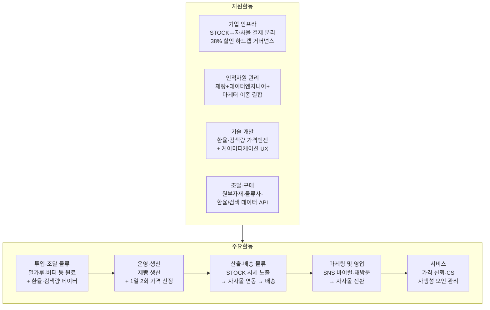

# 시장분석 02 — 가치사슬 분석: MAKJI STOCK × 막지 자사몰

대상: [시장분석 01](01_PORTERS_FIVE_FORCES.md)과 동일 — 막지(MAKJI)의 프리미엄 헬시플레저 베이커리 D2C 사업. 단, 이 문서는 "MAKJI STOCK(게이미피케이션 시세 랜딩)"과 "막지 자사몰(실 결제·배송)"이 의도적으로 분리된 이원 구조라는 점을 가치사슬 전체에 반영한다.

방법론: [business-analysis-frameworks / 02_가치사슬_분석](https://github.com/jennie-brain/business-analysis-frameworks/blob/main/02_%EA%B0%80%EC%B9%98%EC%82%AC%EC%8A%AC_%EB%B6%84%EC%84%9D/00_%EB%B0%A9%EB%B2%95%EB%A1%A0.md)

## 한눈에 보기

**핵심 요약**: 이 사업의 가치사슬은 일반 베이커리와 달리 두 갈래로 갈라진다 — ① 원재료→생산→배송이라는 **물리적 가치사슬**과 ② 환율·검색량 데이터→가격 산정→게이미피케이션 UX라는 **정보 가치사슬**이 "산출·배송 물류" 단계에서 다시 합쳐져 자사몰로 넘어간다. 경쟁우위는 물리적 사슬(원가·품질)이 아니라 **정보 가치사슬(운영·생산의 가격 엔진)** 과 **마케팅 및 영업(재방문 설계)** 두 지점에 집중돼 있다.

## 1. 주요활동

### 투입·조달 물류 (Inbound Logistics)

| 유형 | 질문 | 답변 |
|---|---|---|
| 🏗️ 설계 | 물리적 투입자원은 무엇인가? | 밀가루·버터·설탕·달걀 등 제빵 원료(프리미엄 포지셔닝을 위한 발효버터·유기농 밀가루 포함), 포장재, 신선물류용 냉장 배송 인프라 |
| 🏗️ 설계 | 이 사업만의 추가 투입자원은 무엇인가? | 원/달러 환율 데이터 피드, 네이버 검색량(검색 관심도) 데이터 — 이 둘이 STOCK의 하루 두 번(오전장 06:00·오후장 16:00) 가격 산정의 원재료다 |
| 🚀 개선 | [시장분석 01] 공급자 교섭력(중~강)이 여기서 어떻게 나타나는가? | 프리미엄 원료일수록 소수 공급업체 의존도가 높고, 환율 상승은 원가를 올리는 동시에 STOCK 화면의 할인폭도 줄인다 — 원가와 소비자 혜택이 같은 방향으로 함께 나빠지는 이중 노출 구조 |
| 🚀 개선 | 데이터 공급자(환율·검색량 API)에 대한 의존도를 줄일 수 있는가? | 두 데이터 모두 외부 API 장애·정책 변경에 취약 — 대체 데이터 소스나 캐시 전략 없이는 "오늘 가격이 왜 안 바뀌었나" 같은 신뢰 이슈로 직결됨 |

### 운영·생산 (Operations)

| 유형 | 질문 | 답변 |
|---|---|---|
| 🏗️ 설계 | 물리적 생산과 정보 처리가 어떻게 병행되는가? | (물리) 제빵 생산·재고 관리 ↔ (정보) 06:00/16:00 정기 배치로 환율·검색량을 조합해 5종 SKU 가격을 재계산 — 이 둘은 서로 다른 팀(생산 vs 개발)이 담당하지만 출력 시점(오전 9시 "오늘의 장이 열립니다")은 고정 동기화돼야 한다 |
| 🏗️ 설계 | 가격 산정 로직에 제약조건이 어떻게 반영되는가? | RFP가 못박은 "최대 할인율 38% 하드캡"이 여기서 강제된다 — 아무리 환율이 유리하게 움직여도 이 상한을 넘는 계산 결과는 시스템이 컷오프해야 한다 |
| 🚀 개선 | 생산 계획이 가격 변동에 실시간 대응할 수 있는가? | 가격이 하루 두 번 바뀌지만 생산·재고는 그렇게 빠르게 조정할 수 없다 — 오후장에서 가격이 오르며 수요가 몰려도 당일 생산분은 이미 고정이라는 물리적 병목이 존재 |
| 🚀 개선 | 오전 가격 잠금(가격 잠금 기능) 운영 리스크는? | 잠금 수량이 몰릴 경우 실제 재고·생산 여력을 초과하는 약속(오전가 보장)을 하게 될 위험 — 하루 한 번·빵 한 개로 제한한 규칙이 이 리스크를 통제하는 장치 |

### 산출·배송 물류 (Outbound Logistics)

| 유형 | 질문 | 답변 |
|---|---|---|
| 🏗️ 설계 | 정보(가격)와 실물(빵)이 각각 어떤 채널로 전달되는가? | 가격·쿠폰 정보는 MAKJI STOCK 화면으로, 실물 구매·배송은 별도의 막지 자사몰로 — 두 채널이 의도적으로 분리돼 있어 "정보 열람"과 "결제 실행" 사이에 이탈 지점이 생긴다 |
| 🏗️ 설계 | STOCK → 자사몰 연동은 어떻게 이뤄지는가? | 쿠폰번호를 복사해 자사몰에 로그인 후 직접 등록하는 수동 연동 방식 — RFP 요구사항("결제 시스템 분리")을 지키는 대신 전환 단계가 한 스텝 늘어난다 |
| 🚀 개선 | [시장분석 01]의 신규 진입 위협(온라인 장벽 낮음)과 이 활동의 관계는? | 이 수동 연동 스텝 자체가 낮은 진입장벽 위에서 유일하게 만들 수 있는 마찰(경쟁사가 베끼기 번거로운 지점)이자, 동시에 전환율을 깎아먹는 이탈 지점이기도 하다 — 양날의 검 |
| 🚀 개선 | 실물 배송(콜드체인)의 병목은? | 신선 베이커리 특성상 배송 리드타임이 품질에 직접 영향 — 이 부분은 STOCK의 게이미피케이션 요소가 아니라 순수 물류 역량(자사몰 쪽 과제)에 달려 있다 |

### 마케팅 및 영업 (Marketing & Sales)

| 유형 | 질문 | 답변 |
|---|---|---|
| 🏗️ 설계 | 핵심 후킹 메시지는 무엇인가? | "빵값이 주식처럼 움직인다"는 게이미피케이션 자체가 마케팅 자산 — SNS·메타 광고 소재로 설계된 구조(RFP 목적 4) |
| 🏗️ 설계 | 재방문을 어떻게 설계하는가? | 하루 두 번 장이 열리는 리듬(오전장/오후장) + 매일 한 번의 예측/쿠폰 선택이 재방문 트리거 — 습관화가 목표 |
| 🚀 개선 | [시장분석 01]의 구매자 교섭력(강)·대체재 위협(강)이 여기서 가장 크게 노출되는 이유는? | 화제성 소비(런던베이글·노티드 사례)처럼, STOCK의 '재미' 요소도 다른 앱의 출석 쿠폰과 대체 가능한 카테고리로 인식되면 습관화 이전에 이탈할 수 있다 — 이 사업 전체에서 리스크가 가장 집중되는 지점 |
| 🚀 개선 | 프로모션(쿠폰) 종료 이후에도 고객이 남는가? | 쿠폰이 안정형(10~15%)·공격형(5~20%) 두 갈래로 나뉘는 설계는 "혜택 소진 후 이탈"을 늦추려는 장치이지만, 근본적으로는 STOCK 방문 자체가 재미있어야 지속된다 |

### 서비스 (Service)

| 유형 | 질문 | 답변 |
|---|---|---|
| 🏗️ 설계 | 가격 산정에 대한 신뢰 문의를 어떻게 처리하는가? | "왜 오늘 가격이 이렇게 됐나" 문의에 대응하려면 계산 근거를 내부적으로는 추적 가능해야 하지만, 화면에는 노출하지 않는 원칙([[user-facing-copy-only]] 메모리 참고)과 균형을 맞춰야 한다 |
| 🏗️ 설계 | 사행성 오인 관련 CS는? | RFP 제약조건("금융 규제 준수 — 사행성·공격적 주식 용어 표기 금지")에 따라, "이건 투자가 아니라 할인 프로모션"이라는 응대 스크립트가 필요 |
| 🚀 개선 | STOCK(무결제)과 자사몰(결제) 간 CS 이관은 매끄러운가? | 쿠폰 미적용·배송 지연 등은 결국 자사몰 CS 소관인데 고객은 STOCK에서 문의를 시작할 가능성이 높다 — 채널 간 문의 라우팅 설계가 누락되면 서비스 품질 저하로 이어짐 |

## 2. 지원활동

### 기업 인프라 (Firm Infrastructure)

| 유형 | 질문 | 답변 |
|---|---|---|
| 🏗️ 설계 | STOCK과 자사몰의 조직·책임 경계는? | RFP가 명시한 대로 PG(결제) 연동을 STOCK에서 배제하고 자사몰에만 두는 구조 — 이는 [시장분석 01]의 "산업 내 경쟁 강도·법적 규제 리스크"에 대한 방어 장치이기도 하다(사행성 오인 시 결제 자체가 STOCK에 없다는 점이 법적 방어선이 됨) |
| 🚀 개선 | 38% 하드캡 같은 마진 방어 규칙을 누가 감시하는가? | 가격 엔진 로직과 별개로, 이 상한이 배포 이후에도 깨지지 않는지 주기적으로 검증하는 거버넌스가 필요(코드 배포 시 회귀 테스트 등) |

### 인적자원 관리 (HRM)

| 유형 | 질문 | 답변 |
|---|---|---|
| 🏗️ 설계 | 어떤 인력 조합이 필요한가? | 제빵/생산 인력, 프론트엔드·데이터 엔지니어(가격 엔진), 브랜드·콘텐츠 마케터라는 이질적 3개 조직이 한 제품(STOCK)을 위해 맞물려야 한다 |
| 🚀 개선 | 이 이질적 조합의 리스크는? | 베이커리 조직은 통상 F&B 운영 리듬(생산·유통기한 중심)으로 움직이고, 개발 조직은 배포·실험 리듬으로 움직인다 — 하루 두 번 정시 가격 갱신이라는 요구가 두 리듬을 강제로 동기화시키는 지점이라 조율 실패 시 장애로 직결 |

### 기술 개발 (Technology Development)

| 유형 | 질문 | 답변 |
|---|---|---|
| 🏗️ 설계 | 핵심 경쟁력을 만드는 기술은? | 환율·검색량을 조합해 정기적으로 가격을 산정하는 엔진과, 그 결과를 "주식처럼" 체감되게 만드는 게이미피케이션 프론트엔드 |
| 🚀 개선 | [시장분석 01]의 신규 진입 위협("가격 게임화 자체는 모방 용이")에 대한 기술적 방어선은? | 가격 산정 로직 자체는 공개돼도 무방하지만(오히려 "왜 이 가격인지" 신뢰를 만드는 요소), UX 완성도·데이터 안정성·브랜드 스토리텔링의 결합이 복제하기 어려운 부분이다 — 기술 자체보다 통합 경험이 방어선 |

### 조달·구매 (Procurement)

| 유형 | 질문 | 답변 |
|---|---|---|
| 🏗️ 설계 | 핵심 조달 대상은? | 원부자재 공급업체, 냉장 물류사, 환율 데이터 API(외부 금융데이터 제공사), 네이버 검색량 데이터(검색광고 API 등), 자사몰 플랫폼(카페24 등 이커머스 솔루션) |
| 🚀 개선 | 특정 공급자·API에 과도하게 종속되어 있지 않은가? | 환율·검색량 데이터 공급자가 소수로 좁혀질 경우, [시장분석 01]의 공급자 교섭력 리스크가 원재료뿐 아니라 "가격 산정에 필요한 데이터" 축에서도 반복된다 |

---

## 요약: 가치가 만들어지는 지점 vs 리스크가 쌓이는 지점

이 사업의 가치는 "① 원료·데이터 투입 → ② 제빵 생산과 가격 엔진의 이원 운영 → ③ STOCK에서 자사몰로의 전환"이라는 흐름에서 만들어지며, 경쟁우위는 물리적 원가 절감이 아니라 **운영·생산 단계의 가격 엔진**과 **마케팅 및 영업 단계의 재방문 설계**에 집중돼 있다.

반대로 리스크는 세 지점에 쌓인다 — (1) 투입·조달 물류의 환율·원부자재 이중 노출(원가↑ 동시에 할인폭↓), (2) 마케팅 및 영업 단계의 화제성 소진 위험([시장분석 01] 구매자 교섭력·대체재 위협과 직결), (3) 산출·배송 물류의 STOCK→자사몰 수동 연동에서 발생하는 전환 이탈. 세 지점 모두 다음 문서(핵심성공요인 분석)에서 우선순위를 다시 짚는다.

## 참고 자료

- [시장분석 01 — Porter's Five Forces](01_PORTERS_FIVE_FORCES.md)
- MAKJI 브랜드 RFP 분석 및 기획 요구사항 정의서 (`docs/00_rfp/RFP_ANALYSIS.md`)
- [business-analysis-frameworks / 02_가치사슬_분석 방법론](https://github.com/jennie-brain/business-analysis-frameworks/blob/main/02_%EA%B0%80%EC%B9%98%EC%82%AC%EC%8A%AC_%EB%B6%84%EC%84%9D/00_%EB%B0%A9%EB%B2%95%EB%A1%A0.md)
