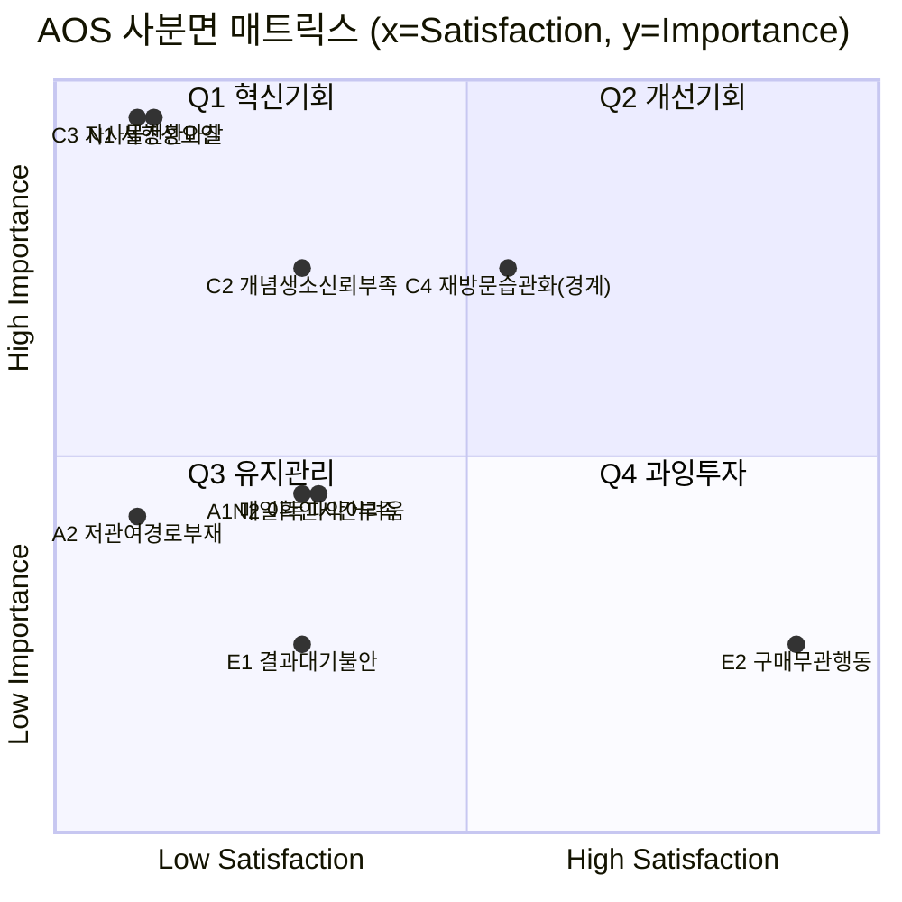

# 시장분석 06 — 시장기회분석: AOS·DOS 기반 우선순위

방법론: [business-analysis-frameworks / 06_시장기회분석](https://github.com/jennie-brain/business-analysis-frameworks/blob/main/06_%EC%8B%9C%EC%9E%A5%EA%B8%B0%ED%9A%8C%EB%B6%84%EC%84%9D/00_%EB%B0%A9%EB%B2%95%EB%A1%A0.md)

핵심 공식:
- **AOS(조정형 기회점수, 고객 체감 기준)** = Importance × (1 − Satisfaction/5)
- **DOS(발견된 기회점수, 시장가중 기준)** = (Importance − Satisfaction) × Market Relevance

이 챕터는 새 Pain 리스트를 만들지 않는다. [시장분석 05](05_PERSONA_CJM.md)의 4개 페르소나(Core·Adjacent·Extreme·Non-user) 전원의 Pain/Goal과 CJM Pain Point를 그대로 채점 대상으로 쓴다 — 특정 유형만 골라 점수화하면 사분면 해석 자체가 왜곡되기 때문이다.

## 1. Pain 리스트 (9건, 4유형 전원)

| ID | 페르소나 | Pain | 근거([시장분석 05]) |
|---|---|---|---|
| C2 | Core·김소민 | STOCK 컨셉이 처음 보는 것이라 신뢰가 안 감 | ②탐색·유입 단계 — "빵이 주식처럼 움직인다고? 신기하네"(호기심)이지만 동시에 신뢰 부족 |
| C3 | Core·김소민 | 자사몰로 넘어갈 때 재가입·재입력이 번거로움 | ④자사몰 전환(핵심 관문) — "어, 여기서 또 가입해야 돼?" |
| C4 | Core·김소민 | 재방문이 반짝 흥미로 끝나고 습관이 안 될 위험 | ⑥재방문 — 개선 기회 "습관화 위험" 명시 |
| A1 | Adjacent·박현주 | 매일 앱을 켜서 오늘 가격을 확인할 시간이 없음 | "매번 비교할 시간이 없음", ③STOCK 체험을 건너뛰고 싶어함 |
| A2 | Adjacent·박현주 | 저관여(구독형) 구매 경로가 없음 | 현재 대체 수단이 "마켓컬리 정기구독"인데 STOCK엔 이 경로가 없음 |
| E1 | Extreme·이도현 | 공격형 예측 결과가 다음 날 06:00에야 나와 기다리는 동안 재미 요소가 없음 | ③STOCK 체험에 계속 머무는 행동 패턴, 대기 구간의 몰입 장치 부재 |
| E2 | Extreme·이도현 | 예측·쿠폰 획득 자체가 목적이라 실구매로 잘 안 이어짐 | "쿠폰만 모으고 실제 구매로는 잘 안 이어짐 — 서비스 취지와 실제 행동이 어긋남"(사업 리스크형 Pain) |
| N1 | Non-user·정은숙 | 가격이 오르내리는 컨셉 자체가 사행성처럼 느껴져 진입을 거부 | "이 서비스가 '도박 같은 느낌'이라 진입 자체를 꺼림" — [시장분석 03] KSF #4와 직결 |
| N2 | Non-user·정은숙 | 정가 대비 실제 이득이 얼마인지 한눈에 파악하기 어려움 | "명확한 정가에 안심하고 사고 싶다" — 복잡해 보이는 가격 표시에 대한 거부감 |

## 2. Importance·Satisfaction·AOS

Importance는 "그 페르소나 본인의 목표 달성에 이 Pain이 얼마나 중요한가", Satisfaction은 "현재 STOCK 설계가 이 Pain을 얼마나 해결하고 있는가"를 1~5로 평가한 것이다. E2는 예외적으로 페르소나 개인 관점(만족)과 사업 관점(리스크)이 갈리는 항목이라 별도로 설명을 붙였다.

| ID | Importance | 근거 | Satisfaction | 근거 | AOS = Imp×(1−Sat/5) |
|---|---|---|---|---|---|
| C3 | 5 | 유일한 매출 실현 관문 — 여기서 막히면 다른 모든 단계가 무의미([시장분석 03] KSF #1) | 1 | 현재 방식은 "쿠폰번호 복사→자사몰 재로그인→직접 등록"의 수동 연동뿐 | **4.0** |
| N1 | 5 | 이 Pain 하나가 진입 여부(사용/비사용)를 결정 | 1 | 현재 온보딩·화면 어디에도 "이건 투자가 아니다"를 적극 해명하는 장치가 없음 | **4.0** |
| C2 | 4 | 첫인상에서 신뢰를 잃으면 이후 단계 자체가 시작되지 않음 | 2 | "재미있는 컨셉"이라는 설명은 있으나 신뢰를 뒷받침하는 근거 제시는 약함 | **2.4** |
| A2 | 3 | Adjacent는 2순위 세그먼트([시장분석 04] Segment Map 2사분면)라 Core보다 사업 비중은 낮음 | 1 | 저관여 구독 경로가 전혀 없음 | **2.4** |
| A1 | 3 | 위와 동일한 이유로 중간 중요도 | 2 | 서비스 설계가 "매일 능동적으로 켜서 확인"을 전제로 함 | **1.8** |
| N2 | 3 | 신뢰 문제(N1)보다는 부차적인 이해 난이도 문제 | 2 | 현재 가격 표시는 "정가 → 오늘 가격"만 보여줘 개선 여지 있으나 미흡 | **1.8** |
| C4 | 4 | 재방문율은 이 서비스의 핵심 KPI | 3 | 연속 방문 보상 등 설계 여지는 있으나 아직 구체화 전 — Q1·Q2 경계선상 | **1.6** |
| E1 | 2 | Extreme은 [시장분석 04] Segment Map에 별도로 사이즈가 잡힌 세그먼트가 아님 | 2 | 대기 구간에 별도 몰입 장치 없음 | **1.2** |
| E2 | 2 | 이도현 개인 목표("이기는 재미") 관점에서는 구매 자체가 중요하지 않음 | 5 | 그의 개인 목표는 이미 충분히 충족되고 있음(그래서 개인 차원 AOS는 낮음 — 사업 차원 리스크는 3절 각주 참고) | **0.0** |

### AOS 사분면 매트릭스

기준선은 표본이 작아(9건) 평균선 대신 척도 중간값(Importance·Satisfaction 각 3점)을 사용했다. C4는 Satisfaction=3으로 경계선에 걸쳐 있어 Q1·Q2 사이 애매한 위치임을 그대로 노출했다.

| 사분면 | 해당 Pain | 건수 |
|---|---|---|
| Q1 혁신기회 (High Imp·Low Sat) | C3, N1, C2, (C4 경계) | 3~4건 |
| Q2 개선기회 (High Imp·High Sat) | 없음 | 0건 |
| Q3 유지관리 (Low Imp·Low Sat) | A1, A2, N2, E1 | 4건 |
| Q4 과잉투자 (Low Imp·High Sat) | E2 | 1건 |

Q2(개선기회)가 비어 있다는 것 자체가 신호다 — "중요하면서 이미 잘 해결된" 영역이 아직 없다는 뜻이고, 이는 프로토타입 단계 서비스라는 현재 상태와 일치한다.

## 3. DOS로 확장 — Market Relevance

Market Relevance는 [시장분석 04]의 Market Segment Map(SAM 내 세그먼트 비중)을 근거로, "이 Pain이 SAM 전체에서 얼마나 넓게 영향을 미치는가"를 0~1로 판단했다. 페르소나 개인이 아니라 Pain 자체의 시장 파급력 기준이다 — 예를 들어 N1은 '정은숙(Non-user)'의 Pain으로 카드에 적혀 있지만, 사행성 신뢰 문제는 [시장분석 03] KSF #4가 지적하듯 Core 타겟에도 잠재하는 시장 전체의 리스크이므로 Market Relevance를 높게 잡았다.

| ID | Market Relevance | 근거 |
|---|---|---|
| C3 | 0.9 | 유일한 매출 관문 — SAM 전체(모든 세그먼트)가 이 지점을 통과해야 함 |
| N1 | 0.85 | 사행성 신뢰 문제는 Non-user만이 아니라 [시장분석 04] 1사분면 핵심 타겟(Core)에도 잠재 — RFP의 법적 제약(KSF #4)과 직결 |
| C2 | 0.8 | STOCK 진입 단계는 모든 세그먼트가 통과하는 첫 관문 |
| N2 | 0.55 | 가격 이해도 문제는 폭넓게 걸치지만 N1만큼 진입 자체를 막지는 않음 |
| A2 | 0.4 | [시장분석 04] Segment Map 2사분면(확장 타겟, 2순위)에 한정된 니즈 |
| A1 | 0.4 | 위와 동일 세그먼트 |
| C4 | 0.6 | Core(핵심 타겟) 세그먼트의 장기 리텐션·LTV에 영향 |
| E1 | 0.15 | [시장분석 04] Segment Map에 별도로 사이즈가 잡히지 않은 극소수 행동 패턴 |
| E2 | 0.15 | 위와 동일 — 시장 규모보다는 지표 설계 이슈에 가까움 |

| ID | Importance − Satisfaction | Market Relevance | DOS |
|---|---|---|---|
| C3 | 5−1=4 | 0.9 | **3.6** |
| N1 | 5−1=4 | 0.85 | **3.4** |
| C2 | 4−2=2 | 0.8 | **1.6** |
| A2 | 3−1=2 | 0.4 | **0.8** |
| C4 | 4−3=1 | 0.6 | **0.6** |
| N2 | 3−2=1 | 0.55 | **0.55** |
| A1 | 3−2=1 | 0.4 | **0.4** |
| E1 | 2−2=0 | 0.15 | **0.0** |
| E2 | 2−5=−3 | 0.15 | **−0.45** |

E2는 DOS가 음수다 — 고객 개인에게는 이미 과잉 충족된 데다 시장 파급력도 작다는 뜻으로, "이 행동을 억지로 구매로 전환시키려는 투자"는 자원 낭비일 수 있다는 신호로 읽는다(단, [시장분석 05]가 남긴 시사점대로 리텐션 지표와 구매전환 지표를 분리 측정해야 한다는 과제는 별도로 유효하다).

## 4. AOS·DOS 판단 매트릭스

기준: AOS≥2.0, DOS≥1.5를 "높음"으로 판단했다(각 지표 상위 절반에 해당하는 자연스러운 경계).

| 케이스 | 해당 Pain | 전략 방향 |
|---|---|---|
| **BEST CASE** (AOS·DOS 둘 다 높음) | **C3, N1, C2** | 즉시 타게팅 — 07챕터 JTBD 검증 최우선 대상 |
| AOS 높음·DOS 낮음 (고객은 고통스럽지만 시장은 작음) | A2 | Adjacent 세그먼트 락인에는 유효하나 전사적 우선순위는 아님 |
| DOS 높음·AOS 낮음 | 없음 | — |
| 둘 다 낮음 | A1, C4, N2, E1, E2 | 탐색적 관찰 또는 후순위 — 자원 재배분 검토 대상 |

## 5. 07번(JTBD) 검증 대상

Q1(혁신기회) + BEST CASE에 공통으로 걸리는 상위 3건을 다음 챕터의 실사 대상으로 넘긴다.

1. **C3 — STOCK→자사몰 전환 마찰** (AOS 4.0 / DOS 3.6, 전체 1위): 실제 이탈이 이 지점에서 얼마나 발생하는지, 어떤 마찰 요소(재로그인·쿠폰 재입력)가 결정적인지 검증 필요.
2. **N1 — 사행성 오인으로 인한 진입 거부** (AOS 4.0 / DOS 3.4, 공동 1위): 이 불신이 실제 잠재 고객(Core 포함)에게서 어느 정도 관찰되는지, 어떤 문구·장치가 이를 해소하는지 검증 필요.
3. **C2 — STOCK 개념 자체에 대한 신뢰 부족** (AOS 2.4 / DOS 1.6, BEST CASE 3순위): N1과 결이 비슷하지만 '사행성 우려'보다는 '생소함' 쪽에 가까운지, 별개 원인인지 인터뷰로 구분 필요.

## 참고 자료

- [시장분석 01 — Porter's Five Forces](01_PORTERS_FIVE_FORCES.md)
- [시장분석 03 — 핵심성공요인(KSF)](03_KSF.md)
- [시장분석 04 — TAM·SAM·SOM & Market Segment Map](04_TAM_SAM_SOM.md)
- [시장분석 05 — 페르소나·고객여정지도](05_PERSONA_CJM.md)
