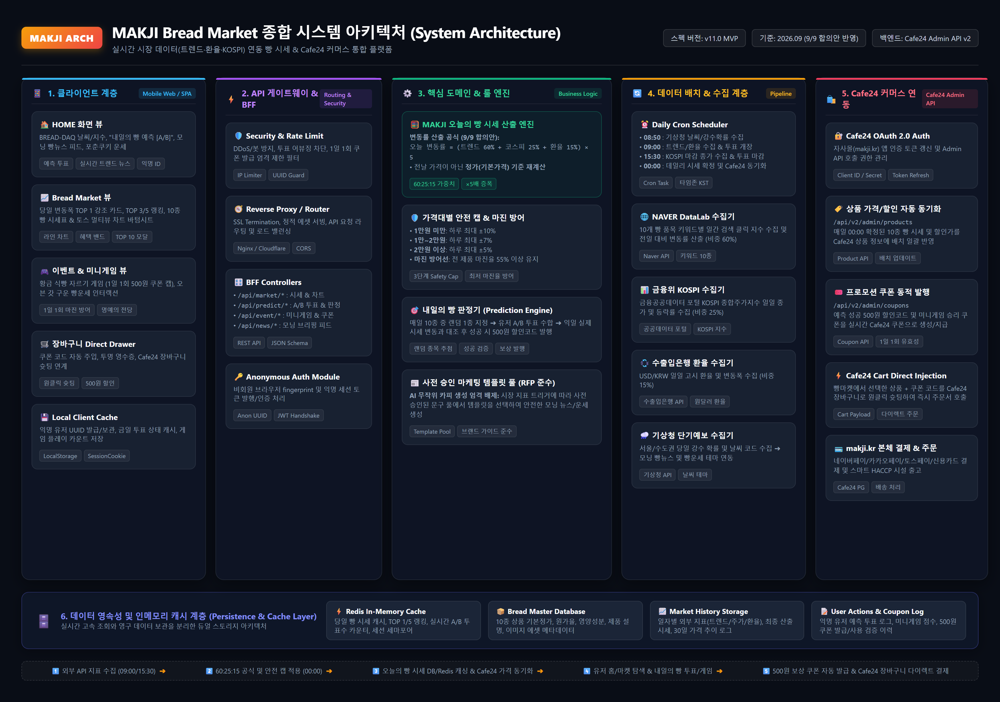
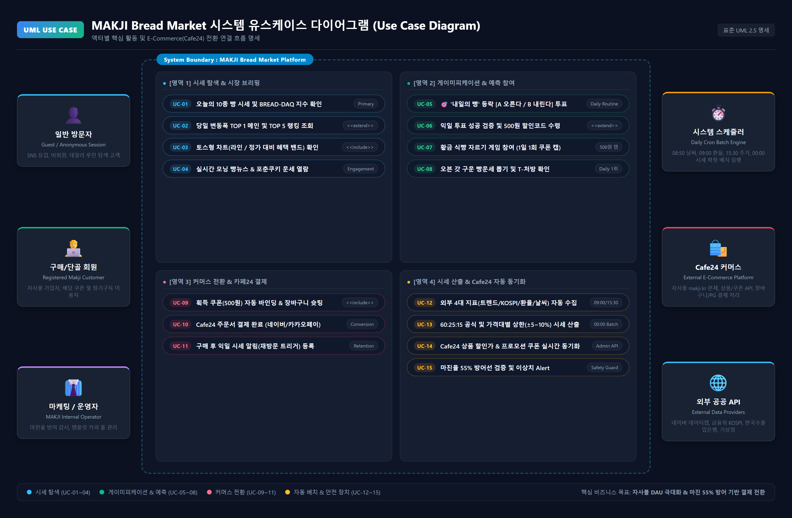
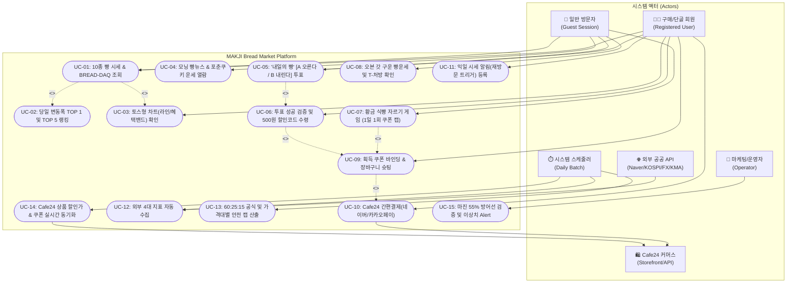
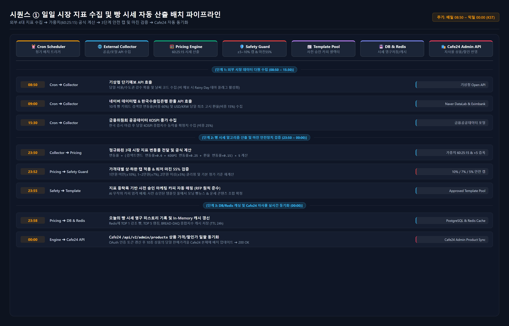
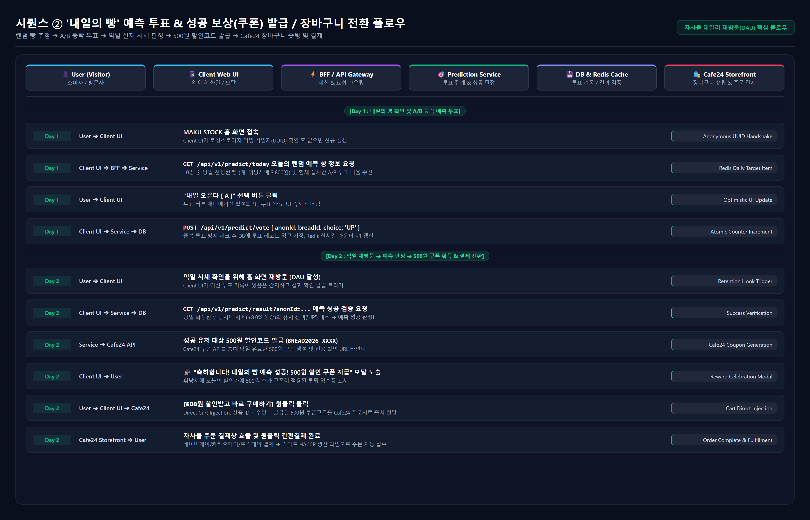
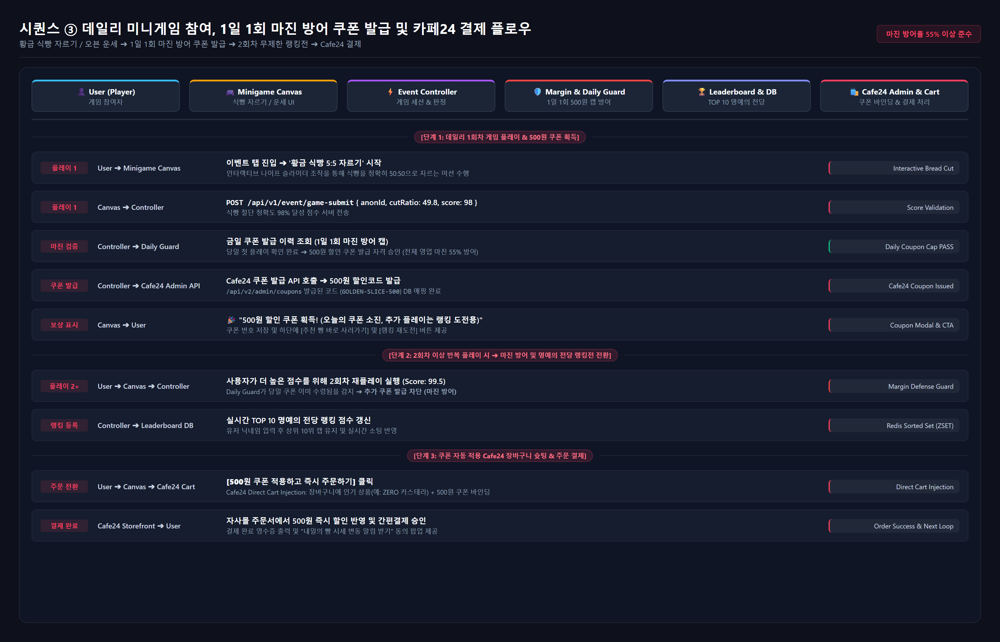

```mermaid
sequenceDiagram
    autonumber
    actor Cron as ⏰ Cron Scheduler
    participant Collector as 🌐 External Collector
    participant ExtAPI as 📡 External Open APIs
    participant Pricing as 🧮 Pricing Engine
    participant Safety as 🛡️ Safety Guard
    participant Template as 📰 Template Pool
    participant Storage as 💾 DB & Redis
    participant Cafe24 as 🛍️ Cafe24 Admin API

    rect rgb(20, 30, 45)
        Note over Cron, ExtAPI: [단계 1: 외부 시장 데이터 다원 수집 (08:50 ~ 15:30)]
        Cron->>Collector: 08:50 기상청 API 호출 트리거
        Collector->>ExtAPI: 기상청 단기예보 (강수확률, 날씨 코드)
        ExtAPI-->>Collector: 강수 확률 데이터 반환
        
        Cron->>Collector: 09:00 네이버 트렌드 & 환율 호출 트리거
        Collector->>ExtAPI: Naver DataLab (10개 빵 키워드 검색량)
        Collector->>ExtAPI: 한국수출입은행 (USD/KRW 환율)
        ExtAPI-->>Collector: 키워드 검색량 및 환율 데이터 반환
        
        Cron->>Collector: 15:30 KOSPI 마감 종가 호출 트리거
        Collector->>ExtAPI: 금융공공데이터 포털 (KOSPI 종가 등락률)
        ExtAPI-->>Collector: KOSPI 변동률 반환
    end

    rect rgb(25, 40, 35)
        Note over Pricing, Template: [단계 2: 알고리즘 시세 산출 & 마진 안전장치 (23:50 ~ 00:00)]
        Collector->>Pricing: 정규화된 3대 지표 변동률 전달
        Pricing->>Pricing: 오늘 변동률 = (트렌드×0.6 + KOSPI×0.25 + 환율×0.15) × 5 계산
        Pricing->>Safety: 10종 가격대별 상·하한 캡 검증 요청
        Safety->>Safety: 1만원 미만(±10%), 1~2만원(±7%), 2만원 이상(±5%) 적용
        Safety->>Safety: 원가율 검증 및 최소 마진율 55% 방어 확인
        Safety-->>Pricing: 안전 캡 적용된 최종 빵 시세 확정
        Pricing->>Template: 변동 지표 전달 ➔ 사전 승인 마케팅 카피 매핑 (RFP 원칙)
        Template-->>Pricing: 모닝 빵뉴스 & 운세 피드 확정
    end

    rect rgb(40, 25, 30)
        Note over Storage, Cafe24: [단계 3: DB/Redis 캐싱 및 Cafe24 동기화 (00:00)]
        Pricing->>Storage: PostgreSQL 시세 히스토리 영구 저장
        Pricing->>Storage: Redis에 TOP 1/TOP 5/BREAD-DAQ 캐싱 (TTL 24h)
        Pricing->>Cafe24: /api/v2/admin/products 상품 할인가 일괄 갱신
        Cafe24-->>Pricing: 200 OK (자사몰 상품 판매가 동기화 완료)
    end
```

```mermaid
sequenceDiagram
    autonumber
    actor User as 👤 User (Visitor)
    participant UI as 📱 Client Web UI
    participant BFF as ⚡ BFF / API Gateway
    participant Predict as 🎯 Prediction Service
    participant Cache as 💾 DB & Redis
    participant Cafe24API as 🎟️ Cafe24 Coupon API
    participant Store as 🛍️ Cafe24 Storefront

    rect rgb(20, 30, 45)
        Note over User, Cache: [Day 1: 내일의 빵 확인 및 A/B 등락 예측 투표]
        User->>UI: 홈 화면 진입 (익명 세션 생성/확인)
        UI->>BFF: GET /api/v1/predict/today
        BFF->>Predict: 당일 랜덤 선정 빵(휘낭시에) 및 실시간 투표율 조회
        Predict-->>UI: 휘낭시에 정보(3,800원) + A(오른다)/B(내린다) 반환
        User->>UI: "내일 오른다 [ A ]" 클릭 투표
        UI->>BFF: POST /api/v1/predict/vote { anonId, breadId: 3, choice: "UP" }
        BFF->>Predict: 중복 투표 검증 및 저장
        Predict->>Cache: 투표 기록 저장 및 Redis Atomic Counter (+1)
        Predict-->>UI: 투표 완료 (현재 비율: 오른다 68% vs 내린다 32%)
    end

    rect rgb(25, 40, 35)
        Note over User, Store: [Day 2: 익일 재방문 ➔ 예측 판정 ➔ 500원 쿠폰 ➔ 결제 전환]
        User->>UI: 익일 시세 확인 위해 홈 화면 재방문 (DAU 달성!)
        UI->>BFF: GET /api/v1/predict/result?anonId=...
        BFF->>Predict: 당일 확정 시세(+8%)와 전일 유저 투표("UP") 대조
        Predict-->>BFF: 예측 성공 판정! (Success = True)
        BFF->>Cafe24API: POST /api/v2/admin/coupons (500원 전용 쿠폰코드 생성)
        Cafe24API-->>BFF: 코드 발급 (BREAD2026-XXXX)
        BFF-->>UI: 🎉 "내일의 빵 예측 성공! 500원 할인코드 지급"
        UI-->>User: 축하 모달 & 500원 적용된 투명 영수증 노출
        User->>UI: [500원 할인받고 바로 구매하기] 클릭
        UI->>Store: Direct Cart Injection (상품ID + 수량 + 500원 쿠폰코드)
        Store-->>User: 카페24 결제창 호출 ➔ 간편결제(네이버페이) 완료!
    end
```

```mermaid
sequenceDiagram
    autonumber
    actor User as 👤 User (Player)
    participant GameUI as 🎮 Minigame Canvas
    participant Controller as ⚡ Event Controller
    participant MarginGuard as 🛡️ Margin & Daily Guard
    participant Leaderboard as 🏆 Leaderboard DB
    participant Cafe24 as 🛍️ Cafe24 Admin & Cart

    rect rgb(35, 25, 30)
        Note over User, Cafe24: [단계 1: 데일리 1회차 플레이 ➔ 500원 쿠폰 획득]
        User->>GameUI: 이벤트 탭 진입 ➔ '황금 식빵 5:5 자르기' 시작
        User->>GameUI: 인터랙티브 칼 슬라이더로 50:50 정밀 절단
        GameUI->>Controller: POST /api/v1/event/game-submit { anonId, score: 98 }
        Controller->>MarginGuard: 금일 쿠폰 수령 여부 확인
        MarginGuard-->>Controller: 당일 첫 플레이 확인 ➔ 500원 쿠폰 자격 승인 (마진 55% 방어)
        Controller->>Cafe24: POST /api/v2/admin/coupons/issue
        Cafe24-->>Controller: 500원 할인코드 발급 (GOLDEN-SLICE-500)
        Controller-->>GameUI: 500원 쿠폰 지급 완료 & [구매하기] CTA 표시
        GameUI-->>User: 🎉 500원 쿠폰 획득! (추가 플레이는 랭킹전으로 전환)
    end

    rect rgb(20, 30, 45)
        Note over User, Leaderboard: [단계 2: 2회차 이상 반복 플레이 ➔ 마진 방어 및 명예의 전당]
        User->>GameUI: 더 높은 점수를 위해 2회차 재도전 (Score: 99.5)
        GameUI->>Controller: POST /api/v1/event/game-submit { anonId, score: 99.5 }
        Controller->>MarginGuard: 쿠폰 발급 가능 여부 재검증
        MarginGuard-->>Controller: ⚠️ 금일 쿠폰 이미 수령됨 ➔ 추가 쿠폰 차단 (마진 방어)
        Controller->>Leaderboard: Redis ZSET에 TOP 10 닉네임 & 랭킹 점수 갱신
        Leaderboard-->>GameUI: 명예의 전당 TOP 10 랭킹 보드 반환
    end

    rect rgb(40, 30, 20)
        Note over User, Cafe24: [단계 3: 쿠폰 자동 적용 Cafe24 장바구니 슛팅 & 주문 결제]
        User->>GameUI: [500원 쿠폰 적용하고 즉시 주문하기] 클릭
        GameUI->>Cafe24: Direct Cart Injection (인기상품 ZERO 카스테라 + 500원 쿠폰 바인딩)
        Cafe24-->>User: 자사몰 결제창에서 500원 즉시 할인 반영 및 간편결제 완료
    end
```

# MAKJI Bread Market (MAKJI STOCK) 시스템 아키텍처 및 UML 설계 명세서

> **문서 버전:** v1.0 (2026.09 공식 MVP 반영)  
> **프로젝트:** ㈜스윗앤스위츠 MAKJI x Cafe24 통합 E-Commerce 플랫폼  
> **기준 문서:** `9 9 (수) mvp 회의록.md`, `BREAD_MARKET_WIREFRAME_AND_SERVICE_SPEC.md`, `PRICE_SIMULATOR_V9.md`

---

## 1. 기획 분석 및 아키텍처 설계 배경

MAKJI 자사몰([makji.kr](https://makji.kr))은 고품질 글루텐프리/비건 베이커리를 제공하지만, 고정 가격 체계로 인해 고객의 **일일 재방문(DAU) 유인**이 부족한 비즈니스 페인포인트를 겪고 있습니다.

이를 해결하기 위해 **MAKJI Bread Market (MAKJI STOCK)**은 외부 시장 데이터(네이버 검색트렌드 60%, KOSPI 25%, USD/KRW 환율 15%)를 투명한 할인 공식으로 연결하여 고객에게 **"오늘의 빵 시세 확인 & 예측 투표"**라는 데일리 루틴을 제공하고, **500원 할인 쿠폰과 카페24 장바구니 다이렉트 슛팅**을 통해 자사몰 실결제로 전환시키는 **Food FinCommerce 플랫폼**입니다.

---

## 2. 시스템 아키텍처 (System Architecture)



### 2.1 계층별 컴포넌트 구조

```
┌────────────────────────────────────────────────────────────────────────────────────────────────────────┐
│ 1. Presentation Layer (Mobile Web / SPA, 390px Mobile-First)                                          │
│   • HOME View: BREAD-DAQ 날씨/지수 | 내일의 빵 예측 투표 [A/B] | 모닝 빵뉴스 피드 | 포춘쿠키 운세      │
│   • Market View: 변동폭 TOP 1 메인 카드 | TOP 5 랭킹 | 10종 시세표 & 토스 멀티뷰 차트 (라인/혜택밴드)  │
│   • Event View: 황금 식빵 5:5 자르기 게임 (1일 1회 쿠폰 캡) | 명예의 전당 TOP 10 랭킹                  │
│   • Checkout Drawer: 쿠폰 자동 적용 | 투명 영수증 | Cafe24 장바구니 슛팅 인터페이스                   │
└────────────────────────────────────────────────────────────────────────────────────────────────────────┘
                                                    │ REST API / WebSocket
┌───────────────────────────────────────────────────▼────────────────────────────────────────────────────┐
│ 2. API Gateway & BFF Layer                                                                             │
│   • Security / Rate Limiter: 1일 1회 쿠폰 발급 제한, 봇/DDoS 차단, 익명 UUID 위변조 방지               │
│   • Reverse Proxy & Router: Nginx / Cloudflare (SSL, CORS, 캐싱)                                       │
│   • BFF Controllers: /api/market/*, /api/predict/*, /api/event/*, /api/news/*, /api/commerce/*        │
│   • Anonymous Auth Module: 비회원 브라우저 Fingerprint 및 세션 토큰 발행                               │
└────────────────────────────────────────────────────────────────────────────────────────────────────────┘
                                                    │ Internal Calls
┌───────────────────────────────────────────────────▼────────────────────────────────────────────────────┐
│ 3. Core Business & Rule Engines                                                                        │
│   • MAKJI Pricing Engine: 오늘 변동률 = (트렌드 60% + 코스피 25% + 환율 15%) × 5 (기본가격 기준 재계산) │
│   • Safety Cap & Margin Guard: 1만 미만 ±10%, 1~2만 ±7%, 2만 이상 ±5% 상한 / 전 제품 마진 55% 방어    │
│   • Prediction Resolver: 10종 중 매일 1종 랜덤 추첨 ➔ A/B 등락 판정 ➔ 성공 시 500원 할인코드 발행     │
│   • Approved Template Pool: AI 무작위 카피 배제, 사전 승인 문구 기반 모닝 브리핑 & 운세 매핑          │
└────────────────────────────────────────┬───────────────────────────────────────┬───────────────────────┘
                                         │                                       │
┌────────────────────────────────────────▼──────────────┐     ┌──────────────────▼──────────────────────┐
│ 4. Batch & External Collector Layer                   │     │ 5. Cafe24 E-Commerce Integration Layer   │
│   • Daily Cron Scheduler                              │     │   • Cafe24 OAuth 2.0 Auth Client        │
│     - 08:50 기상청 날씨/강수확률 수집 (Rainy Day 플래그)│     │   • /api/v2/admin/products              │
│     - 09:00 네이버 트렌드 & 환율 수집 & 투표 개장      │     │     (매일 00:00 10종 상품 할인가 동기화) │
│     - 15:30 KOSPI 마감 종가 수집 & 투표 마감           │     │   • /api/v2/admin/coupons               │
│     - 00:00 데일리 시세 확정 및 Cafe24 동기화         │     │     (예측 성공 및 미니게임 500원 쿠폰)  │
│   • External API Adapters                             │     │   • Cart Direct Injection               │
│     (Naver DataLab, 금융위 KOSPI, 한국수출입은행,     │     │     (선택 상품 + 쿠폰코드 장바구니 슛팅)│
│      기상청 단기예보)                                 │     │   • makji.kr 본체 결제 (간편결제/PG)     │
└───────────────────────────────────────────────────────┘     └─────────────────────────────────────────┘
                                         │                                       │
┌────────────────────────────────────────▼───────────────────────────────────────▼───────────────────────┐
│ 6. Persistence & In-Memory Cache Layer                                                                 │
│   • Redis In-Memory Cache: 당일 시세 캐시, TOP 1/5 랭킹, 실시간 A/B 투표수 카운터, 활성 세션          │
│   • PostgreSQL DB: 10종 기본정가/마진 마스터, 30일 시세 히스토리, 유저 투표 로그, 쿠폰 발급/사용 이력 │
└────────────────────────────────────────────────────────────────────────────────────────────────────────┘
```

---

## 3. 유스케이스 다이어그램 (Use Case Diagram)



### 3.1 Mermaid 유스케이스 다이어그램



---

## 4. 시퀀스 다이어그램 (Sequence Diagrams)

### 4.1 시퀀스 ① 일일 시장 지표 수집 및 빵 시세 자동 산출 배치 파이프라인



#### Mermaid 시퀀스 코드



---

### 4.2 시퀀스 ② '내일의 빵' 예측 투표 & 성공 보상 발급 / 장바구니 전환 플로우



#### Mermaid 시퀀스 코드



---

### 4.3 시퀀스 ③ 데일리 미니게임 참여, 1일 1회 마진 방어 쿠폰 발급 및 카페24 결제 플로우



#### Mermaid 시퀀스 코드



---

## 5. 핵심 엔지니어링 및 비즈니스 안전장치 규격

| 항목 | 설계 규격 및 원칙 | 근거 및 비즈니스 기대효과 |
| :--- | :--- | :--- |
| **시세 산출 공식** | `오늘 변동률 = (트렌드×0.6 + KOSPI×0.25 + 환율×0.15) × 5` | 검색트렌드를 주력으로 삼아 상품별 차별화된 움직임 형성 |
| **기준 가격 원칙** | 전일 시세가 아닌 **정가(기본가격) 기준 매일 재산정** | 복리 효과로 인한 비정상적인 가격 폭등/폭락 원천 방지 |
| **3단계 Safety Cap** | 1만원 미만: ±10% / 1만~2만: ±7% / 2만원 이상: ±5% | 고가 상품의 과도한 변동 방지 & 저가 상품의 혜택 체감 극대화 |
| **최저 마진 방어선** | 전 상품 원가율 45% 이하 / **영업 마진 55% 이상 절대 사수** | 500원 쿠폰 및 시세 할인이 중복되어도 회사 수익성 보호 |
| **콘텐츠 운영 원칙** | **AI 무작위 카피 엄격 배제**, 사전 승인 템플릿 풀 매핑 | 브랜드 이미지 훼손 방지 및 식품위생법/표시광고법 완벽 준수 |
| **비회원/익명 유입** | 브라우저 Fingerprint + UUID 로컬스토리지 핸드셰이크 | 로그인 장벽 없이 즉시 투표/게임 유도 ➔ 구매 시 Cafe24 회원 전환 |
| **E-Commerce 전환** | **Cafe24 Direct Cart Injection** (장바구니 슛팅) | 복잡한 쿠폰 복사/붙여넣기 없이 원클릭으로 주문서 직행 |

---

## 6. 산출물 파일 요약

1. [시스템 아키텍처 다이어그램 (architecture_diagram.png)](architecture_diagram.png)
2. [유스케이스 다이어그램 (usecase_diagram.png)](usecase_diagram.png)
3. [일일 시세 산출 배치 파이프라인 시퀀스 (sequence_diagram_pricing_batch.png)](sequence_diagram_pricing_batch.png)
4. [내일의 빵 예측 & 장바구니 전환 시퀀스 (sequence_diagram_prediction_checkout.png)](sequence_diagram_prediction_checkout.png)
5. [미니게임 & 마진 방어 주문 시퀀스 (sequence_diagram_minigame_order.png)](sequence_diagram_minigame_order.png)
