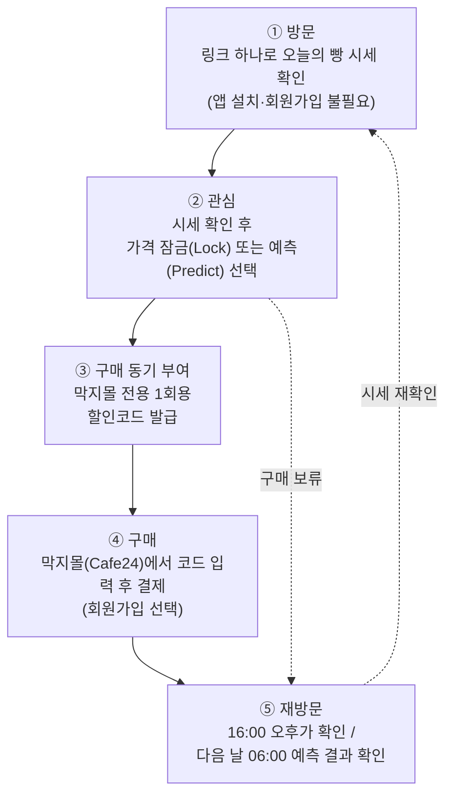

# MAKJI STOCK (막지스톡) 서비스 기획안

본 문서는 '막지스톡_최종 발표' 자료를 바탕으로 막지스톡의 사업 배경, 서비스 구조, 검증 계획을 정리한 상세 기획안입니다.

---

## 1. 시장 기회: 온라인 베이커리 시장이 빠르게 커지고 있습니다

국내 온라인 베이커리 시장은 2021년부터 2025년까지 약 **95% 성장**한 것으로 추산됩니다. 막지스톡의 핵심 과제는 이렇게 늘어나는 온라인 수요를 막지 자사몰(Cafe24)로 끌어오는 것입니다.

* **국내 온라인 베이커리 시장 규모:** 2021년 3,200억 원 → 2024년 5,400억 원 → **2025년 6,250억 원(추산)**
  * 출처: 한국농수산식품유통공사(aT) 및 업계 인용 보도. 2025년 수치는 추산치이며 확정 실적이 아닙니다. 2022·2023년 수치는 확보하지 못했습니다.

### 동종 업계 레퍼런스: 자사몰 중심 브랜드 '널담'은 2년 만에 매출을 두 배 이상 키웠습니다
주 레퍼런스는 자사몰을 기반으로 성장한 널담입니다. 막지가 추진하는 B2C 자사몰 확장 경로와 가장 가까운 사례이기 때문입니다.

* **베이커리 널담 (주 레퍼런스):** 2023년 145.6억 원 → 2024년 161.6억 원 → 2025년 **328.3억 원** (전년 대비 약 103.2% 성장, 2026년 목표 800억 원)
* **신세계푸드 온라인 베이커리 매출 (보조 레퍼런스):** 2023년 255억 원 → 2024년 310억 원 → 2025년 850억 원 (2년간 3.3배 성장)
  * 대기업 채널에서도 온라인 베이커리 수요가 커지고 있음을 보여 주는 보조 근거입니다.
  * 두 레퍼런스의 출처는 발표 전 확인해 명시합니다.

---

## 2. 문제 정의: 고객이 방문한 시점에 구매하지 않습니다

막지는 **B2C 시장으로 사업을 확장**하려 합니다. 5월 한 달간 단일 제품('막지 ZERO 카스테라')을 판매하며 쌓인 데이터(로그인 90회, 결제금액 기준)를 분석한 결과, **고객이 사이트를 둘러보는 시간대와 실제로 결제하는 시간대가 달랐습니다.** 방문이 곧바로 구매로 이어지지 않는다는 뜻입니다.

* **오전 (08:00 ~ 10:00):** 로그인 비중 25.6%, 결제금액 비중 8.0% → **방문은 많지만 결제는 적습니다**
* **저녁 (20:00 ~ 24:00):** 로그인 비중 20.0%, 결제금액 비중 28.4% → **결제가 이 시간대에 몰립니다**

**문제:** 고객에게 방문한 그 시점에 구매할 뚜렷한 이유가 없습니다.

※ 단일 제품, 한 달간의 데이터로 표본이 작습니다. 파일럿에서 시간대별 방문·결제 비중을 다시 측정합니다.

### 서비스 목표: 방문을 늘리고, 방문한 시점에 구매하도록 만듭니다
1. **유입 증가:** 매일 다시 찾아올 이유를 만들어 방문 수를 늘립니다.
2. **전환율 상승:** 방문 즉시 구매할 동기를 만들어 둘러보기만 하던 고객을 구매로 이끕니다.

---

## 3. 솔루션: 막지스톡은 빵 가격을 주식 시세처럼 움직이게 합니다

주가가 오르내리듯 빵 가격도 하루 두 번 바뀝니다. 고객은 시세를 확인하고 **원하는 혜택을 직접 선택한 뒤** 자사몰에서 구매합니다.

* **핵심 컨셉:** 빵 가격을 주식 시세처럼 운영합니다. 고객은 하루 두 번 바뀌는 시세를 보고 자신에게 맞는 혜택을 골라 자사몰에서 구매합니다.
* **관심 유도:** 가격이 움직인다는 사실 자체가 고객의 관심을 끕니다.
* **재방문 유도:** 시세 확인과 예측 게임이 다시 방문할 이유가 됩니다.
* **즉시 구매 유도:** 사용 기한이 정해진 할인코드가 지금 구매할 이유가 됩니다.
  * 할인코드는 발급 후 정해진 시간(안정형 3시간, 예측 보상 24시간) 안에만 사용할 수 있어 타임세일과 같은 효과를 냅니다. 별도의 타임세일 페이지는 두지 않고 '사용 기한이 있는 코드'로 일원화합니다.

---

## 4. MVP 핵심 기능: 세 가지 기능으로 유입과 전환을 동시에 높입니다

| # | 핵심 기능 | 주요 내용 | 목표 |
| :-: | :--- | :--- | :--- |
| 1 | **시세 변동** | 검색 관심도와 환율을 반영해 빵 가격을 하루 두 번(06:00 / 16:00) 갱신 | 관심 유발, 유입 증가 |
| 2 | **예측 게임** | 다음 날 오전가의 등락을 예측하고, 안정형(확정 할인)과 공격형(적중 시 할인) 중 혜택 선택 | 즉시 구매 또는 다음 날 재방문 |
| 3 | **가격 잠금** | 원하는 빵의 오전가를 잠근 뒤 오후가와 비교해 더 유리한 가격으로 구매 | 당일 구매 전환 |

기능별 세부 동작은 6장에서 설명합니다.

---

## 5. 고객 여정: 링크 하나로 들어와 구매하고, 다시 방문합니다

1. **방문:** 앱 설치나 회원가입 없이 링크 하나로 '오늘의 빵 시세'를 확인합니다.
2. **관심:** 마음에 드는 빵의 가격을 잠그거나(Lock) 다음 날 가격을 예측합니다(Predict).
3. **구매 동기 부여:** 막지몰 전용 1회용 할인코드를 발급합니다.
4. **구매:** 막지몰(Cafe24)에서 할인코드를 입력하고 결제합니다. 회원가입은 필수가 아닙니다.
5. **재방문:** 16:00 오후가를 확인하거나, 다음 날 06:00 예측 결과를 확인하러 다시 방문합니다.

---

## 6. 화면별 기능과 기대효과

> 발표 운영 메모: 기능 하나당 슬라이드 한 장으로 구성하고, 사용자 화면 흐름은 테두리 없는 목업으로 보여 줍니다. 슬라이드에는 기능과 기대효과만 담고, MY 탭(발급 코드, 잠금 현황, 예측 결과)은 앱 시연에서 소개합니다.

### 6.1. 시세 변동
* **화면 흐름:** ① 링크로 시세 화면 진입 → ② 빵 6종의 현재 가격과 할인율 확인 → ③ 06:00 / 16:00 갱신 후 바뀐 가격 확인
* **기능:** 빵 6종의 가격이 하루 두 번(06:00 / 16:00) 바뀌며, 정가 대비 할인율(0~25%)을 함께 표시합니다.
* **기대효과:** 가격 변동이 관심을 끌어 유입이 늘고, 고객이 하루 두 번 시세를 확인하러 다시 방문합니다.

### 6.2. 가격 예측 게임 (안정형 / 공격형)
* **화면 흐름:** ① 다음 날 06:00 오전가의 상승·하락 선택 → ② 혜택 방식 선택(안정형 / 공격형) → ③ 안정형은 확정 할인코드 즉시 발급, 공격형은 다음 날 결과 확인 후 발급
* **기능:** 다음 날 06:00 오전가의 등락을 예측하고 혜택 방식을 고릅니다. 안정형은 3시간 안에 사용하는 확정 할인이고, 공격형은 예측이 적중하면 할인을 지급합니다(24시간 내 사용).
* **기대효과:** 안정형은 방문 즉시 구매로 이어져 전환율을 높이고, 공격형은 결과 확인을 위한 다음 날 재방문을 만듭니다.

### 6.3. 가격 잠금
* **화면 흐름:** ① 원하는 빵의 오전가 잠금(하루 1개) → ② 16:00 오후가 공개 → ③ 가격이 내리면 오후가로, 오르면 차액 쿠폰을 받아 잠금가로 구매
* **기능:** 오전가를 잠근 뒤 16:00 오후가와 비교해 더 유리한 가격으로 구매합니다. 어느 경우에도 고객은 잠금가보다 비싸게 사지 않으며, 잠금은 당일 01:59까지 유효합니다.
* **기대효과:** 오전에 둘러보기만 한 고객을 같은 날 저녁 구매로 연결합니다.

### 6.4. 가격 정책: 정가를 상한으로 두고, 시장 지표에 따라 가격을 조정합니다

> 발표 운영 메모: 별도 슬라이드보다는 "할인율은 어떻게 정해지며, 손실 위험은 없는가"라는 질문에 답하는 근거 자료로 활용합니다. 검색 관심도·환율 연동은 4장과 6.1절에서 소개하므로 여기서는 반복하지 않습니다.

* **정가가 상한입니다:** 할인율은 0~25% 범위에서만 움직이며, 계산 결과가 이 범위를 벗어나면 상한 또는 하한에서 고정됩니다. 판매가가 정가를 넘는 경우는 없습니다.
* **할인에는 시장 근거가 있습니다:** 할인율은 검색 관심도(수요 지표, 0~15%p)와 환율(원가 지표)로만 결정되므로 할인 폭의 이유를 고객에게 설명할 수 있습니다. 환율이 오르면 그만큼 할인 폭이 줄어듭니다.
* **즉시 구매가 가장 유리하도록 설계했습니다:** 안정형(오전 7~10% / 오후 5~7%)의 기대 혜택이 공격형(적중 시 5~13%)보다 크도록 설계해, 고객이 결제를 미루거나 게임에만 의존하지 않도록 합니다.
* **운영 시간:** 오전장 06:00~15:59, 오후장 16:00~01:59, 정가 시간 02:00~05:59이며 주말에도 운영합니다.

**백테스트 결과** (최근 90일, 2026-06-30 ~ 2026-09-27, 빵 6종, 924개 시세 구간, 실제 네이버 검색지수와 한국은행 환율 사용, 환율 상승분 전액 반영)

#### ① 고객이 가격 변동과 혜택을 체감할 수 있는가
| 항목 | 결과 | 해석 |
| :--- | :--- | :--- |
| 평균 할인율 | **11.77%** (중앙값 11.7%) | 정가 대비 평균 약 12% 저렴 |
| 할인율 10% 이상 구간 | **59.8%** | 10회 중 6회는 체감할 만한 할인 수준 |
| 직전 시세 대비 5% 이상 변동한 구간 | **52.3%** (평균 6.44%, 최대 31.56%) | 절반 이상의 구간에서 가격 변화가 뚜렷함 |
| 오후가가 오전가보다 높음 / 낮음 | 216회 / 168회 | 등락이 한쪽으로 치우치지 않아 잠금·예측 기능의 의미가 유지됨 |
| 할인 상한(25%) / 하한(0%) 도달 | 27회(2.9%) / 29회(3.1%) | 상·하한 도달은 각각 3% 안팎이며, 나머지 약 94%는 시장 지표에 따라 움직임 |

#### ② 제품당 마진은 줄어도 전체 매출은 늘어나는가
백테스트는 가격만 시뮬레이션합니다. 판매량 변화는 파일럿에서 확인해야 하므로, 여기서는 **정가 판매 수준의 매출·이익을 유지하려면 판매량이 얼마나 늘어야 하는지**를 계산했습니다. 계산에는 예측 게임 할인코드까지 반영한 실효 할인율(시세 할인과 코드 할인을 합친 실제 할인율)을 사용했으며, 원가율 50%는 가정값입니다.

* **즉시 구매 코드(안정형):** 판매가에 오전장 7~10%, 오후장 5~7% 할인을 추가로 적용합니다.
* **적중 코드(공격형):** 판정일 오전가에 5~13% 할인을 추가로 적용합니다. 고객이 방향을 무작위로 선택한다고 보고 적중 확률을 50%로 계산했습니다.
* **보수적 가정:** 모든 구매에 코드가 사용된다고 가정했습니다. 실제로는 코드를 쓰지 않는 구매도 있으므로 평균 할인율은 이보다 낮아집니다.

| 시나리오 | 평균 실효 할인율 | 개당 이익 변화 | 정가 판매와 매출이 같아지는 판매량 | 정가 판매와 이익이 같아지는 판매량 | 이때 매출 |
| :--- | :---: | :---: | :---: | :---: | :---: |
| 시세 할인만 | 약 11.8% | -23.5% | +13.3% | +30.8% | +15.4% |
| 시세 + 즉시 구매 코드 | 18.2% | -36.4% | +22.3% | +57.3% | +28.6% |
| 시세 + 적중 코드 (적중 시) | 20.5% | -41.0% | +25.8% | +69.4% | +34.7% |
| 시세 + 적중 코드 (기대값) | 16.7% | -33.5% | +20.1% | +50.3% | +25.2% |

* **매출:** 모든 시나리오에서 판매량이 **13~26%** 늘면 정가 판매 이상의 매출을 올립니다.
* **이익:** 코드를 적용하면 개당 이익이 그만큼 줄어듭니다. 정가 판매와 같은 이익을 내려면 **판매량이 약 50~57%**(적중 코드는 기대값 기준) 늘어야 하며, 이때 매출은 25~29% 증가합니다.
* **안전장치:** 코드를 최대 보상률로 받더라도 실효 할인율은 안정형 최대 32.5%, 공격형 최대 34.7%입니다. 924개 시세 구간 중 설계 상한(38%)을 넘은 경우는 한 번도 없었습니다.
* **구매 시점 설계:** 오전장 고객의 안정형 실효 할인율(20.2%)이 오후장(15.4%)보다 높아, 일찍 구매할수록 유리한 구조가 유지됩니다.
* 판매량 증가는 방문 증가와 전환율 상승에서 나옵니다. 따라서 7장의 KPI(방문, 구매 전환)가 이 계산을 검증하는 지표가 됩니다.

---

## 7. 비즈니스 효과와 파일럿 KPI

파일럿 기간에는 퍼널(Funnel) 단계별로 다음 대표 지표를 측정합니다.

1. **방문:** 마켓 방문 수 (퍼널 기준값)
2. **참여:** 가격 잠금 참여율, 예측 참여 완료율
3. **상품 이동:** 상품 상세 이동률, 잠금 후 구매 페이지 이동률
4. **구매:** 할인코드 등록·사용률 (Cafe24 이동 대비 구매전환율)
5. **재방문:** 다음 날 결과 확인율, 7일 내 재방문율 (오전/오후 재방문율)
6. **운영 지표:** Cafe24 가격 반영 성공률, 평균 반영 지연 시간

### 판매량 판정 기준
6.4절의 손익 계산은 판매량이 얼마나 늘어야 하는지를 보여 줄 뿐, 실제 증가 여부는 파일럿에서 확인합니다.

* **판정:** 파일럿 기간 판매량이 기준 기간(파일럿 이전 실적 또는 미적용 구간) 대비 손익분기 판매량 이상인지 확인합니다. 현재 가정 기준으로는 약 1.6배입니다.
* **재산정:** 코드 사용률, 실제 평균 실효 할인율, 실제 원가율을 측정해 손익분기 판매량을 다시 계산합니다. 1.6배는 모든 구매에 코드가 사용되고 원가율이 50%라는 가정에서 나온 값이므로, 실측 결과에 따라 달라질 수 있습니다.

### 담당자와 협의해 확정할 항목
아래 항목은 담당자와 협의한 뒤 목표를 설정합니다.

1. **파일럿 기간**
2. **대상 상품**
3. **마진율**
4. **원가**
5. **성공 기준** (판매량 목표 및 대표 지표별 목표치)

---

## 8. 시스템 아키텍처와 회원 정책

### 8.1. 기존 자사몰을 그대로 활용하는 연동 구조
막지스톡은 기존 Cafe24 자사몰 위에 추가되는 구조로, 결제·회원 시스템을 새로 구축하지 않습니다.
* **외부 API:** 네이버 검색어 트렌드, 한국은행 ECOS 환율
* **Bread Market (프론트엔드/백엔드):** Next.js 기반이며, Vercel Cron으로 데이터 수집, 가격 계산, 시세 화면 제공, 잠금·예측 쿠폰 발급 요청을 처리합니다.
* **Supabase (DB):** 가격 변동 내역과 잠금·예측 결과를 기록합니다.
* **Cafe24 (기존 자사몰):** 상품, 회원, 장바구니, 결제는 기존 방식 그대로 운영합니다. API로 산출된 판매가와 1회용 쿠폰만 연동합니다.

### 8.2. 회원가입 없이 운영하는 이유 (진입 장벽 최소화)
* **배경:** 구매 이유가 생기기 전에 회원가입부터 요구하면 고객은 첫 단계에서 이탈합니다.
* **전략:** 앱 설치, 회원가입, 비밀번호 없이 **링크 하나로 바로 시세를 확인**할 수 있게 합니다. 잠금·예측으로 받은 할인코드는 막지몰에서 사용하며, **회원가입은 필수가 아닌 선택 사항**입니다.
* **개인정보:** 이름과 연락처는 수집하지 않습니다. 브라우저의 익명 기록으로 '하루 1회' 참여 여부만 관리합니다.

---

## 9. RFP 요구사항 구현 매핑

| RFP 요구사항 | MAKJI STOCK 구현 내용 |
| :--- | :--- |
| **시장 데이터 연동** | 검색 관심도와 환율을 반영해 빵 6종의 가격을 매일 자동 계산 |
| **매일 방문 유도** | 오전 6시·오후 4시 하루 두 번 시세 변경, '내일의 가격 예측' 운영 |
| **참여 설계** | 예측과 보상으로 자발적 재방문 유도 |
| **구매 전환 유도** | 구매 시점을 고객이 고르는 안정형·가격 잠금·공격형 3가지 옵션 제공 |
| **자사몰 반영** | Cafe24 API를 통한 실판매가 반영 및 1회용 할인코드 발급 |
| **개인화** | 고객이 자신의 성향에 맞춰 구매 시점과 혜택 방식을 직접 선택 |
| **확장 가능성** | 동일한 가격 엔진을 기반으로 Bakery ETF, FX Bakery, Bread Index 등으로 단계적 확장 |

---

## 부록. 예상 질문: 손익분기 판매량 '약 1.6배'의 산출 근거

> 발표 운영 메모: 슬라이드에는 넣지 않고, 관련 질문이 나올 때 답변 근거로 활용합니다.

### 계산 과정
정가를 100, 원가를 50(원가율 50% 가정)으로 두면 정가 판매 시 개당 이익은 50입니다. 할인으로 결제가가 낮아지면 개당 이익이 줄어들므로, **정가 판매와 같은 총이익을 내려면 줄어든 이익만큼 판매량이 늘어야 합니다.**

> 손익분기 판매량(배) = 정가 판매 시 개당 이익 ÷ 할인 후 개당 이익
> = 50 ÷ (100 − 평균 실효 할인율 − 50)

**'즉시 구매 코드' 시나리오 (약 1.6배)**
1. 백테스트(최근 90일, 빵 6종, 924개 시세 구간)에서 시세 할인만 적용한 평균 할인율은 약 11.8%입니다.
2. 여기에 즉시 구매 코드(오전장 7~10%, 오후장 5~7%)를 더하면 평균 실효 할인율은 **18.2%**가 됩니다.
3. 결제가는 100 − 18.2 = 81.8, 개당 이익은 81.8 − 50 = **31.8**로, 정가 판매(50)보다 약 36% 줄어듭니다.
4. 줄어든 이익을 메우려면 50 ÷ 31.8 = **약 1.57배**, 즉 약 1.6배를 판매해야 합니다.

**시나리오별 비교**

| 시나리오 | 평균 실효 할인율 | 개당 이익 | 이익 손익분기 판매량 | 매출 손익분기 판매량 |
| :--- | :---: | :---: | :---: | :---: |
| 시세 할인만 | 약 11.8% | 38.2 | 약 1.3배 | 약 1.13배 |
| 시세 + 즉시 구매 코드 | 18.2% | 31.8 | **약 1.6배** | 약 1.22배 |
| 시세 + 적중 코드 (기대값) | 16.7% | 33.3 | 약 1.5배 | 약 1.20배 |
| 시세 + 적중 코드 (적중 시) | 20.5% | 29.5 | 약 1.7배 | 약 1.26배 |

* 발표에서 제시하는 1.6배는 코드 시나리오 중 가장 높은 값(즉시 구매 코드)입니다. 코드를 고려한 전체 범위는 **약 1.5~1.7배**입니다.
* 매출 손익분기 판매량(정가 판매와 매출이 같아지는 판매량)은 결제가만으로 계산할 수 있으며(100 ÷ 결제가), 모든 시나리오에서 약 1.1~1.3배입니다.
* 적중 코드의 기대값은 고객이 방향을 무작위로 선택할 때 적중 확률 50%, 가격이 같으면 무승부로 보고 코드를 지급한다는 조건으로 계산했습니다.

### 계산의 전제 조건
| 가정 | 값 | 변동 시 영향 |
| :--- | :--- | :--- |
| 원가율 | 50% (실측 아님) | 40%면 약 1.4배, 60%면 약 1.8배 |
| 코드 사용률 | 모든 구매에 코드 사용 (가장 보수적) | 구매의 50%만 사용하면 약 1.4배, 70%면 약 1.5배 |
| 구매 시점 | 오전장·오후장 구매 비중 동일 | 오전 구매 비중이 높으면 할인이 커져 손익분기 판매량이 올라감 |
| 판매량 | 백테스트는 가격만 시뮬레이션하며, 판매량 증가는 검증되지 않음 | 파일럿에서 실측 |

* 손익분기 판매량에 가장 큰 영향을 주는 변수는 원가율입니다. 이 때문에 원가와 마진율은 담당자와 협의해 확정하기로 했습니다(7장).

### 예상 질문과 답변
* **원가율을 50%로 잡은 근거는 무엇인가?** 실측값이 아닌 가정입니다. 담당자와 실제 원가를 확인한 뒤 다시 계산하며, 원가율별 결과는 위 표와 같습니다.
* **1.6배는 지나치게 높은 목표가 아닌가?** 1.6배는 정가 판매와 동일한 이익을 유지하기 위한 조건입니다. 매출 기준으로는 판매량이 약 1.2배만 늘어도 정가 판매를 넘어섭니다. 또한 코드를 사용하지 않는 구매가 있으므로 실제 필요한 판매량은 이보다 낮아질 수 있습니다.
* **판매량이 실제로 그만큼 늘어나는가?** 백테스트로는 확인할 수 없습니다. 파일럿에서 기준 기간 대비 판매량을 측정하고, 실측한 할인율과 원가로 손익분기를 다시 계산합니다.
* **할인 폭이 과도해질 위험은 없는가?** 코드를 최대 보상률로 받아도 실효 할인율은 최대 34.7%입니다. 924개 시세 구간 중 설계 상한(38%)을 넘은 경우는 한 번도 없었습니다.
