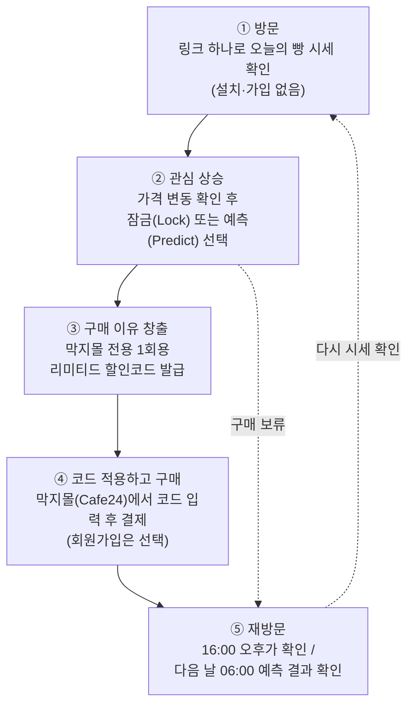

# MAKJI STOCK (막지 주식) 기획안 상세 문서

본 문서는 '막지스톡_최종 발표' 자료를 기반으로 작성된 비즈니스 및 서비스 상세 기획안입니다.

---

## 1. 시장 기회: 온라인 베이커리 시장은 매년 크게 성장하고 있습니다

온라인 베이커리 시장은 2021년부터 2025년까지 약 **95% 성장**한 것으로 추산됩니다. 이 성장하는 수요를 자사몰(Cafe24)로 어떻게 가져올 것인지가 막지 주식의 핵심 과제입니다.

* **국내 온라인 베이커리 시장 규모:** 2021년 3,200억 원 ➡️ 2024년 5,400억 원 ➡️ **2025년 6,250억 원(추산)**
  * 출처: 한국농수산식품유통공사(aT) 및 업계 인용 보도. 2025년 수치는 추산치이므로 확정 실적으로 표현하지 않음.

### 동종 업계 레퍼런스: 자사몰 중심 브랜드 '널담'이 2년 만에 2배 넘게 성장했습니다
자사몰 기반으로 성장한 널담을 주된 레퍼런스로 삼습니다. 막지가 가려는 B2C 자사몰 확장 경로와 가장 가깝기 때문입니다.

* **베이커리 널담 (주 레퍼런스):** 2023년 145.6억 원 ➡️ 2024년 161.6억 원 ➡️ 2025년 **328.3억 원** (전년 대비 약 103.2% 성장, 2026년 목표 800억 원)
* **신세계푸드 온라인 베이커리 매출 (보조 레퍼런스):** 2023년 255억 ➡️ 2024년 310억 ➡️ 2025년 850억 (3.3배 성장)
  * 대기업 채널까지 온라인 베이커리 수요가 커지고 있음을 보여주는 보조 근거입니다.

---

## 2. 문제 정의: 방문한 고객이 그 자리에서 사지 않고 있습니다

막지는 **B2C 시장으로 확장**하려 합니다. 5월 한 달간 단일 제품('막지 ZERO 카스테라') 1종을 판매하며 쌓인 구매 데이터(로그인 90회, 결제금액 기준)를 분석했더니, **사용자가 사이트를 둘러보는 시간대와 실제로 구매하는 시간대가 다르다**는 사실이 드러났습니다. 방문한 그 시점에 바로 구매가 일어나지 않는다는 뜻입니다.

* **오전 (08:00 ~ 10:00):** 로그인 비중 25.6% vs 결제금액 비중 8.0% ➡️ **아침에 둘러보기만 함**
* **저녁 (20:00 ~ 24:00):** 로그인 비중 20.0% vs 결제금액 비중 28.4% ➡️ **저녁에 실질적 결제 발생**

**🚨 문제:** 방문 시점에 바로 살 '명확한 이유'가 없습니다.

### 서비스 목표: 방문을 늘리고, 방문한 순간 사도록 만듭니다
1. **유입 증가:** 매일 다시 찾아올 이유를 만들어 방문 자체를 늘립니다.
2. **전환율 상승:** 방문 즉시 구매할 동기를 만들어 둘러보기만 하던 고객이 구매로 이어지게 합니다.

---

## 3. 솔루션: 막지 스톡은 주식시장처럼 빵 가격을 움직이게 합니다

주식 가격이 오르내리듯 빵 가격도 변합니다. 하루 두 번 바뀌는 빵 시세를 보고, 고객이 **스스로 혜택을 골라** 자사몰로 이동해 구매합니다.

* **핵심 컨셉:** 빵값을 주식시장처럼! 하루 두 번 열리는 시세를 보고 내 방식대로 혜택을 골라 자사몰에서 구매.
* **관심 끌기:** 가격 변동이 눈길을 끕니다.
* **재방문 유도:** 가격 확인과 예측 게임이 다시 들어오게 만듭니다.
* **지금 구매:** 사용 기한이 정해진 리미티드 할인코드가 지금 사야 할 이유를 줍니다.
  * 할인코드는 발급 후 일정 시간(안정형 3시간, 예측 보상 24시간) 안에만 쓸 수 있어 타임세일과 같은 긴박감을 냅니다. 별도 타임세일 페이지는 두지 않고 '기한 있는 코드'로 통일합니다.

---

## 4. MVP 핵심 기능: 세 가지 기능으로 유입과 전환을 만듭니다

| # | 핵심 기능 | 하는 일 | 겨냥하는 목표 |
| :-: | :--- | :--- | :--- |
| 1 | **가격 변동** | 검색 관심도·환율로 빵 가격을 하루 두 번(06:00 / 16:00) 갱신 | 관심 유발, 유입 증가 |
| 2 | **예측 게임** | 내일 오전가의 등락을 예측하며 안정형(확정 할인) / 공격형(맞히면 할인) 중 혜택 선택 | 즉시 구매 또는 다음 날 재방문 |
| 3 | **잠금 기능** | 마음에 드는 빵의 오전가를 잠그고 오후가와 비교해 유리한 쪽으로 구매 | 같은 날 구매 전환 |

세부 동작은 6장에서 설명합니다.

---

## 5. 5단계 고객 여정: 링크 하나로 들어와 구매하고 다시 돌아옵니다

1. **방문:** 앱 설치나 가입 없이 링크 하나로 바로 '오늘의 빵 시세' 확인
2. **관심 상승:** 마음에 드는 빵의 가격을 잠금(Lock)하거나 내일 가격 예측(Predict)
3. **구매 이유 창출:** 막지몰 전용 1회용 할인코드 발급
4. **코드 적용하고 구매:** 막지몰(Cafe24)에서 할인코드를 입력하고 결제. 회원가입은 선택이라, 가입해도 되고 안 해도 됨
5. **재방문 (리텐션):** 오후 16:00 가격을 확인하거나, 다음날 06:00 예측 결과를 보러 재방문

---

## 6. 화면별 기능과 기대효과

발표에서는 기능 하나당 슬라이드 한 장을 씁니다. 슬라이드마다 사용자 화면 흐름을 테두리 없는 목업으로 보여주고, **기능**과 **기대효과**만 짚습니다. MY 탭(발급 코드, 잠금 현황, 예측 결과)은 슬라이드에 넣지 않고 앱 시연에서 보여줍니다.

### 6.1. 시세 변동
* **화면 흐름:** ① 링크로 시세 화면 진입 ➡️ ② 6종 빵의 현재 가격과 할인율 확인 ➡️ ③ 06:00 / 16:00 갱신 후 바뀐 가격 확인
* **기능:** 6종 빵 가격이 하루 두 번(06:00 / 16:00) 바뀌고, 정가 대비 할인율(0~25%)을 표시
* **기대효과:** 가격 변동이 눈길을 끌어 유입 증가, 하루 두 번 다시 확인하러 옴

### 6.2. 가격 예측 게임 (안정형 / 공격형 선택)
* **화면 흐름:** ① 내일 06:00 오전가가 오를지 내릴지 선택 ➡️ ② 혜택 방식 선택(안정형 / 공격형) ➡️ ③ 안정형은 확정 할인코드 발급, 공격형은 다음 날 결과 확인 후 발급
* **기능:** 내일 06:00 오전가의 등락을 예측하며 혜택 방식을 선택. 안정형은 3시간 안에 쓰는 확정 할인, 공격형은 예측이 맞으면 할인 지급(24시간 내 사용)
* **기대효과:** 안정형은 방문 즉시 구매(전환율 상승), 공격형은 다음 날 결과를 보러 재방문

### 6.3. 가격 잠금
* **화면 흐름:** ① 마음에 드는 빵의 오전가 잠금(하루 1개) ➡️ ② 16:00 오후가 공개 ➡️ ③ 내리면 오후가로 구매, 오르면 차액 쿠폰과 함께 잠금가로 구매
* **기능:** 오전가를 잠그고 16:00 오후가와 비교해 유리한 쪽으로 구매. 손해 없이 당일 01:59까지 유효
* **기대효과:** 아침에 구경만 한 고객을 같은 날 저녁 구매로 회수

### 6.4. 가격 정책: 정가를 지키며 시장 신호에 따라 움직입니다
발표 슬라이드로 만들기보다 "할인율이 어떻게 정해지고, 손해는 없는가"라는 질문에 답하는 근거로 씁니다. 검색 관심도·환율 연동은 4장과 6.1에서 이미 소개하므로 여기서는 반복하지 않습니다.

* **정가가 천장입니다:** 할인율은 0~25% 안에서만 움직이고, 계산 결과가 이 범위를 벗어나면 상한·하한에서 멈춥니다. 판매가가 정가를 넘는 일은 없습니다.
* **시장 신호가 곧 근거입니다:** 검색 관심도(수요 신호, 0~15%p)와 환율(원가 신호)로만 정해지므로, 할인이 커지는 이유를 고객에게 설명할 수 있습니다. 환율이 오르면 그만큼 할인도 줄어듭니다.
* **지금 사는 쪽이 가장 유리합니다:** 안정형(오전 7~10% / 오후 5~7%)의 기대값이 공격형(5~13%, 맞혀야 지급)의 기대값보다 크게 설계되어 있어, 결제를 미루거나 게임에만 기대지 않게 합니다.
* **시장의 하루:** 오전장 06:00~15:59, 오후장 16:00~01:59, 정가 시간 02:00~05:59. 주말에도 운영합니다.

**백테스트 결과** (최근 90일, 2026-06-30 ~ 2026-09-27, 6종, 924개 시세 구간, 실제 네이버 검색지수와 한국은행 환율 사용, 환율 상승분 전부 반영)

#### ① 고객이 가격 변동과 혜택을 체감하는가
| 항목 | 결과 | 의미 |
| :--- | :--- | :--- |
| 평균 할인율 | **11.77%** (중앙값 11.7%) | 정가 대비 평균 약 12% 저렴 |
| 할인율 10% 이상인 구간 | **59.8%** | 열 번 중 여섯 번은 체감할 만한 할인 |
| 직전 시세 대비 5% 이상 움직인 구간 | **52.3%** (평균 6.44%, 최대 31.56%) | 가격이 절반 이상의 구간에서 눈에 띄게 변함 |
| 오후가가 오전가보다 높음 / 낮음 | 216회 / 168회 | 오르내림이 한쪽으로 쏠리지 않아 잠금·예측의 의미가 유지됨 |
| 할인 상한(25%) / 하한(0%) 도달 | 27회(2.9%) / 29회(3.1%) | 상한·하한에 닿는 경우는 각각 3% 안팎으로, 나머지 94%는 신호에 따라 자연스럽게 움직임 |

#### ② 제품당 마진은 줄지만 전체 매출은 늘어나는가
백테스트는 가격 쪽만 시뮬레이션합니다. 판매량은 파일럿에서 확인하므로, 여기서는 **"판매량이 얼마나 늘어야 하는가"**를 계산했습니다. 예측 게임에서 받는 할인코드까지 얹은 실효 할인율로 계산하며, 원가율 50%는 가정입니다.

* **지금 구매 시 코드(안정형):** 판매가에 오전장 7~10% / 오후장 5~7%를 얹습니다.
* **적중 시 코드(공격형):** 판정일 오전가에 5~13%를 얹습니다. 방향을 무작위로 골랐다고 보고 적중 확률 50%로 계산했습니다.
* **보수적 가정:** 모든 구매가 코드를 쓴다고 봤습니다. 실제로는 코드를 쓰지 않는 구매도 있어 이보다 할인이 작아집니다.

| 시나리오 | 평균 실효 할인율 | 개당 이익 변화 | 매출이 정가 판매와 같아지는 판매량 | 이익이 정가 판매와 같아지는 판매량 | 그때 매출 |
| :--- | :---: | :---: | :---: | :---: | :---: |
| 시세 할인만 | 약 11.8% | -23.5% | +13.3% | +30.8% | +15.4% |
| 시세 + 지금 구매 코드 | 18.2% | -36.4% | +22.3% | +57.3% | +28.6% |
| 시세 + 적중 코드 (적중 시) | 20.5% | -41.0% | +25.8% | +69.4% | +34.7% |
| 시세 + 적중 코드 (기대값) | 16.7% | -33.5% | +20.1% | +50.3% | +25.2% |

* **매출:** 어느 시나리오든 판매량이 **13~26%** 늘면 정가 판매 이상의 매출이 됩니다.
* **이익:** 코드를 얹으면 개당 이익이 커지는 만큼 줄어, 정가 판매와 같은 이익을 내려면 **판매량이 약 50~57%(기대값 기준)** 늘어야 합니다. 이때 매출은 25~29% 늘어납니다.
* **안전선:** 코드를 최대 보상률로 받아도 실효 할인은 안정형 최대 32.5%, 공격형 최대 34.7%로, 설계한 38% 상한을 넘은 적이 924개 시세 구간에서 0회입니다.
* **방향:** 오전장에 오는 고객의 안정형 실효 할인(20.2%)이 오후장(15.4%)보다 커서 "일찍 사는 쪽이 유리"하게 유지됩니다.
* 판매량 증가는 방문 증가와 전환율 상승에서 나옵니다. 그래서 7장 KPI(방문, 구매전환)가 이 계산을 검증하는 지표입니다.

---

## 7. 비즈니스 효과 및 파일럿 테스트 KPI

파일럿 기간 동안 퍼널(Funnel) 단계별로 아래 대표 지표를 측정합니다.

1. **방문:** 마켓 방문 수 (퍼널 기준값)
2. **참여:** 가격 잠금 참여율, 예측 참여 완료율
3. **상품 이동:** 상품 상세 이동률, 잠금 후 구매 이동률
4. **구매:** 할인코드 등록 및 사용률 (Cafe24 이동 대비 구매전환율)
5. **재방문:** 다음 날 결과 확인율, 7일 내 반복 방문율 (오전/오후 재방문율)
6. **운영 지표:** Cafe24 가격 반영 성공률 및 평균 반영 지연 시간

### 판매량 판정 기준
6.4절의 손익 계산은 "판매량이 얼마나 늘어야 하는가"까지만 보여줍니다. 실제로 늘었는지는 파일럿에서 확인합니다.

* **판정:** 파일럿 기간 판매량이 기준 기간(파일럿 전 실적 또는 비적용 구간) 대비 손익분기 판매량 이상인지 봅니다. 가정 기준으로는 약 1.6배입니다.
* **재계산:** 코드 사용률, 실제 평균 실효 할인율, 실제 원가율을 실측해 손익분기 판매량을 다시 계산합니다. 1.6배는 모든 구매가 코드를 쓰고 원가율이 50%라는 가정에서 나온 값이므로, 실측 후 달라질 수 있습니다.

### 담당자와 협의 후 확정할 항목
아래 항목은 담당자와 협의한 뒤 목표를 설정합니다.

1. **파일럿 기간**
2. **대상 상품**
3. **마진율**
4. **원가**
5. **성공 기준** (판매량 목표와 위 대표 지표별 목표치)

---

## 8. 시스템 아키텍처 및 회원 정책

### 8.1. 외부 의존성 없는 심리스 연동 구조
막지 스톡은 기존 Cafe24 위에 가볍게 얹히는 구조이며, 결제/회원 시스템을 별도 구축하지 않습니다.
* **외부 API:** 네이버 검색어 트렌드, 한국은행 ECOS 환율
* **Bread Market (프론트/백엔드):** Next.js, Vercel Cron으로 데이터 수집, 가격 계산, 시세 화면, 잠금/예측 쿠폰 발급 요청 처리
* **Supabase (DB):** 가격 변동 및 잠금/예측 반영 결과 기록
* **Cafe24 (본진):** 기존 상품, 회원, 장바구니, 결제 처리 동일. API를 통해 산출된 판매가와 1회용 쿠폰만 연동.

### 8.2. 왜 가입 없이 운영하는가? (문턱 0 정책)
* **이유:** 고객에게 가입부터 요구하면 "아직 살 이유도 없는데 왜?"라며 문턱에서 이탈합니다.
* **전략:** 앱 설치나 회원 가입, 비밀번호 없이 **링크 한 번으로 바로 시세를 구경**하게 만듭니다. 이후 잠금/예측으로 받은 할인코드를 막지몰에서 쓰게 하며, **회원가입은 필수가 아닌 선택**입니다. 가입해도 되고 안 해도 됩니다.
* **개인정보:** 이름과 연락처를 수집하지 않고, 브라우저 익명 기록으로 "하루 1번" 참여만 제어합니다.

---

## 9. RFP 요구사항 구현 매핑 요약

| RFP 요구사항 | MAKJI STOCK 구현 내용 |
| :--- | :--- |
| **시장 데이터 연동** | 검색 관심도 + 환율로 6종 빵 가격 매일 자동 계산 |
| **매일 방문 유도** | 오전 6시 / 오후 4시 하루 두 번 시세 변경 및 '내일의 가격 예측' 퀴즈 운영 |
| **참여 설계** | 예측과 리워드로 자발적 재방문 유도 |
| **구매 전환 유도** | 고객 구매 시점(의향)을 고르는 안정형, 가격 잠금, 공격형 3가지 옵션 제공 |
| **자사몰 반영** | Cafe24 API를 통한 실판매가 업데이트 및 1회용 할인코드 발급 |
| **개인화** | 고객이 본인의 성향에 맞춰 구매 시점과 혜택 방식을 직접 선택 |
| **확장 가능성** | Bakery ETF, FX Bakery, Bread Index 등 같은 가격 엔진 위에서 단계적 확장 가능 |
