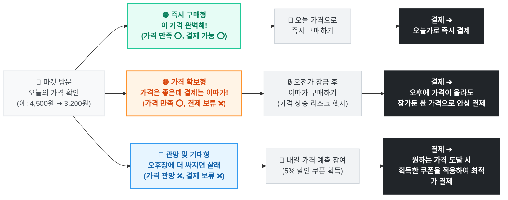

# MAKJI BREAD MARKET 구매 의사별 행동 플로우 (개선안)

> **메시지 핵심:** 잠금과 예측 기능은 구매를 미루는 장치가 아니라, 유저의 상황(결제 여유)과 니즈(더 싼 가격)에 맞춰 **가장 유리한 구매 방식을 보장하는 무기**입니다.

### 각 타깃별 추천 카피라이팅 (UI 적용용)

1. **즉시 구매형 (🟢 초록색 영역)**
   * **버튼 명:** 즉시 구매하기
   * **서브 카피:** 고민하는 순간 내일 가격이 오를 수 있어요!
2. **가격 확보형 (🟡 주황색 영역)**
   * **버튼 명:** 가격 잠그기 (하루 1회)
   * **서브 카피:** 바쁘다면 일단 잠그세요. 오후에 가격이 올라도 이 가격 그대로 방어해 드려요.
3. **관망/기대형 (🔵 파란색 영역)**
   * **버튼 명:** 가격 예측하고 5% 쿠폰 받기
   * **서브 카피:** 더 싼 가격을 기다리시나요? 예측에 참여하고 최적가에 쿠폰까지 얹어서 구매하세요.
