# 외환시장 24시간 변동성 시각화 (오전장 vs 오후장)

외환시장이 '열려 있는 시간(낮)'과 '닫혀 있는 시간(밤)'의 차이 때문에 발생하는 변동성 불균형을 시각화한 다이어그램입니다.

```mermaid
flowchart TD
    %% 스타일 정의
    classDef timePoint fill:#343a40,color:white,font-weight:bold,stroke:none,rx:5px,ry:5px;
    classDef activeMarket fill:#ffe8cc,stroke:#fd7e14,stroke-width:3px,color:#d9480f,font-weight:bold;
    classDef deadMarket fill:#f1f3f5,stroke:#ced4da,stroke-width:2px,color:#868e96,stroke-dasharray: 5 5;
    classDef amResult fill:#d3f9d8,stroke:#2b8a3e,stroke-width:2px,color:#2b8a3e,font-weight:bold;
    classDef pmResult fill:#f8d7da,stroke:#c92a2a,stroke-width:2px,color:#c92a2a,font-weight:bold;

    %% 타임라인 노드
    T1["어제 오전 9시\n(시가 Open)"]:::timePoint
    T2["어제 오후 3시 30분\n(종가 Close)"]:::timePoint
    T3["오늘 오전 9시\n(시가 Open)"]:::timePoint

    %% 변동성 구간 (화살표 굵기로 차이 표현)
    T1 ==>|"[활발한 거래 시간]\n은행과 기업이 달러를 사고팝니다\n변동성 엄청 큼 (약 0.45% 출렁임)"| T2
    T2 -.->|"[시장 닫힌 시간]\n공식 외환시장이 잠들어 있습니다\n변동성 거의 없음 (약 0.04% 찔끔)"| T3

    %% 백그라운드 그룹 묶기
    subgraph 오전장_로직 ["대표님이 기획하신 '오전장' (아침 6시 발표)"]
        direction LR
        A1("어제 시가") -->|"비교"| A2("어제 종가")
        A3("🎯 [낮 시간]의 큰 변동폭 반영\n할인율이 매일 크게 팍팍 바뀜!"):::amResult
        A2 -.-> A3
    end

    subgraph 오후장_로직 ["대표님이 기획하신 '오후장' (오후 4시 발표)"]
        direction LR
        P1("어제 종가") -->|"비교"| P2("오늘 시가")
        P3("🚨 [밤 사이]의 죽은 변동폭 반영\n매일 할인율이 0% 근처에서 멈춤!"):::pmResult
        P2 -.-> P3
    end

    %% 연결
    T2 ~~~ 오전장_로직
    T3 ~~~ 오후장_로직
```

### 💡 요약 설명
1. **외환시장의 진실:** 
   달러 가격은 아침 9시(시가)부터 오후 3시 30분(종가)까지만 팍팍 움직입니다. 장이 닫힌 오후 3시 30분부터 다음 날 아침 9시까지는 가격이 '그대로 정지'해 있습니다.
2. **현재 기획의 문제점:**
   * **오전장(아침 6시)**은 가장 활발했던 '낮 시간'의 가격표를 가져다 씁니다. 당연히 매일 할인이 다이내믹합니다.
   * **오후장(오후 4시)**은 아무도 거래하지 않아 가격이 멈춰있던 '밤 시간'의 가격표를 가져다 씁니다. 당연히 며칠이 지나도 할인은 제자리걸음입니다.
