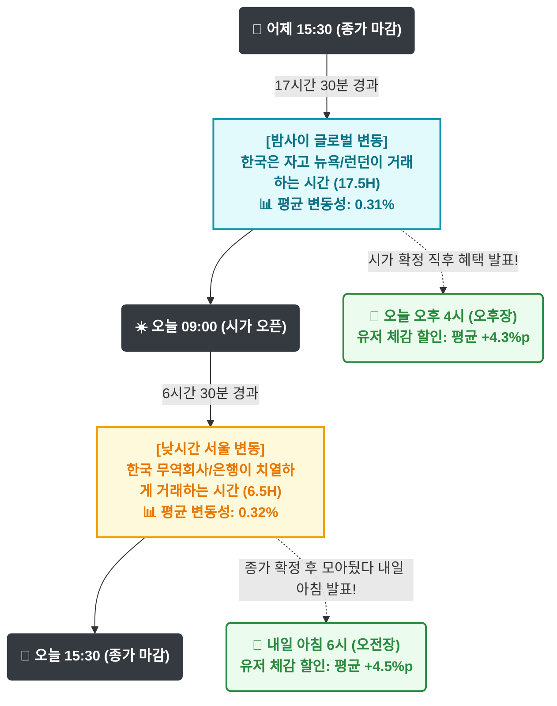
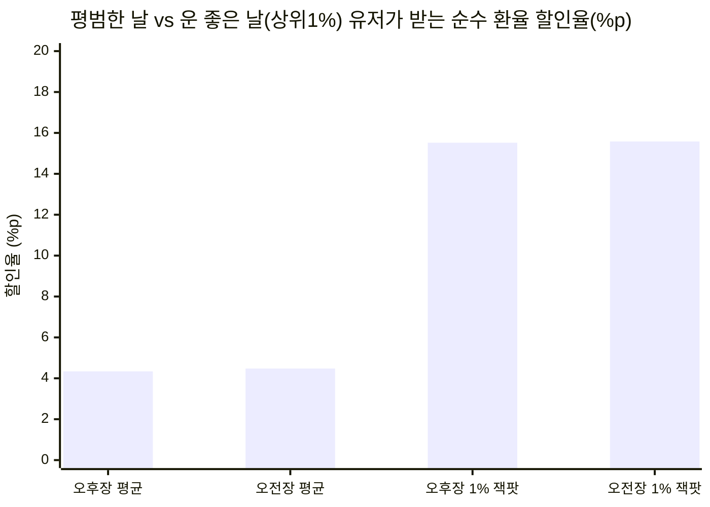
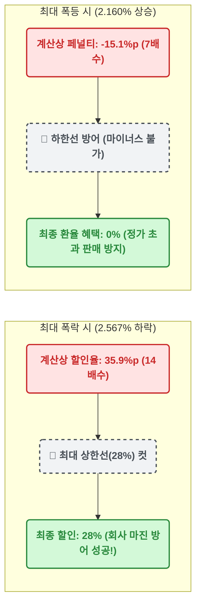

# 📊 막지 스탁(MAKJI STOCK) 외환 변동성 마스터 리포트
**분석 데이터:** 한국은행 ECOS 6년 치 (2020.09 ~ 2026.09, 총 1,467 거래일)
**적용 산식:** 14배수 (0.1% 하락당 1.4%p 할인 적용, 최대 28% 상한)

---

## 1. 🕒 막지 스탁 핑퐁 로직의 시각화 (타임라인)

외환시장의 실제 흐름과 유저에게 발표되는 타이밍이 어떻게 맞물려 돌아가는지 한눈에 보여줍니다.

**💡 핵심 인사이트:** 시간이 17시간(밤) 대 6시간(낮)으로 쪼개져 있음에도 불구하고, 양쪽 구간의 평균 하락폭(`0.31%` vs `0.32%`)이 소름 돋게 일치합니다. 완벽한 50:50 밸런스입니다.

---

## 2. 🎁 유저 체감 혜택 시각화 (14배수 파워)

유저가 앱에 접속했을 때 실제로 화면에서 보게 될 '환율 할인율'을 체감할 수 있는 차트입니다.

**💡 핵심 인사이트:** 평상시에는 마진에 무리가 없는 **4%대 할인**이 잔잔하게 터지다가, 상위 1% 이벤트 데이가 오면 어느 장에서든 공평하게 **15%대 잭팟**이 터져 바이럴(입소문)을 주도합니다.

---

## 3. 📊 할인율 구간별 횟수 분포 (총 6년 기준)

가장 보수적이고 안전한 14배수 엔진을 달았을 때, 할인이 어느 구간에 몰려있는지 보여주는 분포표입니다.

| 환율 할인 구간 (순수 환율만) | 🌙 오후장 | ☀️ 오전장 | 6년 총합 (확률) |
| :--- | :--- | :--- | :--- |
| **🚨 28% (최대 상한선 도달)** | 2회 | 3회 | **5회** (약 1년에 1번) |
| **🔥 20% ~ 27.9%** | 7회 | 1회 | **8회** (약 1년에 1번) |
| **🎉 15% ~ 19.9%** | 10회 | 12회 | **22회** (분기당 1번) |
| **🎁 10% ~ 14.9%** | 36회 | 37회 | **73회** (한 달에 1번) |
| **🍞 1% ~ 9.9% (평상시)** | 618회 | 649회 | **1,267회** (가장 자주 터짐) |

**💡 핵심 인사이트:** 
*   **"왜 14배수인가?" ➔ 2.0%의 방어막:** 환율 할인이 28% 상한선을 치려면 환율이 정확히 **2.0% 폭락**해야 합니다. 데이터상 2.0% 폭락은 6년에 5번뿐입니다. 즉, 14배수는 상한선(출혈 이벤트)을 1년에 딱 한 번으로 통제하는 **가장 완벽한 재무적 안전장치**입니다.
*   **두 자릿수(10% 이상) 잭팟은 한 달에 1.5번!** 28%부터 10%까지 합치면 연 18회 터집니다. 런칭 초기에 과도한 마진 소모 없이도, 검색 쿠폰(최대 15%)과 결합해 유저 체감 할인을 20%대로 자주 밀어 올릴 수 있습니다.

---

## 4. 📉 극단적 시장(블랙스완) 방어 시각화

환율이 미친 듯이 폭락하거나 폭등할 때, 시스템이 회사를 어떻게 보호하는지 보여줍니다.

---

## 5. 📅 연도별 변동성 흐름 (2020 ~ 2026)

| 연도 | 오후장 상위 1% 잭팟 | 오전장 상위 1% 잭팟 | 시장 분위기 요약 |
| :--- | :--- | :--- | :--- |
| **2020년** | `0.687%` 하락 | `0.703%` 하락 | 환율 변동이 거의 없는 평온한 지루한 장세 |
| **2021년** | `0.568%` 하락 | `0.673%` 하락 | 계속 평온함 (할인 체감 낮음) |
| **2022~2023년**| `1.161%` 하락 | `1.210%` 하락 | 금리 인상기, 2% 폭락 블랙스완 최초 발생 |
| **2025년** | `1.356%` 하락 | `1.150%` 하락 | 역대 최대 폭락(2.56%)이 터진 해 |
| **2026년(현재)**| **`1.625%` 하락** | **`1.196%` 하락** | **평상시 변동폭과 1% 잭팟 모두 6년 내 역대 최고!** |

**💡 최종 결론:** 올해(2026년)는 과거 어느 때보다 환율이 역동적으로 널뛰고 있습니다. 즉, **지금 막지 스탁을 런칭하시면 과거 어느 때보다 잦은 빈도로 큰 할인 혜택을 자연스럽게 뿌릴 수 있는 '마케팅 황금기'** 를 맞이하시게 됩니다. 
이 14배수 로직 그대로 개발을 진행하십시오!
