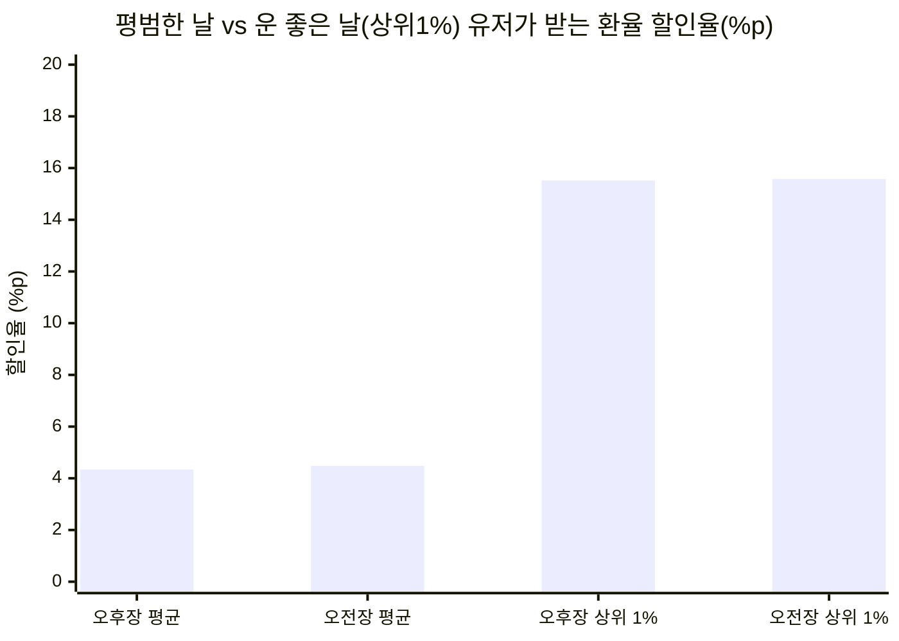
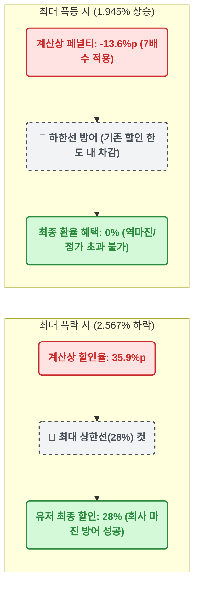

# 📊 막지 스탁(MAKJI STOCK) 외환 변동성 종합 리포트
**분석 데이터:** 한국은행 ECOS 6년 치 (총 1,467 거래일)
**분석 기준:** 전영업일 종가(15:30) ↔ 당일 시가(09:00) ↔ 당일 종가(15:30)

---

## 1. 🕒 장별 통계 요약표 (Raw Data)

| 분석 지표 | 🌙 밤사이 변동 (오버나잇)  `전일 15:30 ➔ 당일 09:00` | ☀️ 낮 시간 변동 (인트라데이)  `당일 09:00 ➔ 당일 15:30` | 밸런스 비교 |
| :--- | :--- | :--- | :--- |
| **발표 시점** | **오늘 오후 4시 (오후장)** | **내일 아침 6시 (오전장)** | - |
| **평균 하락폭** | `0.310%` | `0.320%` | ⚖️ **50:50 완벽 일치** |
| **평균 유저 혜택** | **약 +4.3%p** | **약 +4.5%p** | ⚖️ 매일 4%대 달달한 혜택 |
| **하락:상승 비율**| 673일 : 778일 (하락 46%) | 702일 : 748일 (하락 48%) | ☀️ 낮 시간에 할인이 더 자주 터짐 |

---

## 2. 🎰 '잭팟' 발생 일수 분석 (6년 총 1,467일 기준)

14배수 적용 시, 유저들이 열광하는 '빅세일(잭팟)'이 6년간 실제로 며칠이나 터졌는지 카운트한 결과입니다.

| 잭팟 수준 | 환율 하락률 기준 | 오후장 잭팟 횟수 | 오전장 잭팟 횟수 | 6년 총합 (확률) |
| :--- | :--- | :--- | :--- | :--- |
| 🚨 **최대 상한선 (28%)** | **2.0% 이상 폭락** | 2일 | 3일 | **5일** (약 1년에 1번) |
| 🔥 **초특가 할인 (21% 이상)** | **1.5% 이상 하락** | 9일 | 4일 | **13일** (약 1년에 2번) |
| 🎉 **깜짝 세일 (14% 이상)** | **1.0% 이상 하락** | 26일 | 19일 | **45일** (약 1~2달에 1번) |

*💡 인사이트: 유저를 미치게 만드는 21% 이상 할인은 1년에 딱 2번 정도 터지므로 **비용 부담 없이 완벽한 바이럴 효과**를 만들어냅니다. 그리고 두 달에 한 번꼴로 14% 이상의 짭짤한 할인이 터져주어 유저의 이탈을 막습니다.*

---

## 3. 🎁 유저 체감 혜택 시각화 (14배수 적용 시)

---

## 4. 📉 극단적 시장(스트레스 테스트) 시각화

환율이 미친 듯이 치솟거나 폭락하는 '블랙스완'이 왔을 때, 회사의 마진(28% Cap)이 어떻게 유저와 회사를 보호하는지 보여줍니다.

