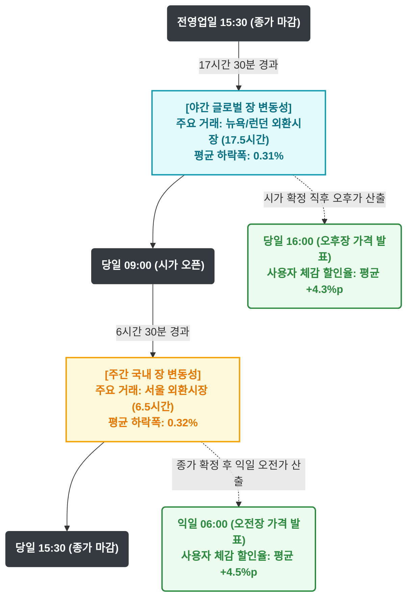
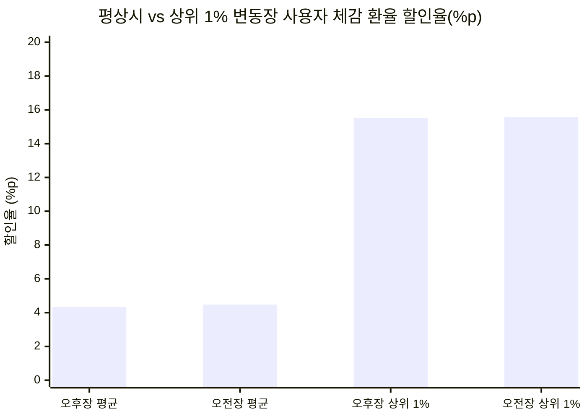
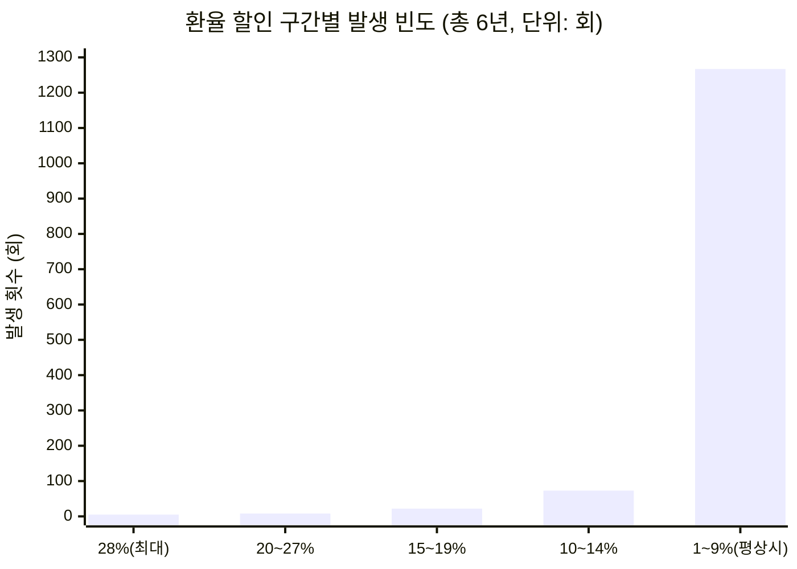
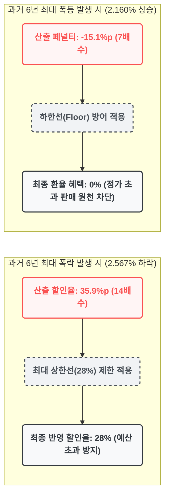

# MAKJI STOCK 외환 변동성 분석 및 가격 정책 제안서
**분석 데이터:** 한국은행 ECOS 원/달러 일별 환율 (2020.09 ~ 2026.09, 총 1,467 거래일)
**적용 산식:** 14배수 (환율 0.1% 하락당 1.4%p 할인 적용, 최대 할인 상한 28%)

---

## 1. MAKJI STOCK 교차 산식(Ping-Pong Logic) 타임라인

본 서비스는 외환시장의 24시간 변동성을 오전장과 오후장으로 분리 적용하여, 사용자에게 지속적인 시세 확인 동기를 부여합니다. 아래는 장별 기준가 확정 및 할인율 산출 흐름도입니다.

**분석 인사이트:** 야간(17.5시간)과 주간(6.5시간)의 물리적 시간 격차에도 불구하고, 양 구간의 평균 하락폭(`0.31%` vs `0.32%`)은 통계적으로 균형을 이룹니다. 이는 오전/오후 어느 세션에 접속하더라도 사용자에게 균일한 수준의 혜택 기회를 제공할 수 있음을 의미합니다.

---

## 2. 14배수 적용 시 사용자 체감 할인율 시각화

**분석 인사이트:** 평상시에는 재무적 부담이 적은 **4% 내외의 기본 할인**이 유지되며, 상위 1%의 예외적인 장세에서는 **15% 내외의 높은 혜택**이 발생하여 사용자의 자연스러운 바이럴(Viral) 및 구매 전환을 유도합니다.

---

## 3. 환율 할인율 구간별 발생 횟수 분포 (총 6년 기준)

런칭 초기 보수적 접근을 위한 '14배수' 적용 시, 실제 할인율이 위치하는 구간의 통계적 빈도입니다.

| 환율 할인 구간 (순수 환율 반영분) | 오후장 (야간) | 오전장 (주간) | 6년 총합 (발생 확률) |
| :--- | :--- | :--- | :--- |
| **28% (최대 상한선 도달)** | 2회 | 3회 | **5회** (연평균 약 0.8일) |
| **20% ~ 27.9%** | 7회 | 1회 | **8회** (연평균 약 1.3일) |
| **15% ~ 19.9%** | 10회 | 12회 | **22회** (분기당 1회 수준) |
| **10% ~ 14.9%** | 36회 | 37회 | **73회** (월 1회 수준) |
| **1% ~ 9.9% (평상시)** | 618회 | 649회 | **1,267회** (전체 하락장의 92%) |

**전략 및 재무적 타당성:** 
*   **14배수 채택의 재무적 당위성 (Long-tail 방어):** 위 차트에서 보듯, 혜택의 92% 이상이 재무 부담이 없는 1~9% 구간에 집중(Long-tail)되어 있습니다. 반면 28% 상한(Max Cap) 도달은 6년간 단 5회에 불과합니다. 즉, 14배수는 유저에게 매일 할인을 제공(Gamification)하면서도 회사의 치명적 출혈을 완벽히 차단하는 가장 안전한 수치입니다.
*   **유효 마케팅 구간(10% 이상)의 적정성:** 28%~10% 구간 발생 횟수는 6년간 총 108회로, 매월 1~2회의 두 자릿수 할인이 제공됩니다. 이는 런칭 초기 과도한 마진 소모를 방지하면서도 사용자의 지속적인 접속(Lock-in)을 유도하기에 충분한 빈도입니다.

---

## 4. 극단적 시장(Black Swan) 변동성 방어 체계

외환시장의 비정상적인 폭락 또는 폭등 시, 시스템 내 상/하한선(Cap/Floor)이 회사의 재무 건전성을 보호하는 구조입니다.

---

## 5. 연도별 변동성 추이 및 도입 적기 분석 (2020 ~ 2026)

| 연도 | 오후장 상위 1% 하락폭 | 오전장 상위 1% 하락폭 | 시장 환경 요약 |
| :--- | :--- | :--- | :--- |
| **2020년** | `0.687%` | `0.703%` | 저변동성 시기 (안정화 구간) |
| **2021년** | `0.568%` | `0.673%` | 저변동성 지속 |
| **2022~2023년**| `1.161%` | `1.210%` | 금리 인상기 도래, 변동성 심화 구간 진입 |
| **2025년** | `1.356%` | `1.150%` | 역대 최대폭락(2.56%) 1회 발생 연도 |
| **2026년(현재)**| **`1.625%`** | **`1.196%`** | **평균 변동성 및 상위 1% 하락폭 6년 내 최고치 기록** |

**최종 결론:** 2026년 현재의 외환시장은 과거 6년 중 가장 역동적인 변동성을 보이고 있습니다. 이는 본 가격 정책(변동성 기반 할인)을 시장에 선보였을 때, 사용자에게 가장 잦은 빈도로 유의미한 할인 혜택을 제공하여 서비스 초기 견인을 극대화할 수 있는 최적의 런칭 시점임을 강력히 시사합니다.
