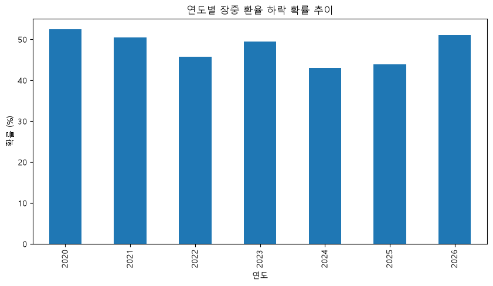
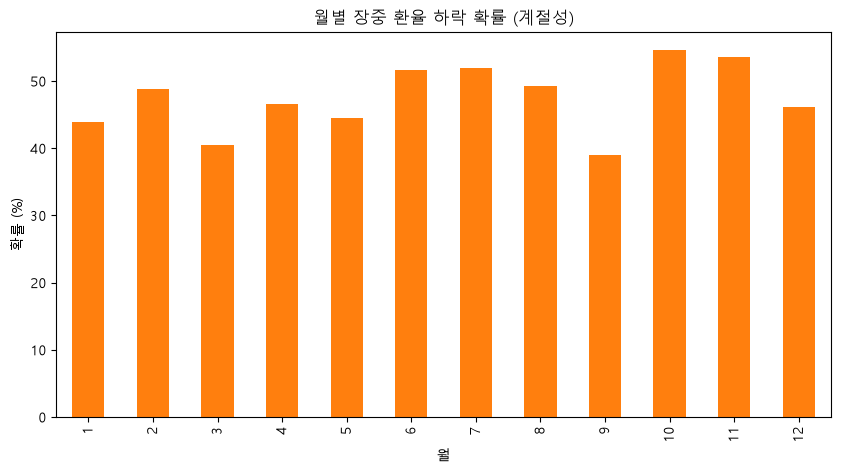
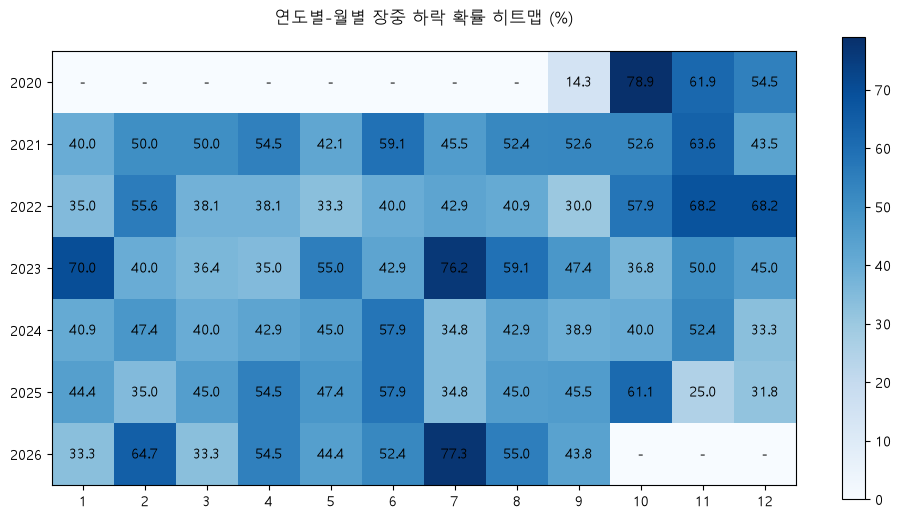

# 막지(Makji) 환율 하락 확률 통계 및 분석 리포트

본 리포트는 막지의 '막지스탁 줍줍' 마케팅 트리거(환율 연동 시나리오)를 기획하기 위한 연도별/월별 상세 통계 자료입니다.

## 1. 시각화 데이터

### 1.1 연도별 하락 확률 추이

### 1.2 월별 하락 확률 (계절성)

### 1.3 연도별-월별 하락 확률 히트맵 (장중 하락 기준)

---

## 2. 연도별-월별 상세 통계 (장중 하락: 당일 15:30 < 당일 시가)

| 연도 | 월 | 하락일수/총영업일 | 확률(%) |
|---|---|---|---|
| 2020 | 9 | 1 / 7 | 14.3% |
| 2020 | 10 | 15 / 19 | 78.9% |
| 2020 | 11 | 13 / 21 | 61.9% |
| 2020 | 12 | 12 / 22 | 54.5% |
| 2021 | 1 | 8 / 20 | 40.0% |
| 2021 | 2 | 9 / 18 | 50.0% |
| 2021 | 3 | 11 / 22 | 50.0% |
| 2021 | 4 | 12 / 22 | 54.5% |
| 2021 | 5 | 8 / 19 | 42.1% |
| 2021 | 6 | 13 / 22 | 59.1% |
| 2021 | 7 | 10 / 22 | 45.5% |
| 2021 | 8 | 11 / 21 | 52.4% |
| 2021 | 9 | 10 / 19 | 52.6% |
| 2021 | 10 | 10 / 19 | 52.6% |
| 2021 | 11 | 14 / 22 | 63.6% |
| 2021 | 12 | 10 / 23 | 43.5% |
| 2022 | 1 | 7 / 20 | 35.0% |
| 2022 | 2 | 10 / 18 | 55.6% |
| 2022 | 3 | 8 / 21 | 38.1% |
| 2022 | 4 | 8 / 21 | 38.1% |
| 2022 | 5 | 7 / 21 | 33.3% |
| 2022 | 6 | 8 / 20 | 40.0% |
| 2022 | 7 | 9 / 21 | 42.9% |
| 2022 | 8 | 9 / 22 | 40.9% |
| 2022 | 9 | 6 / 20 | 30.0% |
| 2022 | 10 | 11 / 19 | 57.9% |
| 2022 | 11 | 15 / 22 | 68.2% |
| 2022 | 12 | 15 / 22 | 68.2% |
| 2023 | 1 | 14 / 20 | 70.0% |
| 2023 | 2 | 8 / 20 | 40.0% |
| 2023 | 3 | 8 / 22 | 36.4% |
| 2023 | 4 | 7 / 20 | 35.0% |
| 2023 | 5 | 11 / 20 | 55.0% |
| 2023 | 6 | 9 / 21 | 42.9% |
| 2023 | 7 | 16 / 21 | 76.2% |
| 2023 | 8 | 13 / 22 | 59.1% |
| 2023 | 9 | 9 / 19 | 47.4% |
| 2023 | 10 | 7 / 19 | 36.8% |
| 2023 | 11 | 11 / 22 | 50.0% |
| 2023 | 12 | 9 / 20 | 45.0% |
| 2024 | 1 | 9 / 22 | 40.9% |
| 2024 | 2 | 9 / 19 | 47.4% |
| 2024 | 3 | 8 / 20 | 40.0% |
| 2024 | 4 | 9 / 21 | 42.9% |
| 2024 | 5 | 9 / 20 | 45.0% |
| 2024 | 6 | 11 / 19 | 57.9% |
| 2024 | 7 | 8 / 23 | 34.8% |
| 2024 | 8 | 9 / 21 | 42.9% |
| 2024 | 9 | 7 / 18 | 38.9% |
| 2024 | 10 | 8 / 20 | 40.0% |
| 2024 | 11 | 11 / 21 | 52.4% |
| 2024 | 12 | 7 / 21 | 33.3% |
| 2025 | 1 | 8 / 18 | 44.4% |
| 2025 | 2 | 7 / 20 | 35.0% |
| 2025 | 3 | 9 / 20 | 45.0% |
| 2025 | 4 | 12 / 22 | 54.5% |
| 2025 | 5 | 9 / 19 | 47.4% |
| 2025 | 6 | 11 / 19 | 57.9% |
| 2025 | 7 | 8 / 23 | 34.8% |
| 2025 | 8 | 9 / 20 | 45.0% |
| 2025 | 9 | 10 / 22 | 45.5% |
| 2025 | 10 | 11 / 18 | 61.1% |
| 2025 | 11 | 5 / 20 | 25.0% |
| 2025 | 12 | 7 / 22 | 31.8% |
| 2026 | 1 | 7 / 21 | 33.3% |
| 2026 | 2 | 11 / 17 | 64.7% |
| 2026 | 3 | 7 / 21 | 33.3% |
| 2026 | 4 | 12 / 22 | 54.5% |
| 2026 | 5 | 8 / 18 | 44.4% |
| 2026 | 6 | 11 / 21 | 52.4% |
| 2026 | 7 | 17 / 22 | 77.3% |
| 2026 | 8 | 11 / 20 | 55.0% |
| 2026 | 9 | 7 / 16 | 43.8% |
