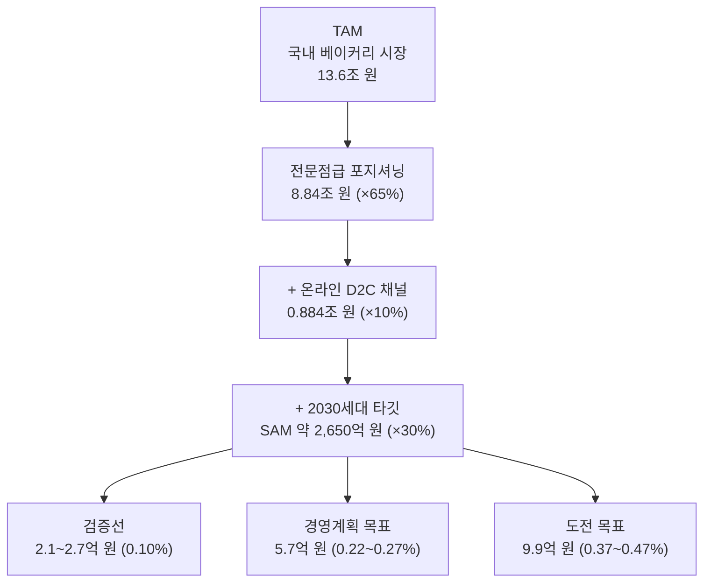
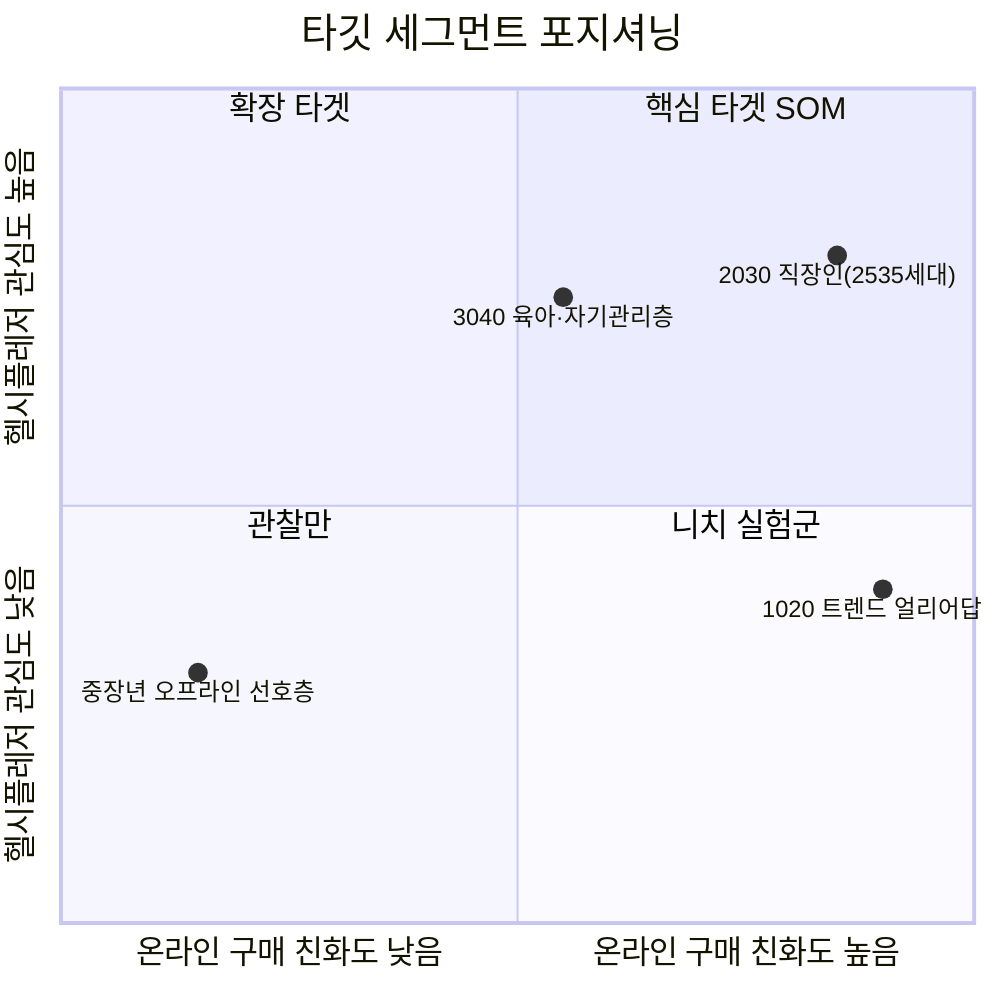

# 시장분석 04 — TAM·SAM·SOM & Market Segment Map: MAKJI(막지) D2C 채널

방법론: [business-analysis-frameworks / 04_TAM-SAM-SOM_마켓세그먼트](https://github.com/jennie-brain/business-analysis-frameworks/blob/main/04_TAM-SAM-SOM_%EB%A7%88%EC%BC%93%EC%84%B8%EA%B7%B8%EB%A8%BC%ED%8A%B8/00_%EB%B0%A9%EB%B2%95%EB%A1%A0.md) · 산업 정의는 [시장분석 01(Five Forces)](01_PORTERS_FIVE_FORCES.md)와 동일하다.

## 요약

| 구분 | 정의 | 규모 | 근거 |
|---|---|---|---|
| TAM | 국내 베이커리 시장 전체 | **약 13.6조 원(2025)** | 삼일PwC경영연구원 |
| SAM | 프리미엄/전문점급 × 온라인 D2C 채널 × 2030세대 타깃으로 좁힌 유효시장 | **약 2,650억 원(추정)** | 아래 2절 퍼널 |
| SOM | 막지 자사몰 채널의 1년 차 목표 체계 | **검증선 2.1~2.7억 원 · 경영계획 목표 5.7억 원 · 도전 목표 9.9억 원** | [시장분석 09](09_YEAR1_REVENUE_SCENARIOS.md) |

## 1. TAM — 전체 시장

국내 베이커리 시장은 2025년 기준 약 **13조 6,000억 원**으로, 이 중 베이커리 전문점(프랜차이즈+개인·로컬헤리티지)이 약 8조 8,000억 원(65%)을 차지한다. 다만 점포 수는 2022년 약 2만 8,000개를 정점으로 정체 국면에 들어섰고, 인구 10만 명당 베이커리 전문점 수가 한국 54개로 일본(10개)의 5배에 달할 만큼 포화도가 높다 — [시장분석 01](01_PORTERS_FIVE_FORCES.md)의 '기존 경쟁 강도 매우 강' 판단과 일치한다.

**TAM = 약 13.6조 원**

한계: 이 수치는 오프라인·온라인, 전문점·양산형(편의점·마트 유통 포장빵)을 모두 포함한 전체 산업 규모다. 세부 채널·연령대별 공식 통계는 공개돼 있지 않아, 2절에서 별도 근거를 들어 좁힌다.

## 2. SAM — 서비스 가능 시장 (퍼널)

막지가 실제로 경쟁하는 시장은 "①전문점급 프리미엄 포지셔닝 + ②온라인 자사몰(D2C) 채널 + ③2030세대 타깃"으로 좁힌 교집합이다. 세 필터를 순서대로 적용한다.

| 필터 | 비율(근거) | 남는 시장 |
|---|---|---|
| ① TAM | — | 13.6조 원 |
| ② 전문점급 포지셔닝만 (편의점·마트 양산빵 제외) | 65%(PwC, 베이커리 전문점 비중) | 8.84조 원 |
| ③ 온라인 D2C·이커머스 채널만 | **10%(가정)** — 국내 식품군 전체 이커머스 침투율은 23%(2023년 기준)이지만, 빵은 신선식품 중에서도 유통기한이 짧고 냉장·냉동 배송 인프라가 아직 성숙하지 않아 식품 평균보다 보수적으로 낮게 가정 | 0.884조 원 |
| ④ 2030(2535세대) 타깃만 | **30%(가정)** — 통계청 인구 구조상 20~30대가 성인 인구의 약 30% 내외를 차지한다는 인구통계 근사치를 사용(RFP가 인용한 "대중 부유층의 33.6%가 2535세대"는 모집단이 달라 그대로 쓰지 않음) | **약 2,650억 원** |

**SAM = 약 2,650억 원(추정)**

한계: ③·④는 베이커리 카테고리 전용 공식 통계가 없어 인접 통계(식품 이커머스 평균 침투율, 인구 구조)를 근거로 한 보수적 가정이다. 실측 데이터가 확보되면(예: 자사몰 실제 트래픽의 연령 분포) 갱신이 필요하다.

**실측 참고 — 널담 사례**: [시장분석 01]이 지목한 직접 경쟁자 널담(조인앤조인)은 온라인(자사몰+스마트스토어)만으로 시작해 2025년 매출 328억 원(전년 대비 약 104%↑)까지 성장했다. 이는 "③온라인 D2C 채널 10%" 가정이 완전히 근거 없는 숫자는 아니라는 것을 실증하는 참고 사례이지만, 그대로 검증치로 쓸 수는 없다 — 널담의 328억 원에는 이후 확장한 GS25·CU·세븐일레븐·올리브영 등 **편의점·오프라인 유통 매출이 섞여 있어** 순수 온라인 D2C 매출만 분리한 수치가 아니다. 막지는 편의점 유통 계획이 없으므로, 이 가정은 낙관적으로 상향하지 않고 그대로 보수적으로 유지한다.

**그림 1. TAM→SAM→SOM 퍼널** — TAM에서 SAM으로 좁힐 때는 포지셔닝(전문점급)·채널(온라인)·타깃 연령대 세 축을 순서대로 곱해 적용했다.

## 3. SOM — 막지 자사몰 채널의 1년 차 목표

기존의 1년 차 0.5~1%(13~27억 원) 및 3년 차 2~3% 가정은 외부 성공 사례나 막지의 주문 데이터로 뒷받침되지 않아 본문 목표에서 제외한다. 런칭 단계의 막지에는 **검증선·경영계획 목표·도전 목표**를 구분하는 방식이 더 정직하고 운영에도 유용하다.

| 구분 | 점유율(SAM 대비) | 1년 차 연매출 | 정의 |
|---|---:|---:|---|
| Downside | 0.05% | 1.1~1.3억 원 | 전환·재구매가 미정착한 경우 |
| 검증선 | 0.10% | 2.1~2.7억 원 | 자사몰 구매 구조의 사업성 확인 기준 |
| 경영계획 목표 | 0.22~0.27% | 5.7억 원 | 망넛이네의 런칭 초기 연도 매출을 참고한 목표 |
| Stretch | 0.37~0.47% | 9.9억 원 | 널담 초기 연도 매출에 준하는 도전 목표 |

5.7억 원과 9.9억 원은 각각 유사 성공 브랜드의 초기 실적을 참고한 값이다. 따라서 평균적인 신생 브랜드의 기대치가 아니라, **달성 시 어떤 성공 궤적에 진입하는지 보여주는 벤치마크**로 사용한다. 상세 출처·계산·한계는 [시장분석 09](09_YEAR1_REVENUE_SCENARIOS.md)에 기록한다.

## 4. Market Segment Map

SAM 내부를 "온라인 친화도"와 "헬시플레저 관심도" 두 축으로 나눠 우선순위를 매긴다.

**그림 2. 세그먼트 포지셔닝** — "2030 직장인(2535세대)"만 1사분면(핵심 타겟 SOM)에 위치한다. "3040 육아·자기관리층"은 헬시플레저 관심도는 높지만 자사몰 재방문형 게이미피케이션 UX에는 상대적으로 덜 친화적이라 2사분면(확장 타겟)으로, "1020 트렌드 얼리어답터"는 온라인 친화도는 최고치지만 구매력·건강 관심도가 상대적으로 낮아 4사분면(니치 실험군, 바이럴 확산 통로로만 유효)으로 분류했다.

| 세그먼트 | SAM 내 위치 | 우선순위 | 권고 액션 |
|---|---|---|---|
| 2030 직장인(2535세대) | 1사분면 | 1순위 | SOM 타겟, MVP 5종·가격 게임화 UX 최우선 |
| 3040 육아·자기관리층 | 2사분면 | 2순위 | 헬시플레저 메시징 재사용, 2년차 이후 확장 |
| 1020 트렌드 얼리어답터 | 4사분면 | 관찰 | 직접 타겟은 아니나 SNS 바이럴 확산의 핵심 통로 |
| 중장년 오프라인 선호층 | 3사분면 | 비우선 | 자사몰 채널과 적합도 낮음, SOM 제외 |

## 참고자료

- [맛·건강 챙기는 '헬시플레저' 트렌드 적중…널담, 역대 최대 매출 - 머니투데이](https://www.mt.co.kr/future/2026/01/21/2026012114091292451)
- [삼일PwC "K-베이커리, 내수 한계 넘어 글로벌서 새 성장축 찾아야"](https://www.pwc.com/kr/ko/press-room/2026/20260528.html)
- [Samil PwC Industry Focus — K-베이커리, 내수의 한계를 넘어 (PDF)](https://www.pwc.com/kr/ko/insights/industry-focus/samilpwc_k-bakery.pdf)
- [삼일PwC "정체 국면 맞은 K-베이커리, 해외서 활로 찾아야" - 아시아투데이](https://www.asiatoday.co.kr/kn/view.php?key=20260528010008617)
- [온라인 장보기 익숙할수록 '신선식품' 담았다 - 푸드투데이](https://www.foodtoday.or.kr/news/article.html?no=206475)
- [이커머스, 대형마트 신선식품 시장에 도전장 - 뉴데일리](https://biz.newdaily.co.kr/site/data/html/2025/04/23/2025042300096.html)
- [D2C 성공사례 브랜드의 4가지 특징 - 채널톡](https://channel.io/ko/blog/articles/cc251497)
- [자사몰 단계별 활성화, 벤치마크 사례 Best 10 - 채널톡](https://channel.io/ko/blog/articles/d2c-case-best-10-3d091223)
- [시장분석 01 — Porter's Five Forces](01_PORTERS_FIVE_FORCES.md)
