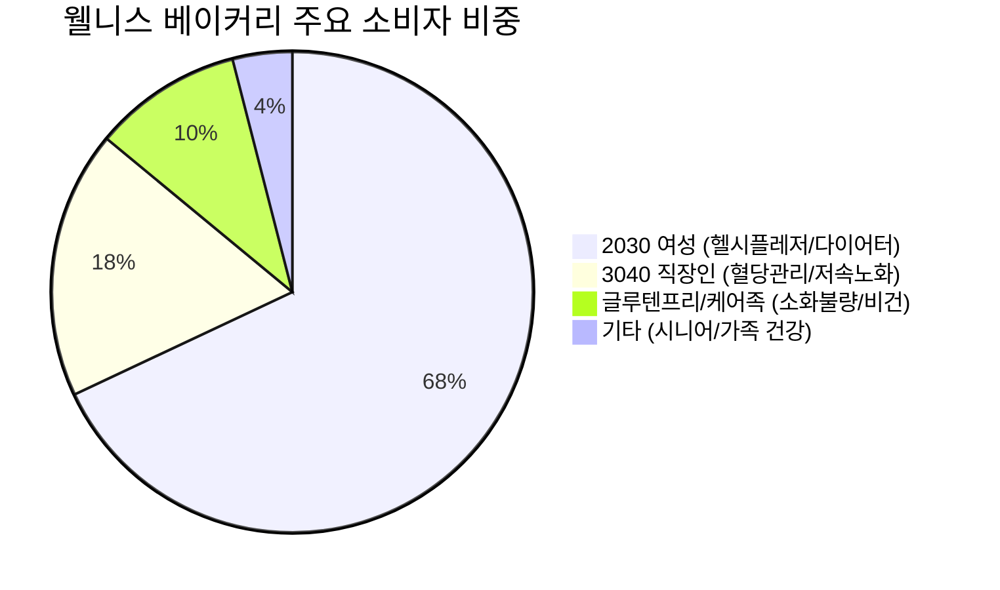
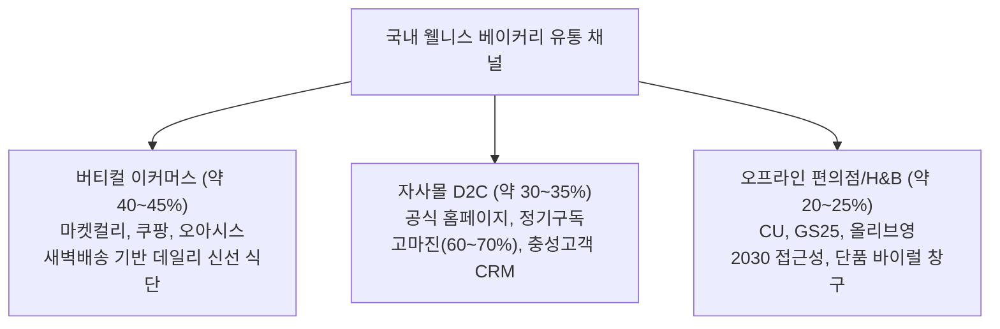
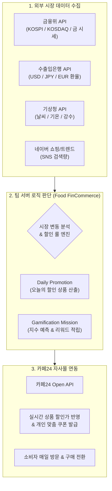

# 웰니스 베이커리(Wellness Bakery) 시장 심층 리서치 및 MAKJI 프로젝트 전략 보고서

> **작성 기준일:** 2026년 9월  
> **연계 프로젝트:** ㈜스윗앤스위츠 MAKJI AI 기반 Food FinCommerce Platform ('Bread Market' MVP)

---

## 목차
1. [Executive Summary](#1-executive-summary)
2. [시장 현황 및 성장성 분석](#2-시장-현황-및-성장성-분석)
3. [주 소비자(Target Persona) 심층 프로파일링](#3-주-소비자target-persona-심층-프로파일링)
4. [경쟁사 및 시장 점유율 구조 분석](#4-경쟁사-및-시장-점유율-구조-분석)
5. [주된 마케팅 방식 및 그로스 전략](#5-주된-마케팅-방식-및-그로스-전략)
6. [스윗앤스위츠 MAKJI의 고유 차별성](#6-스윗앤스위츠-makji의-고유-차별성)
7. [MAKJI 'Bread Market' 프로젝트 연계 기획 제언](#7-makji-bread-market-프로젝트-연계-기획-제언)

---

## 1. Executive Summary

* **시장 진화:** 국내 베이커리 시장(약 5조 원 규모) 내에서 정제 탄수화물·설탕을 배제하고 단백질·식이섬유·대체당 및 업사이클링 원료를 사용하는 **‘웰니스 베이커리’**가 전체 성장을 견인하는 핵심 성장 축으로 급부상하고 있습니다.
* **핵심 소비자:** 2030 여성(약 65~75%)을 중심으로 형성된 ‘스마트 헬시플레저’ 및 ‘혈당·저속노화(Slow Aging) 관리층’이 주도하며, 성분표(순탄수화물, 당류, 단백질)를 직접 계산하고 SNS로 인증하는 고관여 소비 패턴을 보입니다.
* **경쟁 구도:** 푸드테크 D2C 스타트업(널담, 라라스윗, 그림의빵 등)이 초기 시장을 개척한 후, 대형 제과기업(SPC 삼립 '프로젝트:H', 파리바게뜨 '파란라벨' 등)이 대대적으로 가세하며 대중화 단계로 진입하고 있습니다.
* **MAKJI의 기회:** 막걸리 양조 부산물(술지게미)을 업사이클링한 독자적 기능성 원료('막지 파우더')와 글루텐프리 프리미엄 구움과자 라인업을 보유한 MAKJI는, 본 RFP의 **‘Food FinCommerce (Bread Market)’**를 통해 D2C 자사몰의 데일리 방문율과 구매 전환율을 극대화할 수 있는 강력한 차별화 모멘텀을 확보할 수 있습니다.

---

## 2. 시장 현황 및 성장성 분석

### (1) 웰니스 베이커리의 정의 및 패러다임 전환

```
[전통 베이커리]                         [웰니스 베이커리]
정제 백밀가루 + 설탕 + 버터    ───▶    대체원료(막지 파우더, 쌀가루, 아몬드분)
단순 미식 / 길티 플레저 (Guilt)        대체 감미료(알룰로스) + 고단백 + 고식이섬유
혈당 스파이크 / 칼로리 부담            헬시 플레저 (Healthy Pleasure) / 저속노화
```

* **정의:** 밀가루(글루텐), 정제설탕을 최소화하거나 배제하고, 통곡물, 대체분말(쌀가루, 아몬드가루, 업사이클링 부산물 분말), 대체감미료(알룰로스, 에리스리톨, 스테비아) 및 단백질을 보강하여 **'맛의 타협 없이 건강 목표를 달성하는 빵'**을 통칭합니다.
* **카테고리 확장:** 초기 식사빵(통밀빵, 깜빠뉴) 위주에서 **디저트/구움과자(마들렌, 휘낭시에, 카스테라, 롤케이크, 도넛)**로 급속히 이동하며 일상 기호식품화되었습니다.

### (2) 시장 규모 및 정량 지표

| 구분 | 시장 규모 및 추이 | 성장률 / 핵심 지표 | 비고 |
| :--- | :--- | :--- | :--- |
| **국내 베이커리 전체 시장** | 2025~2026년 기준 **약 4조 8,000억 ~ 5조 원** | 연평균 3~4% 완만한 성장 | 성숙기 진입, 프리미엄/건강빵이 신성장 동력 |
| **온라인 베이커리 시장** | 2021년 3,200억 원 ➔ **2025년 약 6,250억 원** | **4년간 약 2배 급성장 (CAGR ~18%)** | D2C 자사몰 및 새벽배송 이커머스 급성장 |
| **국내 저당·대체식품 시장** | 2021년 2,100억 원 ➔ **2024년 5,700억 원** | **연평균 20% 이상 고속 성장** | 제로 음료에 이어 베이커리/빙과류로 소비 확산 |
| **편의점 냉장 저당 디저트** | 편의점 디저트 내 매출 비중 **25~30% 육박** | 라라스윗 저당롤 **4개월 만에 100만 개 돌파** | 2030 오프라인 소비 접점 대폭 확장 |

### (3) 시장을 관통하는 4대 핵심 트렌드

1. **혈당 다이어트 & 저속노화 (Slow Aging):**
   * 단순 열량(kcal) 제한에서 ‘식후 인슐린 분비와 혈당 스파이크 방지’로 다이어트 패러다임이 진화했습니다.
   * 연속혈당측정기(CGM)를 착용하고 식후 혈당을 모니터링하는 일반 소비자가 증가하면서 '저당(Low-sugar)' 및 '슬로우 카보(Slow-carb)' 성분이 필수 조건이 되었습니다.
2. **길티 프리 (Guilt-Free) 디저트 수요 폭발:**
   * "다이어트 중에도 빵과 디저트를 참지 않는다"는 헬시플레저 소비 성향에 따라, 기존 맛을 온전히 재현한 고단백·저당 구움과자가 인기를 끌고 있습니다.
3. **업사이클링 & 지속가능 푸드테크:**
   * 식음료 부산물(맥주박, 막걸리 지게미 등)을 고부가가치 영양 소재로 전환하는 ESG 푸드테크가 원가 절감과 브랜드 가치 제고를 동시에 달성하고 있습니다.
4. **성분 투명성 (Clean & Clear Label):**
   * 당류(g), 순탄수화물(Net Carb = 탄수화물 - 식이섬유 - 대체당), 단백질(g)을 포장지 정면에 크고 명확하게 공개하는 '매크로(Macro) 표기'가 신뢰의 척도가 되었습니다.

---

## 3. 주 소비자(Target Persona) 심층 프로파일링

웰니스 베이커리의 핵심 구매층은 **2030 여성(전체 구매의 약 70%)**이며, 최근 남성 다이어터 및 3040 직장인, 건강 질환 경계층으로 소비 스펙트럼이 넓어지고 있습니다.



### 세부 페르소나 매트릭스

| 분석 항목 | Persona A: 스마트 헬시플레저 다이어터 | Persona B: 저속노화 & 혈당 수호자 | Persona C: 글루텐프리 클린 이터 |
| :--- | :--- | :--- | :--- |
| **대표 연령/성별** | 24~33세 여성 (대학생, 사회초년생) | 32~45세 남녀 직장인 | 25~49세 전 연령 (워킹맘, 건강염려층) |
| **라이프스타일** | 필라테스, 헬스, 런닝, 인스타그램 식단 기록 | 바쁜 직장 생활, 잦은 회식, 건강검진 후 식단 조절 | 소화불량 경험, 아토피/피부 트러블 민감 |
| **핵심 Pain Point** | "식단 중 빵이 너무 먹고 싶은데 살찌고 붓는다" | "점심 후 식곤증이 심하고 당뇨 가족력이 걱정된다" | "밀가루 빵만 먹으면 속이 더부룩하고 가스가 찬다" |
| **구매 동기** | 죄책감 없는 빵 섭취, 단백질 충전, 예쁜 비주얼 | 당 스파이크 방지, 건강한 데일리 식사 대용 | 속 편한 글루텐프리 간식, 안전한 국산 원료 |
| **확인하는 지표** | 순탄수화물, 칼로리, 단백질 함량(10g 이상 선호) | 당류(2g 미만), 대체당 성분(알룰로스 선호) | 밀가루 0%, 쌀가루/원재료 원산지, 첨가물 유무 |
| **온라인 행동 특성** | SNS 숏폼 반응, 할인 이벤트·리워드 혜택 적극 참여 | 합리적이고 논리적인 데이터 설명 중시, 정기구독 | 브랜드 진정성 및 제조 공정/위생(HACCP) 신뢰 |

---

## 4. 경쟁사 및 시장 점유율 구조 분석

국내 시장은 절대적인 독점 사업자가 없는 **초기 분절(Fragmented) 시장에서 소수의 선도 브랜드가 볼륨을 키우는 과도기**입니다.

### (1) 주요 경쟁 플레이어 비교

```
[프리미엄 D2C / 푸드테크]                [대형 제과 프랜차이즈]
• 널담 (대체단백/비건, 330억 매출)      • SPC 삼립 (프로젝트:H)
• 라라스윗 (저당 롤케이크 1위)         • 파리바게뜨 (파란라벨)
• MAKJI (막걸리 업사이클링 웰니스)       • 뚜레쥬르 (SLOW TLJ)
• 그림의빵 (당뇨 맞춤 식감 특허)        • 롯데웰푸드 (ZERO)
```

| 브랜드 | 운영사 | 핵심 경쟁력 및 제품 포트폴리오 | 판매 채널 | 비즈니스 규모 및 성과 |
| :--- | :--- | :--- | :--- | :--- |
| **널담 (Nuldam)** | 조인앤조인 | • 계란 흰자 대체재(아쿠아파바), 식물성 버터 개발<br>• 고단백 저당 마카롱, 베이글, 휘낭시에, 식빵 | 자사몰(D2C), GS25, 세븐일레븐, 컬리, 글로벌(싱가포르 등) | • **2025년 매출 330억 원** (전년비 +104%)<br>• 영업이익 흑자 전환 성공, R&D 투자 활발 |
| **라라스윗 (Lalasweet)** | 라라스윗 | • 저당 아이스크림 1위 인지도를 베이커리로 이식<br>• 동물성 크림 30% 이상, 당류 2g 미만 저당 생크림롤 | 편의점(CU 전용 단독), 공식 자사몰 | • 저당 롤케이크 **출시 4개월 누적 100만 개 돌파**<br>• 2030 편의점 디저트 카테고리 1위 |
| **그림의빵** | 닥터키친 계열 | • 밀단백질과 식이섬유를 활용한 식감 특허 기술<br>• 저당·고단백 크림빵, 모닝빵, 식사빵 | 마켓컬리, 오아시스마켓, 자사몰 | • 당뇨/키토제닉 환자 및 유지어터 사이에서 높은 신뢰도<br>• 프리미엄 신선 플랫폼 스테디셀러 |
| **머드스콘 / 잇포레스트** | 개별 D2C 브랜드 | • 귀리, 통밀, 병아리콩 기반 고식이섬유 스콘 및 빵<br>• 충성 팬덤 기반의 커뮤니티 운영 | 스마트스토어, 공식 D2C 몰 | • 오픈런 형태의 차수별 주문 판매로 높은 객단가 및 재구매율 유지 |
| **프로젝트:H** | SPC 삼립 | • 삼립 미래식품연구소 효소공법 저당 솔루션<br>• 고단백 저당 큐브식빵, 베이글, 제로 도넛 | 쿠팡, 마켓컬리, 대형마트, 편의점, 삼립몰 | • 2024년 론칭한 대기업의 대규모 웰니스 전문 브랜드<br>• 압도적 유통망과 대량 생산 체계 보유 |

### (2) 유통 채널별 점유율 비중 및 특징



* **자사몰(D2C)의 기회와 위기:**
  * 높은 마진율(플랫폼 수수료 30~40% 절감)과 정기구독 모델 구축이 가능하지만, **'지속적인 트래픽 유입'과 '재방문 유도 비용(CAC)'이 크다는 것이 치명적 약점**입니다.
  * 따라서 자사몰에 고객을 매일 접속하게 만드는 독창적인 참여형 메커니즘(Gamification / Food FinCommerce)이 필수적입니다.

---

## 5. 주된 마케팅 방식 및 그로스 전략

성공적인 웰니스 베이커리 브랜드들은 다음과 같은 4단계 마케팅 공식을 활용하고 있습니다.

```
[1단계: 시각적 스펙] ──▶ [2단계: 과학적 검증] ──▶ [3단계: TPO 루틴화] ──▶ [4단계: 드롭/커뮤니티]
"당 1g, 단백질 12g"      CGM 혈당 수치 인증         "오후 3시 입터짐 방지"      한정수량 오픈런/구독
```

1. **'매크로(Macro) 영양 스펙' 타이포그래피 마케팅:**
   * 상세페이지 상단 및 썸네일에 `"당류 1g", "순탄수 3g", "단백질 10g"`을 압도적인 크기의 숫자로 시각화하여 정보 탐색 비용을 극단적으로 낮춥니다.
2. **연속혈당측정기(CGM)를 통한 실증형 바이럴 콘텐츠:**
   * 인플루언서가 직접 빵을 섭취한 후 2시간 동안의 혈당 그래프 변화를 영상으로 증명하는 콘텐츠가 일반적인 광고보다 3~5배 높은 전환율을 기록합니다.
3. **TPO(Time, Place, Occasion) 기반 일상 루틴 결합:**
   * 단순 건강빵이 아니라, *"오후 3시 사무실 당 떨어질 때 먹는 마들렌"*, *"운동 전후 가벼운 프로틴 충전"*, *"주말 브런치로 즐기는 저속노화 식빵"* 등 구체적인 소비 상황을 제안합니다.
4. **드롭(Drop) 시스템 및 게이미피케이션 리워드:**
   * 한정 생산 및 사전 예약(빵케팅)을 통해 결핍 효과(Scarcity Effect)를 유발하고, 매일 출석체크 및 미션 리워드를 통해 자사몰 체류 시간을 늘립니다.

---

## 6. 스윗앤스위츠 MAKJI의 고유 차별성

RFP에 명시된 ㈜스윗앤스위츠의 브랜드 자산과 기술력은 시장 내에서 명확한 차별적 경쟁 우위를 갖추고 있습니다.

```
┌────────────────────────────────────────────────────────────────────────┐
│                        MAKJI만의 핵심 경쟁 우위                        │
├──────────────────────────────────┬─────────────────────────────────────┤
│ 1. K-푸드 업사이클링 헤리티지   │ 막걸리 양조 부산물(술지게미)을 활용한 독자적│
│                                  │ '막지 파우더' 특허 기술 (ESG + 영양 가치)   │
├──────────────────────────────────┼─────────────────────────────────────┤
│ 2. 속 편한 글루텐프리 디저트    │ 밀가루 대신 쌀가루, 아몬드가루, 대체감미료를 │
│                                  │ 사용한 마들렌·휘낭시에·카스테라 프리미엄 라인│
├──────────────────────────────────┼─────────────────────────────────────┤
│ 3. 검증된 기술 및 생산 인프라   │ 중기부 TIPS 선정, 스마트 HACCP 구축,         │
│                                  │ 국내 대기업 OEM·ODM 납품 및 글로벌 수출 추진│
└──────────────────────────────────┴─────────────────────────────────────┘
```

---

## 7. MAKJI 'Bread Market' 프로젝트 연계 기획 제언

RFP의 핵심 과제인 **"금융·시장 데이터 기반 Food FinCommerce Platform ('오늘의 시장으로 빵을 산다')"**의 성공을 위한 실무 전략을 제안합니다.



### (1) 시장 데이터 연동 규칙의 정합성(Plausibility) 확보 전략
외부 데이터와 빵 상품 간의 연결은 **'고객이 무릎을 탁 치며 공감할 수 있는 위트와 스토리텔링'**이 핵심입니다.

| 외부 지표 변동 | 연동 대상 상품 | 프로모션 명칭 및 스토리텔링 | 기대 심리 및 소비자 반응 |
| :--- | :--- | :--- | :--- |
| **코스피/코스닥 급락 (-1.5% 이상)** | 딥 초코 마들렌 / 카스테라 | **"파란불엔 달콤한 위로, 당 충전 특가"** (초코류 7% 할인) | 주식 하락으로 스트레스받는 2030 직장인의 심리적 위로 소비 자극 |
| **엔화(JPY) 환율 하락** | 프리미엄 말차 마들렌 | **"엔저 기념, 교토 우지 말차 환율 우대전"** (말차류 5% 할인) | 원료 수입국 통화 변동을 상품 가격 인하로 연결하는 금융적 직관성 |
| **금(Gold) 시세 상승** | 골든 레몬 마들렌 / 버터 피낭시에 | **"금값 상승 기념, 황금빛 구움과자 골든 타임 세일"** | 안전자산 선호 심리를 골드 컬러/프리미엄 제품과 위트 있게 결합 |
| **비/강수 예보 (비 오는 날)** | 오리지널 막지 마들렌 전 라인업 | **"비 오는 날엔 파전 대신 '막지'!"** (전 품목 비오는날 10% 쿠폰) | 막걸리 술지게미 베이스라는 브랜드 헤리티지를 날씨와 결합하여 환기 |

### (2) 데일리 방문을 이끄는 게이미피케이션 (Gamification) 설계
* **"오늘의 빵 시장 예측 (Daily Bread Prediction)":**
  * 매일 아침 09:00, "오늘 코스피 종가가 상승(빨간불)할까, 하락(파란불)할까?"를 클릭 1번으로 예측.
  * 예측 성공 시 **'빵 배당금 (적립금 100~300원 or 5% 시크릿 쿠폰)'** 지급.
  * 2030의 앱테크 습관(토스, 모니모 등)을 자사몰로 흡수하여 **매일 자발적 방문 트래픽(DAU)** 확보.

### (3) 확장 서비스 기획안 (RFP ②③④ 영역)

1. **Bakery ETF (나만의 Bread Portfolio):**
   * 영양 목표와 소비 패턴에 맞춘 번들링 상품 구성.
   * `[혈당 안정형 ETF]`: 저당 마들렌 5종 팩 (변동성 낮은 데일리형)
   * `[고단백 성장형 ETF]`: 단백질 보강 머핀 & 구움과자 팩 (운동족 타깃)
2. **FX Bakery (환율 연동 자동 프로모션):**
   * 프랑스산 고메버터 ↔ EUR 환율, 일본 말차 ↔ JPY 환율과 실시간 연동된 원료 기반 프로모션 자동화.
3. **Bread Index (막지 브랜드 지수):**
   * 실시간 판매량, 재구매율, 네이버 검색량 데이터를 가중 평균하여 '오늘의 막지 지수(MAKJI 100)' 산출 및 시각화.

### (4) 시스템 운영 원칙 엄수 (RFP 가이드 준수)
* RFP 지침에 명시된 대로 **AI가 제품 이미지나 상세페이지를 임의 생성하여 자동 업로드하는 것은 금지**되어 있습니다.
* 시스템 아키텍처는 **"사전에 승인된 상품 마스터 데이터 및 프로모션 템플릿 Pool"**을 기반으로, 외부 데이터 조건 만족 시 카페24 API를 통해 할인율/쿠폰을 안전하게 업데이트하는 방식으로 구현해야 합니다.

---

> 본 보고서는 MAKJI AI PM 프로젝트의 1~2주차 기획안 작성, 시장 가설 검증 및 프로토타입 구현을 위한 기초 레퍼런스로 활용될 수 있습니다.
